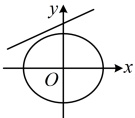
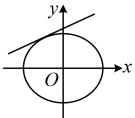
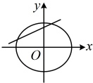

<table border=1 style='margin: auto; word-wrap: break-word;'><tr><td style='text-align: center; word-wrap: break-word;'>位置关系</td><td style='text-align: center; word-wrap: break-word;'>相离</td><td style='text-align: center; word-wrap: break-word;'>相切</td><td style='text-align: center; word-wrap: break-word;'>相交</td></tr><tr><td style='text-align: center; word-wrap: break-word;'>图示</td><td style='text-align: center; word-wrap: break-word;'></td><td style='text-align: center; word-wrap: break-word;'></td><td style='text-align: center; word-wrap: break-word;'></td></tr><tr><td style='text-align: center; word-wrap: break-word;'>交点个数</td><td style='text-align: center; word-wrap: break-word;'>0</td><td style='text-align: center; word-wrap: break-word;'>1</td><td style='text-align: center; word-wrap: break-word;'>2</td></tr><tr><td style='text-align: center; word-wrap: break-word;'>判定方法</td><td style='text-align: center; word-wrap: break-word;'>$ \Delta &lt; 0 $</td><td style='text-align: center; word-wrap: break-word;'>$ \Delta = 0 $</td><td style='text-align: center; word-wrap: break-word;'>$ \Delta &gt; 0 $</td></tr></table>

注： $ \Delta $指的是直线与椭圆的方程联立，消去y或x后，得到的关于x或y的一元二次方程的判别式.

2. 弦长公式

设  $ P_1(x_1, y_1) $， $ P_2(x_2, y_2) $ 是直线  $ y = kx + b $ 上的两点，

则  $ y_1 = kx_1 + b $， $ y_2 = kx_2 + b $，

所以  $ y_1 - y_2 = kx_1 + b - (kx_2 + b) = k(x_1 - x_2) $，

由两点间的距离公式， $ \left|P_1P_2\right| = \sqrt{(x_1 - x_2)^2 + (y_1 - y_2)^2} $

 $ = \sqrt{(x_1 - x_2)^2 + k^2(x_1 - x_2)^2} = \sqrt{(1 + k^2)(x_1 - x_2)^2} $

 $ = \sqrt{1 + k^2} \cdot |x_1 - x_2| $ ①，

若  $ P_1 $， $ P_2 $ 是直线  $ y = kx + b $ 与椭圆的两个交点，设联立直线与椭圆消  $ y $ 后的方程为  $ Ax^2 + Bx + C = 0 $ ( $ A \neq 0 $)，由韦达定理的推论可知  $ \left|x_1 - x_2\right| = \frac{\sqrt{\Delta}}{\left|A\right|} $，代入上面的式①可得  $ \left|P_1P_2\right| = \sqrt{1 + k^2} \cdot \left|x_1 - x_2\right| = \sqrt{1 + k^2} \cdot \frac{\sqrt{\Delta}}{\left|A\right|} $。

同理，若直线的方程以  $ x = my + t $ 的形式给出，则可得到  $ \left|P_1P_2\right| = \sqrt{1 + m^2} \cdot \left|y_1 - y_2\right| $，设联立直线与椭圆消  $ x $ 后的方程为  $ Ay^2 + By + C = 0 $，结合韦达定理的推论可知  $ \left|P_1P_2\right| = \sqrt{1 + m^2} \cdot \left|y_1 - y_2\right| = \sqrt{1 + m^2} \cdot \frac{\sqrt{\Delta}}{|A|} $。

这两个公式常用于计算直线被椭圆截得的弦长，在后续内容中的使用频率很高，请同学们务必熟悉。

【例 3】椭圆  $ C: 3x^{2} + y^{2} = 1 $ 的离心率

为___.

解析： $ 3x^{2}+y^{2}=1\Leftrightarrow y^{2}+\frac{x^{2}}{\frac{1}{3}}=1 $，

所以 $ a^{2}=1,\quad b^{2}=\frac{1}{3} $，故a=1，

所以 $ c=\sqrt{a^{2}-b^{2}}=\sqrt{1-\frac{1}{3}}=\frac{\sqrt{6}}{3} $，

故椭圆 C 的离心率  $ e=\frac{c}{a}=\frac{\sqrt{6}}{3} $.

答案： $ \frac{\sqrt{6}}{3} $

【例4】已知椭圆的离心率为 $ \frac{1}{2} $，焦点是(-3,0)，(3,0)，则椭圆的标准方程为___.

解析：由题意，离心率  $ e = \frac{c}{a} = \frac{1}{2} $ 且  $ c = 3 $，

所以  $ a = 2c = 6 $， $ b^2 = a^2 - c^2 = 6^2 - 3^2 = 27 $，

结合椭圆的焦点在  $ x $ 轴上可得椭圆的标准

方程为  $ \frac{x^2}{36} + \frac{y^2}{27} = 1 $。

答案： $ \frac{x^{2}}{36}+\frac{y^{2}}{27}=1 $

## 知识点2

【例 5】已知直线  $ l: y = x + 1 $，试判断  $ l $ 与椭圆  $ C: \frac{x^2}{9} + \frac{y^2}{5} = 1 $ 的位置关系。

解：联立  $ \begin{cases} y = x + 1 \\ \frac{x^2}{9} + \frac{y^2}{5} = 1 \end{cases} $ 消去  $ y $ 可得  $ \frac{x^2}{9} + \frac{(x+1)^2}{5} = 1 $，整理得： $ 7x^2 + 9x - 18 = 0 $，

判别式  $ \Delta = 9^2 - 4 \times 7 \times (-18) = 585 > 0 $，

所以直线  $ l $ 与椭圆  $ C $ 相交。

知识点3