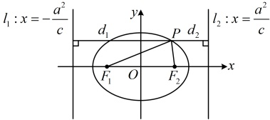

知识点 3：椭圆的第二定义

平面上到定点和到不过该定点的定直线的距离之比等于常数 $ e(0<e<1) $的点的轨迹是椭圆，该定点是椭圆的焦点，定直线是与焦点对应的准线，常数e即为椭圆的离心率.

以焦点在 x 轴上的椭圆为例，有左焦点  $ F_{1}(-c,0) $ 和右焦点  $ F_{2}(c,0) $，与之对应的也有左准线  $ l_{1}:x=-\frac{a^{2}}{c} $ 和右准线  $ l_{2}:x=\frac{a^{2}}{c} $。如图，椭圆上任意一点 P 满足  $ \frac{|PF_{1}|}{d_{1}}=\frac{|PF_{2}|}{d_{2}}=e $，其中  $ d_{1} $， $ d_{2} $ 分别表示点 P 到左准线  $ l_{1} $ 和右准线  $ l_{2} $ 的距离。

由椭圆的第二定义，上图中椭圆上的点构成的集合可

以表示为 $ \left\{P\left|\frac{|PF_1|}{d_1}=e,0<e<1\right.\right\} $或 $ \left\{P\left|\frac{|PF_2|}{d_2}=e,0<e<1\right.\right\} $。

【例 6】已知椭圆  $ C $: $ \frac{x^2}{2}+y^2=1 $ 的右焦

点为  $ F $，直线  $ l:x=2 $，点  $ P $ 在椭圆  $ C $

上，证明：点  $ P $ 到  $ F $ 的距离与  $ P $ 到直

线  $ l $ 的距离之比为常数。

证明：结论涉及的两个距离都能用点  $ P $ 的坐标表示，故设点  $ P $ 的坐标处理，

设  $ P(x_0, y_0) $，由题意，半焦距  $ c = \sqrt{a^2 - b^2} = \sqrt{2 - 1} = 1 $，所以  $ F(1, 0) $，故  $ |PF| = \sqrt{(1 - x_0)^2 + (0 - y_0)^2} = \sqrt{x_0^2 - 2x_0 + 1 + y_0^2} $，

设点  $ P $ 到直线  $ l $ 的距离为  $ d $，则  $ d = |x_0 - 2| $，

所以  $ \frac{|PF|}{d} = \frac{\sqrt{x_0^2 - 2x_0 + 1 + y_0^2}}{|x_0 - 2|} $ ①，

式①涉及  $ x_0 $， $ y_0 $ 两个变量，要进一步化简，

考虑消元，可利用椭圆方程来消元，观察发

现  $ y_0 $ 只有平方项，故消  $ y_0 $，

由点  $ P $ 在椭圆  $ C $ 上可得  $ \frac{x_0^2}{2} + y_0^2 = 1 $，

所以  $ y_0^2 = 1 - \frac{x_0^2}{2} $，代入①得  $ \frac{|PF|}{d} = \frac{\sqrt{x_0^2 - 2x_0 + 1 + 1 - \frac{x_0^2}{2}}}{|x_0 - 2|} = \frac{\sqrt{2}}{2} \cdot \frac{\sqrt{x_0^2 - 4x_0 + 4}}{|x_0 - 2|} = \frac{\sqrt{2}}{2} \cdot \frac{\sqrt{(x_0 - 2)^2}}{|x_0 - 2|} $，

故结论成立。

## 本节核心题型

椭圆的简单几何性质涉及的概念较多，考查的难度跨度较大。本节我们先设计了类型Ⅰ来帮助大家强化对椭圆简单几何性质有关概念的理解；在各大性质中，离心率是常考的性质，于是我们又设计了类型Ⅱ由浅入深地讲解离心率问题；另外，椭圆有关的诸多难题会涉及直线与椭圆的位置关系，所以我们设计了类型Ⅲ来给大家初步分析直线与椭圆的位置关系的判断方法和椭圆弦长的计算方法；最后，我们还设计了一类基于椭圆方程的距离最值问题，让大家熟悉椭圆上动点的设法。

类型Ⅰ：考查椭圆简单几何性质的基础题

【例 7】根据下列条件分别求椭圆的标准方程.