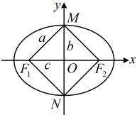
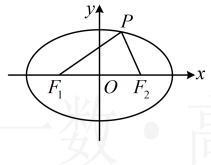

对称性可知 $ |MF_2|=a $，所以称 $ \triangle OMF_1 $为椭圆的特征三角形，由对称性， $ \triangle OMF_2 $， $ \triangle ONF_1 $， $ \triangle ONF_2 $也都是椭圆的特征三角形。

### 2. 焦点三角形

如图，设 $ F_{1} $和 $ F_{2} $是椭圆的两个焦点，P为椭圆上的任意一点，当 $ P,\quad F_{1},\quad F_{2} $三点不在同一条直线上时，这三点会构成一个三角形，我们把这个三角形称为椭圆的焦点三角形，与焦点三角形有关的问题，常联系椭圆定义处理.

解析：由题意，点 A 在椭圆的内部，

所以 $ \frac{(\sqrt{2})^{2}}{4}+m^{2}<1 $，解得： $ -\frac{\sqrt{2}}{2}<m<\frac{\sqrt{2}}{2} $.

答案： $ \left(-\frac{\sqrt{2}}{2},\frac{\sqrt{2}}{2}\right) $

## 知识点4

【例 7】已知椭圆 $ \frac{x^{2}}{49}+\frac{y^{2}}{24}=1 $的左、右焦点分别为 $ F_{1} $， $ F_{2} $，椭圆C上有一点P，则 $ \triangle PF_{1}F_{2} $的周长为___.

解析：由 $ \frac{x^{2}}{49}+\frac{y^{2}}{24}=1 $可得 $ a^{2}=49 $， $ b^{2}=24 $，所以 $ c^{2}=a^{2}-b^{2}=49-24=25 $，结合a,c>0可得a=7，c=5，所以 $ \left|F_{1}F_{2}\right|=2c=10 $，由椭圆的定义，点P到 $ F_{1} $， $ F_{2} $的距离之和 $ \left|PF_{1}\right|+\left|PF_{2}\right|=2a=2\times7=14 $，所以 $ \triangle PF_{1}F_{2} $的周长 $ L=\left|PF_{1}\right|+\left|PF_{2}\right|+\left|F_{1}F_{2}\right|=14+10=24 $.

答案：24

## 本节核心题型

本节的核心内容为椭圆定义和椭圆的标准方程. 我们先设计了类型 I 和类型 II、III 这三组题来巩固与它们相关的一些基本概念；对于椭圆，它的产生方法是多种多样的，所以我们通过类型IV来给大家归纳几种常见的与椭圆相关的求轨迹方程问题；最后，椭圆定义还可能结合平面几何出题，所以我们又设计了类型V这一组题来给大家归纳几种常见的定义与几何性质综合的考题.

## 类型 I：椭圆定义的简单应用

【例 8】已知动点  $ M(x,y) $ 满足  $ \sqrt{(x+3)^2+y^2}+\sqrt{(x-3)^2+y^2}=10 $，则动点  $ M $ 的轨迹方程是___。

解析：所给等式左边两个根式都可表示两点间的距离，故左边可看成距离之和，于是联想到椭圆定义，记  $ F_1(-3,0) $， $ F_2(3,0) $，则  $ \sqrt{(x+3)^2+y^2}+\sqrt{(x-3)^2+y^2}=\left|MF_1\right|+\left|MF_2\right|=10>\left|F_1F_2\right|=6 $，

所以动点  $ M $ 的轨迹是以  $ F_1 $， $ F_2 $ 为焦点的椭圆，可设其方程为  $ \frac{x^2}{a^2}+\frac{y^2}{b^2}=1(a>b>0) $，则  $ 2a=10 $，所以  $ a=5 $，

且椭圆的半焦距  $ c=3 $，所以  $ b=\sqrt{a^2-c^2}=\sqrt{5^2-3^2}=4 $，故动点  $ M $ 的轨迹方程为  $ \frac{x^2}{25}+\frac{y^2}{16}=1 $。

答案： $ \frac{x^{2}}{25}+\frac{y^{2}}{16}=1 $

【反思】若动点到两定点的距离之和为定值，且该定值大于两定点之间的距离，那么动点的轨迹就是椭圆．如