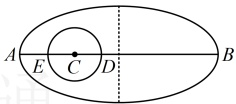

综上所述，满足题意的椭圆的标准方程为 $ \frac{x^{2}}{9}+\frac{y^{2}}{\frac{9}{2}}=1 $或 $ \frac{y^{2}}{6}+\frac{x^{2}}{3}=1 $。

【反思】①当题干给出一些椭圆的简单几何性质，让求椭圆的标准方程时，常设椭圆的标准方程，再翻译已知条件，建立关于 $a, b, c$ 的方程组并求解，但需注意考虑焦点在哪个坐标轴上；②与椭圆 $\frac{y^2}{a^2} + \frac{x^2}{b^2} = 1 (a > b > 0)$ 共焦点的椭圆方程可设为 $\frac{y^2}{a^2 + \lambda} + \frac{x^2}{b^2 + \lambda} = 1 (\lambda > -b^2)$；类似的，与 $\frac{x^2}{a^2} + \frac{y^2}{b^2} = 1 (a > b > 0)$ 共焦点的椭圆方程则可设为 $\frac{x^2}{a^2 + \lambda} + \frac{y^2}{b^2 + \lambda} = 1 (\lambda > -b^2)$。

【变式】某飞船升空后的初始运行轨道是以地球的中心为一个焦点的椭圆，其远地点（长轴端点中离地面最远的点）距地面  $ S_{1} $，近地点（长轴端点中离地面最近的点）距地面  $ S_{2} $，地球的半径为 R，则该椭圆的短轴长为（ ）

A.  $ \sqrt{S_{1}S_{2}} $ B.  $ 2\sqrt{S_{1}S_{2}} $ C.  $ \sqrt{(S_{1}+R)(S_{2}+R)} $ D.  $ 2\sqrt{(S_{1}+R)(S_{2}+R)} $

解析：由题干直接分析椭圆的短轴长不易，可先画出图形，观察  $ S_1 $， $ S_2 $ 和  $ R $ 分别为哪些线段的长，如图，远地点  $ B $ 距地面的距离为  $ BD = S_1 $，近地点  $ A $ 距地面的距离  $ AE = S_2 $， $ CE = CD = R $，观察发现图中没有与短轴直接相关的线段长，故考虑由  $ b = \sqrt{a^2 - c^2} = \sqrt{(a + c)(a - c)} $ 求  $ b $，于是先结合图形求  $ a + c $ 和  $ a - c $，

由图可知， $ a-c=AC=AE+CE=S_2+R $， $ a+c=BC=BD+CD=S_1+R $，所以 $ b=\sqrt{(a+c)(a-c)}=\sqrt{(S_1+R)(S_2+R)} $，故椭圆的短轴长为 $ 2b=2\sqrt{(S_1+R)(S_2+R)} $。

答案：D

【例 8】已知椭圆 $ \frac{x^2}{4} + \frac{y^2}{2} = 1 $的左、右焦点分别为 $ F_1 $， $ F_2 $，点 $ P $在椭圆上，若 $ \overrightarrow{F_1P} \cdot \overrightarrow{F_2P} \leq 1 $，则点 $ P $的纵坐标的取值范围是___。

解析：条件给出  $ \overrightarrow{F_1P} \cdot \overrightarrow{F_2P} \leq 1 $，计算  $ \overrightarrow{F_1P} \cdot \overrightarrow{F_2P} $ 需要  $ \overrightarrow{F_1} $， $ \overrightarrow{F_2} $， $ P $ 的坐标，故先求  $ \overrightarrow{F_1} $， $ \overrightarrow{F_2} $ 的坐标，设  $ P $ 的坐标，由题意，椭圆的半焦距  $ c = \sqrt{4-2} = \sqrt{2} $，所以  $ F_1(-\sqrt{2}, 0) $， $ F_2(\sqrt{2}, 0) $，

设  $ P(x, y) $，则  $ \overrightarrow{F_1P} = (x + \sqrt{2}, y) $， $ \overrightarrow{F_2P} = (x - \sqrt{2}, y) $，所以  $ \overrightarrow{F_1P} \cdot \overrightarrow{F_2P} = (x + \sqrt{2})(x - \sqrt{2}) + y^2 = x^2 + y^2 - 2 $，

因为  $ \overrightarrow{F_1P} \cdot \overrightarrow{F_2P} \leq 1 $，所以  $ x^2 + y^2 - 2 \leq 1 $，故  $ x^2 + y^2 \leq 3 $ ①，

所求为 $y$ 的取值范围，故考虑消去①中的 $x$，怎么消？可用椭圆方程来消，

因为点 $P$ 在椭圆上，所以 $\frac{x^2}{4} + \frac{y^2}{2} = 1$，故 $x^2 = 4 - 2y^2$，代入①得 $4 - 2y^2 + y^2 \leq 3$，解得：$y \leq -1$ 或 $y \geq 1$ ②，

答案是 $(-\infty, -1] \cup [1, +\infty)$ 吗？别忘了椭圆方程中 $y$ 本身还有范围，所以还应考虑这一点，

因为 $P$ 在椭圆上，所以 $-b \leq y \leq b$，又 $b = \sqrt{2}$，所以 $-\sqrt{2} \leq y \leq \sqrt{2}$，结合②得 $y$ 的取值范围是 $[-\sqrt{2}, -1] \cup [1, \sqrt{2}]$

答案：$[-\sqrt{2}, -1] \cup [1, \sqrt{2}]$

【反思】椭圆是封闭的图形，椭圆 $ \frac{x^2}{a^2} + \frac{y^2}{b^2} = 1 (a > b > 0) $上的点的横坐标 $ x \in [-a, a] $，纵坐标 $ y \in [-b, b] $，当需要用到椭圆上的点的坐标时，别忘了考虑这两个范围。