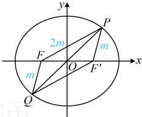

【例 9】已知 $F$ 是椭圆 $C: \frac{x^2}{4} + \frac{y^2}{3} = 1$ 的左焦点，经过坐标原点的直线与 $C$ 交于 $P$，$Q$ 两点，若 $|PF| = 2|QF|$，则 $|PQ| = $（ ）

A. $\frac{10}{3}$    B. $\frac{2\sqrt{30}}{3}$    C. $\frac{2\sqrt{31}}{3}$    D. $\frac{8\sqrt{2}}{3}$

解法1：已知的$|PF|=2|QF|$和所求的$|PQ|$都容易用点$P$的坐标表示，故可考虑设$P$的坐标处理，

由题意，椭圆的半焦距$c=\sqrt{4-3}=1$，所以$F(-1,0)$，设$P(x_0,y_0)$，如图，由对称性，$P$，$Q$关于原点对称，

所以$Q(-x_0,-y_0)$，故$|PF|=\sqrt{(x_0+1)^2+y_0^2}$，$|QF|=\sqrt{(-x_0+1)^2+(-y_0)^2}=\sqrt{(x_0-1)^2+y_0^2}$，

因为$|PF|=2|QF|$，所以$\sqrt{(x_0+1)^2+y_0^2}=2\sqrt{(x_0-1)^2+y_0^2}$，化简得：$3x_0^2-10x_0+3y_0^2+3=0$ ①，

求$|PQ|$需要$x_0$，$y_0$，已有关于$x_0$，$y_0$的1个方程，求解它们还差1个方程，可将点$P$代入椭圆方程，

因为点$P$在椭圆$C$上，所以$\frac{x_0^2}{4}+\frac{y_0^2}{3}=1$，故$y_0^2=3-\frac{3}{4}x_0^2$，代入①得$3x_0^2-10x_0+3\left(3-\frac{3}{4}x_0^2\right)+3=0$，

化简得：$3x_0^2-40x_0+48=0$，所以$(3x_0-4)(x_0-12)=0$，解得：$x_0=\frac{4}{3}$或$12$，

结合 $ -2 \leq x_0 \leq 2 $可得 $ x_0 = \frac{4}{3} $，所以 $ y_0^2 = 3 - \frac{3}{4}x_0^2 = 3 - \frac{3}{4} \times \left( \frac{4}{3} \right)^2 = \frac{5}{3} $，故 $ |PQ| = \sqrt{(-x_0 - x_0)^2 + (-y_0 - y_0)^2} = 2\sqrt{x_0^2 + y_0^2} = 2\sqrt{\left( \frac{4}{3} \right)^2 + \frac{5}{3}} = \frac{2\sqrt{31}}{3} $。

解法2：椭圆中涉及左焦点，常将右焦点取出来联合分析几何关系，

如图，设椭圆 $C$ 的右焦点为 $F'$，由椭圆的对称性，$O$ 同时为 $PQ$，$FF'$ 的中点，

所以四边形 $PFQF'$ 是平行四边形，设 $|QF|=m$，则 $|PF'|=|QF|=m$，$|PF|=2|QF|=2m$，

所以 $|PF|+|PF'|=2m+m=3m$，又由椭圆定义，$|PF|+|PF'|=2a=4$，所以 $3m=4$，故 $m=\frac{4}{3}$，

怎样求 $|PQ|$？此时 $|PF|$ 和 $|QF|$ 都有了，若能求出 $\cos\angle PFQ$，就能在 $\triangle PFQ$ 中用余弦定理求 $|PQ|$。注意到 $|FF|$

也是已知的，故可先到 $\triangle PFF'$ 中求 $\cos\angle FPF'$，再利用 $\angle PFQ$ 与 $\angle FPF'$ 互补求 $\cos\angle PFQ$，

在 $\triangle PFF'$ 中，$|FF'|=2\sqrt{4-3}=2$，$|PF|=2m=\frac{8}{3}$，$|PF|=m=\frac{4}{3}$，所以由余弦定理推论，

$$\cos\angle FPF'=-\frac{|PF|^2+|PF'|^2-|FF'|^2}{2|PF|\cdot|PF'|}=\frac{\left(\frac{8}{3}\right)^2+\left(\frac{4}{3}\right)^2-2^2}{2\times\frac{8}{3}\times\frac{4}{3}}=\frac{11}{16}，故\cos\angle PFQ=\cos(\pi-\angle FPF')=-\cos\angle FPF'=-\frac{11}{16}，$$

在$\triangle PFQ$中，$|QF|=m=\frac{4}{3}$，由余弦定理，$$|PQ|^2=|PF|^2+|QF|^2-2|PF|\cdot|QF|\cdot\cos\angle PFQ$$

$$=\left(\frac{8}{3}\right)^2+\left(\frac{4}{3}\right)^2-2\times\frac{8}{3}\times\frac{4}{3}\times\left(-\frac{11}{16}\right)=\frac{124}{9}，所以|PQ|=\frac{2\sqrt{31}}{3}.$$

答案：C

【反思】看到过原点的直线与椭圆交于P，Q两点，要想到P，Q关于原点对称，椭圆中天然有两个焦点关于原点对称，故以P，Q和两个焦点为顶点的四边形是平行四边形，有关问题常抓住这一几何特征来分析.