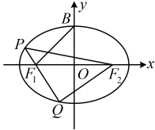

## 类型Ⅱ：椭圆的离心率问题

【例 10】已知  $ F_1 $， $ F_2 $ 分别是椭圆  $ C: \frac{x^2}{a^2} + \frac{y^2}{b^2} = 1 (a > b > 0) $ 的左、右焦点， $ B $ 是  $ C $ 的上顶点，过  $ F_1 $ 的直线交  $ C $ 于  $ P $， $ Q $ 两点， $ O $ 为坐标原点， $ \triangle OBF_1 $ 与  $ \triangle PQF_2 $ 的周长之比为  $ \frac{\sqrt{2} + 1}{4} $，则椭圆的离心率为___。

解析：条件给出了 $ \triangle OBF_{1} $与 $ \triangle PQF_{2} $的周长之比，故先尝试计算这两个三角形的周长，

 $ \triangle OBF_{1} $ 的周长为  $ \left|BF_{1}\right| + \left|OB\right| + \left|OF_{1}\right| = a + b + c $

 $$ \begin{aligned} 关于 \left|PQ\right|+\left|PF_{2}\right|+\left|QF_{2}\right|=\left|PF_{1}\right|+\left|QF_{1}\right|+\left|PF_{2}\right|+\left|QF_{2}\right|=\left(\left|PF_{1}\right|+\left|PF_{2}\right|\right)+\left(\left|QF_{1}\right|+\left|QF_{2}\right|\right)=2a+2a=4a\end{aligned} $$ 

由题意， $ \frac{a+b+c}{4a}=\frac{\sqrt{2}+1}{4} $，所以 $ b+c=\sqrt{2}a $，

离心率是 $c$ 与 $a$ 的比值，故考虑消去 $b$，可反解出 $b$ 再平方，

所以 $b = \sqrt{2}a - c$，故 $b^2 = 2a^2 - 2\sqrt{2}ac + c^2$，

结合 $b^2 = a^2 - c^2$ 可得 $a^2 - c^2 = 2a^2 - 2\sqrt{2}ac + c^2$，化简得：$2c^2 - 2\sqrt{2}ac + a^2 = 0$，

两端同除以 $a^2$ 得 $2e^2 - 2\sqrt{2}e + 1 = 0$，所以 $(\sqrt{2}e - 1)^2 = 0$，解得：$e = \frac{\sqrt{2}}{2}$。

答案 $\sqrt{2}$

答案： $ \frac{\sqrt{2}}{2} $

【变式 1】已知椭圆 $ \frac{x^2}{a^2} + \frac{y^2}{b^2} = 1 (a > b > 0) $的右焦点为 $ F(c,0) $，点 $ P $， $ Q $在直线 $ x = \frac{a^2}{c} $上， $ FP \perp FQ $， $ O $为坐标原点，若 $ \overrightarrow{OP} \cdot \overrightarrow{OQ} = 2\overrightarrow{OF}^2 $，则该椭圆的离心率为（ ）

A.  $ \frac{2}{3} $  

B.  $ \frac{\sqrt{6}}{3} $  

C.  $ \frac{\sqrt{2}}{2} $  

D.  $ \frac{\sqrt{3}}{2} $

解析：条件 $FP \perp FQ$ 和 $OP \cdot OQ = 2OF^-$ 都可用 $P$，$Q$ 的坐标来翻译，故先设 $P$，$Q$ 的坐标，

设 $P\left(\frac{a^2}{c}, y_1\right)$，$Q\left(\frac{a^2}{c}, y_2\right)$，由 $FP \perp FQ$ 得 $k_{FP} \cdot k_{FQ} = \frac{y_1}{a^2} \cdot \frac{y_2}{c} = -1 \Rightarrow y_1 y_2 = -\left(\frac{a^2}{c} - c\right)^2 = -\frac{(a^2 - c^2)^2}{c^2}$ ①，

又 $\overrightarrow{OP} \cdot \overrightarrow{OQ} = 2\overrightarrow{OF}^2$，所以 $\frac{a^2}{c} \cdot \frac{a^2}{c} + y_1 y_2 = 2c^2$，结合式①可得 $\frac{a^4}{c^2} - \frac{(a^2 - c^2)^2}{c^2} = 2c^2$ ②，

所以 $a^4 - (a^2 - c^2)^2 = 2c^4$，从而 $(a^2 + a^2 - c^2)[a^2 - (a^2 - c^2)] = 2c^4$，故 $(2a^2 - c^2)c^2 = 2c^4$，

所以 $2a^2 - c^2 = 2c^2$，从而 $2a^2 = 3c^2$，故椭圆的离心率 $e = \frac{c}{a} = \frac{\sqrt{6}}{3}$。

答案：B

【反思】可以看到，求椭圆离心率的关键步骤是利用已知条件建立关于 a，b，c 的齐次方程。上面的两道题直接翻译题设条件就能建立关于 a，b，c 的齐次方程，有时需要分析几何关系，才能找到建立方程的方法，且这类题难度跨度大，我们通过下面几道题来逐步给大家分析。

【变式2】已知点 A, B, C 为椭圆 D 的三个顶点，若  $ \triangle ABC $ 是正三角形，则 D 的离心率是（）