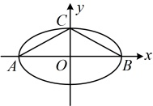
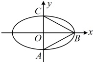
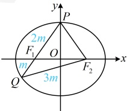

A.  $ \frac{1}{2} $ B.  $ \frac{2}{3} $ C.  $ \frac{\sqrt{6}}{3} $ D.  $ \frac{\sqrt{3}}{2} $

解析：应先画图分析  $ A $， $ B $， $ C $ 三个点中，左、右顶点和上、下顶点的个数怎样分配。题干没说椭圆的焦点在哪条坐标轴上，但这不影响椭圆的离心率，所以不妨假设椭圆的焦点在  $ x $ 轴上，

若  $ A $， $ B $， $ C $ 中有 2 个为左、右顶点，如图 1， $ \triangle ABC $ 不可能为正三角形，不合题意；

若  $ A $， $ B $， $ C $ 中有 2 个为上、下顶点，如图 2，此时  $ \triangle ABC $ 为正三角形等价于  $ \left|AC\right| = \left|AB\right| $，即  $ 2b = \sqrt{a^2 + b^2} $，

所以  $ 4b^2 = a^2 + b^2 $，故  $ a^2 = 3b^2 = 3(a^2 - c^2) $，整理得椭圆  $ D $ 的离心率  $ e = \frac{c}{2} = \frac{\sqrt{6}}{2} $。

图1

图2

答案：C

【变式 3】已知椭圆  $ C: \frac{x^2}{a^2} + \frac{y^2}{b^2} = 1 (a > b > 0) $ 的左、右焦点分别为  $ F_1 $， $ F_2 $，过  $ F_1 $ 的直线  $ l $ 与椭圆  $ C $ 交于  $ P $， $ Q $ 两点，若  $ |PF_1| = 2|QF_1| $， $ |PQ| = |QF_2| $，则椭圆  $ C $ 的离心率为（ ）

A.  $ \frac{\sqrt{2}}{2} $ B.  $ \frac{\sqrt{3}}{3} $ C.  $ \frac{\sqrt{5}}{5} $ D.  $ \frac{1}{2} $

解析：题设条件涉及椭圆上的点  $ P $， $ Q $ 到焦点的距离，考虑联系椭圆定义处理，可先设一段长，并用它表示其它线段的长，

设  $ |QF_1| = m $，则由题意， $ |PF_1| = 2|QF_1| = 2m $， $ |QF_2| = |PQ| = |PF_1| + |QF_1| = 3m $，

由椭圆定义， $ |QF_1| + |QF_2| = m + 3m = 2a $，所以  $ m = \frac{a}{2} $，故  $ |PF_1| = 2m = a $，

又  $ |PF_1| + |PF_2| = 2a $，所以  $ |PF_2| = 2a - |PF_1| = a $，故  $ P $ 为椭圆的一个短轴端点，

由于  $ |F_1F_2| = 2c $，所以图中所有线段的长都有了，怎样建立方程求离心率？有长度，

可用余弦定理推论求角，观察图形发现  $ \angle PF_1O $ 和  $ \angle QF_1F_2 $ 互补，故可在上下两个三角形中分别计算  $ \cos \angle PF_1O $ 和  $ \cos \angle QF_1F_2 $，从而建立方程求离心率，在  $ \triangle POF_1 $ 中， $ \cos \angle PF_1O = \frac{|OF_1|}{|PF_1|} = \frac{c}{a} $，

在  $ \triangle QF_1F_2 $ 中，由余弦定理推论， $ \cos \angle QF_1F_2 = \frac{|QF_1|^2 + |F_1F_2|^2 - |QF_2|^2}{2|QF_1| \cdot |F_1F_2|} = \frac{\left(\frac{a}{2}\right)^2 + (2c)^2 - \left(\frac{3a}{2}\right)^2}{2 \times \frac{a}{2} \times 2c} = \frac{2c^2 - a^2}{ac} $，

由图可知， $ \angle PF_1O = \pi - \angle QF_1F_2 $，所以  $ \cos \angle PF_1O = \cos(\pi - \angle QF_1F_2) = -\cos \angle QF_1F_2 $，故  $ \frac{c}{a} = -\frac{2c^2 - a^2}{ac} $，

化简得： $ a^2 = 3c^2 $，所以椭圆  $ C $ 的离心率  $ e = \frac{c}{a} = \frac{\sqrt{3}}{3} $。

答案：B

【反思】当获得了图中有关线段的长度时，常像本题这样选择两个互补的角，分别到两个三角形中计算它们的余弦值（也可以选择同一个角，到两个三角形中分别求其余弦值，比如后面的变式4的解法1），从而建立方程，此法俗称“双余弦法”，在必修二的解三角形那一章中，我们已经介绍过它了。