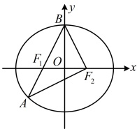
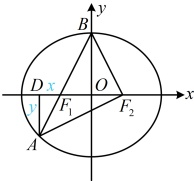

【变式 4】设  $ F_1 $， $ F_2 $ 分别为椭圆  $ C: \frac{x^2}{a^2} + \frac{y^2}{b^2} = 1 (a > b > 0) $ 的左、右焦点， $ B $ 为椭圆  $ C $ 的上顶点，直线  $ BF_1 $ 与椭圆  $ C $ 的另一个交点为  $ A $。若  $ \overrightarrow{AF_2} \cdot \overrightarrow{BF_2} = 0 $，则椭圆  $ C $ 的离心率为___。

解法1：如图1，$A$，$B$两点都在椭圆上，又涉及左、右焦点，故考虑椭圆定义。可先设一段长，看能否用它表示其它线段的长，由题意，$|BF_1|=|BF_2|=a$，设$|AF_1|=m$，则由椭圆定义，$|AF_1|+|AF_2|=2a$，所以$|AF_2|=2a-|AF_1|=2a-m$，因为$\overrightarrow{AF_2}\cdot\overrightarrow{BF_2}=0$，所以$AF_2\perp BF_2$，怎样翻译这一垂直关系？有长度，考虑用勾股定理翻译，在$\triangle ABF_2$中，$|AB|=|AF_1|+|BF_1|=m+a$，且$|AF_2|^2+|BF_2|^2=|AB|^2$，所以$(2a-m)^2+a^2=(m+a)^2$，化简得：$m=\frac{2a}{3}$，所以$|AF_1|=\frac{2a}{3}$，$|AF_2|=2a-m=\frac{4a}{3}$，$|AB|=m+a=\frac{5a}{3}$，由于$|F_1F_2|=2c$，所以所有线段的长都有了，怎样建立方程求离心率？可考虑用“双余弦法”，在$\triangle AF_1F_2$中，由余弦定理推论，$\cos\angle F_1AF_2=\frac{|AF_1|^2+|AF_2|^2-|F_1F_2|^2}{2|AF_1|\cdot|AF_2|}$，$\frac{4a^2}{9}+\frac{16a^2}{9}-4c^2=\frac{5}{4}-\frac{9c^2}{4a^2}$，在$\triangle ABF_2$中，$\cos\angle BAF_2=\frac{|AF_2|}{|AB|}=\frac{\frac{4a}{3}}{\frac{5a}{3}}=\frac{4}{5}$，由图可知，$\angle F_1AF_2=\angle BAF_2$，所以$\frac{5}{4}-\frac{9c^2}{4a^2}=\frac{4}{r}$，化简得椭圆$C$的离心率$e=\frac{c}{r}=\frac{\sqrt{5}}{r^2}$。解法2：按解法1求得有关线段的长度后，也可抓住$\angle ABF_2=2\angle OBF_2$，利用余弦的二倍角公式来建立方程求离心率，由$AF_2\perp BF_2$可得$\cos\angle ABF_2=\frac{|BF_2|}{|AB|}=\frac{a}{\frac{5a}{3}}=\frac{3}{5}$，又$\cos\angle ABF_2=\cos2\angle OBF_2=1-2\sin^2\angle OBF_2$，$1-2\left(\frac{|OF_2|}{|BF_2|}\right)^2=1-2\left(\frac{c}{a}\right)^2$，所以$1-2\left(\frac{c}{a}\right)^2=\frac{3}{5}$，故椭圆$C$的离心率$e=\frac{c}{a}=\frac{\sqrt{5}}{5}$。

解法3：若能将点$A$的坐标用$a, b, c$表示，则将其代入椭圆方程，也能求出离心率，怎样求$A$的坐标？如果用$B$和$F_1$写出直线$BF_1$的方程，与椭圆联立求$A$，则较麻烦，注意到图中有大量垂直，故可考虑分析几何关系，如图2，作$AD \perp x$轴于点$D$，因为$\overrightarrow{AF_2} \cdot \overrightarrow{BF_2} = 0$，所以$AF_2 \perp BF_2$，故$\angle AF_2D + \angle BF_2D = \angle AF_2B = 90^\circ$，另一方面，由$\angle BOF_2 = 90^\circ$可得$\angle OBF_2 + \angle BF_2D = 90^\circ$，所以$\angle AF_2D = \angle OBF_2$，故$\tan \angle AF_2D = \tan \angle OBF_2$，设$|DF_1| = x$，$|AD| = y$，则$\tan \angle AF_2D = \frac{|AD|}{|DF_2|} = \frac{y}{x + 2c}$，又$\tan \angle OBF_2 = \frac{|OF_2|}{|OB|} = \frac{c}{b}$，所以$\frac{y}{x + 2c} = \frac{c}{b}$①，由图2可知，$\triangle AF_1D \sim \triangle BF_1O$，所以$\frac{|AD|}{|OB|} = \frac{|DF_1|}{|OF_1|}$，故$\frac{y}{b} = \frac{x}{c}$，结合①可解得：$x = \frac{2c^3}{b^2 - c^2}$，$y = \frac{2bc^2}{b^2 - c^2}$，所以$|OD| = |DF_1| + |OF_1| = x + c$，$\frac{c^3 + b^2c}{b^2 - c^2} = \frac{(c^2 + b^2)c}{b^2 - c^2} = \frac{a^2c}{b^2 - c^2}$，故$A\left(-\frac{a^2c}{b^2 - c^2}, -\frac{2bc^2}{b^2 - c^2}\right)$，因为$A$在椭圆上，所以$\frac{1}{a^2}\left(-\frac{a^2c}{b^2 - c^2}\right)^2 + \frac{1}{b^2}\left(-\frac{2bc^2}{b^2 - c^2}\right)^2 = 1$，化简得：$a^2c^2 + 4c^4 = (b^2 - c^2)^2$，所以$a^2c^2 + 4c^4 = (a^2 - 2c^2)^2 = a^4 - 4a^2c^2 +$

图2

