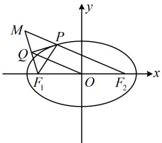
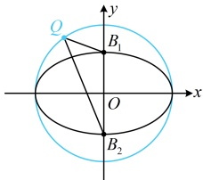
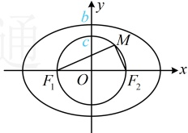

图1

图2

答案：C

【反思】本题的计算量虽然不大，但思维量不小，遇到“角平分线+垂线”的情况，常考虑利用“三线合一”构造等腰三角形，这种添加辅助线的方法可以留个印象。

【例 11】已知  $ F_1 $， $ F_2 $ 是椭圆的两个焦点，满足  $ \overrightarrow{MF_1 \cdot MF_2} = 0 $ 的点  $ M $ 总在椭圆内部，则椭圆离心率的取值范围是（ ）

A.  $ \left(0, \frac{1}{2}\right) $ \quad B.  $ \left(0, \frac{\sqrt{2}}{2}\right) $ \quad C.  $ \left(\frac{1}{2}, \frac{\sqrt{2}}{2}\right) $ \quad D.  $ \left(\frac{\sqrt{2}}{2}, 1\right) $

解析：求离心率需建立关于  $ a $,  $ b $,  $ c $ 的齐次方程，那求离心率的范围呢？当然考虑建立关于  $ a $,  $ b $,  $ c $ 的齐次不等式，如何建立？由  $ \overrightarrow{MF_1} \cdot \overrightarrow{MF_2} = 0 $ 联想到  $ M $ 的轨迹是圆，故可尝试画图分析怎样能使该圆在椭圆内，因为  $ \overrightarrow{MF_1} \cdot \overrightarrow{MF_2} = 0 $，所以  $ M\overrightarrow{F_1} \perp M\overrightarrow{F_2} $，故点  $ M $ 在以  $ F_1\overrightarrow{F_2} $ 为直径的圆上，

由题意，该圆在椭圆内部，如图，应有圆的半径小于短半轴长，即  $ c < b $，

所以  $ c^2 < b^2 = a^2 - c^2 $，从而  $ 2c^2 < a^2 $，故  $ e = \frac{c}{a} < \frac{\sqrt{2}}{2} $，结合  $ 0 < e < 1 $ 得  $ 0 < e < \frac{\sqrt{2}}{2} $

答案：B

【反思】与求离心率类似，对于求离心率的范围这类问题，核心是翻译已知条件，建立关于a, b, c的齐次不等式。在有的题中，题干会给出某变量的范围，这种情况下也可以考虑将离心率用该变量表示，再用函数或不等式的方法分析离心率的取值范围，比如下面的变式。

【变式】已知  $ F_1 $， $ F_2 $ 分别为椭圆的左、右焦点， $ P $ 是椭圆上一点， $ \angle PF_1F_2 = 3\angle PF_2F_1 $， $ \angle PF_2F_1 \in \left(\frac{\pi}{6}, \frac{\pi}{4}\right) $，则椭圆离心率的取值范围为___。

解析：如图，设  $ \angle PF_2F_1 = \alpha $，则  $ \alpha \in \left( \frac{\pi}{6}, \frac{\pi}{4} \right) $，且  $ \angle PF_1F_2 = 3\angle PF_2F_1 = 3\alpha $， $ \angle F_1PF_2 = \pi - 4\alpha $，

至此$\triangle PF_1F_2$的三个内角均用$\alpha$表示出来了，且条件给出了$\alpha$的范围，故考虑把离心率用$\alpha$表示。离心率$e = \frac{c}{a}$与$\triangle PF_1F_2$的边长有关，怎样建立边长与内角的关系？考虑到已表示出3个内角，可用正弦定理沟通边角，在$\triangle PF_1F_2$中，由正弦定理，$\frac{\left|F_1F_2\right|}{\sin(\pi - 4\alpha)} = \frac{\left|PF_1\right|}{\sin\alpha} = \frac{\left|PF_2\right|}{\sin3\alpha}$，

看到  $ |PF_{1}| $ 和  $ |PF_{2}| $，想到椭圆定义，故把后面两个分式相加，

由等比性质， $ \frac{|F_1F_2|}{\sin(\pi-4\alpha)}=\frac{|PF_1|+|PF_2|}{\sin\alpha+\sin3\alpha} $，所以 $ \frac{2c}{\sin4\alpha}=\frac{2a}{\sin\alpha+\sin3\alpha} $，故离心率 $ e=\frac{c}{a}=\frac{\sin4\alpha}{\sin\alpha+\sin3\alpha} $ ①，式①涉及 $ \alpha $， $ 3\alpha $， $ 4\alpha $三个角，为了统一角度，可将 $ 3\alpha $换成 $ \alpha+2\alpha $，将 $ 4\alpha $看成 $ 2\times2\alpha $，把式①展开再化简