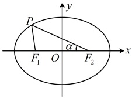

所以 $ e=\frac{2\sin2\alpha\cos2\alpha}{\sin\alpha+\sin\alpha\cos2\alpha+\cos\alpha\sin2\alpha}=\frac{2\sin2\alpha\cos2\alpha}{\sin\alpha(1+\cos2\alpha)+\cos\alpha\sin2\alpha}=\frac{2\sin2\alpha\sin2\alpha+\cos2\alpha\cos2\alpha\cos\alpha\sin2\alpha}{2\sin2\alpha\cos2\alpha\cos\alpha\sin2\alpha\cos\alpha\sin2\alpha}=\frac{2\sin2\alpha\cos2\alpha\cos2\alpha\cos2\alpha\sin2\alpha\cos\alpha\sin2\alpha\cos\alpha\sin2\alpha\cos\alpha\sin2\alpha}{2\sin2\alpha\cos2\alpha\cos\alpha\sin2\alpha\cos\alpha\sin2\alpha\cos\alpha\sin2\alpha\cos\alpha\sin2\alpha\cos\alpha\sin2\alpha} $

 $ e=\frac{2\sin2\alpha\cos2\alpha}{\sin2\alpha\cos2\alpha+\cos2\alpha\sin2\alpha}=\frac{2\sin2\alpha\cos2\alpha}{2\sin2\alpha\cos2\alpha\cos\alpha}=\frac{\cos2\alpha\cos2\alpha-1}{\cos2\alpha}=\frac{2\cos2\alpha-1}{\cos2\alpha}=\frac{1}{2\cos2\alpha\cos2\alpha\cos\alpha\sin2\alpha\cos\alpha\sin2\alpha\cos\alpha\sin2\alpha\cos\alpha\sin2\alpha} $

观察发现 $ \alpha $以 $ \cos\alpha $整体出现，故可考虑将其换元，简化上式，再分析取值范围，令 $ t=\cos\alpha $，则 $ e=2t-\frac{1}{t} $，因为 $ \alpha\in\left(\frac{\pi}{6},\frac{\pi}{4}\right) $，所以 $ t=\cos\alpha\in\left(\frac{\sqrt{2}}{2},\frac{\sqrt{3}}{2}\right) $，因为函数 $ f(t)=2t-\frac{1}{t} $在 $ \left(\frac{\sqrt{2}}{2},\frac{\sqrt{3}}{2}\right) $上 $ \nearrow $，且 $ f\left(\frac{\sqrt{2}}{2}\right)=2\times\frac{\sqrt{2}}{2}-\frac{2}{\sqrt{2}}=0 $， $ f\left(\frac{\sqrt{3}}{2}\right)=2\times\frac{\sqrt{3}}{2}-\frac{2}{\sqrt{3}}=\frac{\sqrt{3}}{3} $，所以 $ e\in\left(0,\frac{\sqrt{3}}{3}\right) $。答案： $ \left(0,\frac{\sqrt{3}}{3}\right) $

## 类型III：直线与椭圆的位置关系

【例 12】已知直线  $ l: y = -x + t (t \in \mathbf{R}) $ 和椭圆  $ C: \frac{x^2}{3} + y^2 = 1 $。

（1）讨论直线  $ l $ 与椭圆  $ C $ 的交点个数；

（2）若  $ t = 1 $，求直线  $ l $ 被椭圆  $ C $ 截得的弦长。

解：（1）（可以想象，椭圆的形状不如圆规则，所以不能像研究直线与圆的位置关系那样用几何法（比较圆心到直线的距离 $d$ 与半径 $r$ 的大小）研究直线与椭圆的位置关系，只能考虑代数法，即联立二者的方程来分析）

将 $y = -x + t$ 代入 $\frac{x^2}{3} + y^2 = 1$ 消去 $y$ 整理得： $4x^2 - 6tx + 3t^2 - 3 = 0$ ①，

（直线 $l$ 与椭圆 $C$ 的交点个数由方程①的解的个数决定，故计算该方程的判别式，再讨论）

方程①的判别式 $\Delta = (-6t)^2 - 4 \times 4 \times (3t^2 - 3) = 12(4 - t^2)$，

当 $\Delta > 0$，即 $-2 < t < 2$ 时，方程①有 2 个实根，所以直线 $l$ 与椭圆 $C$ 有 2 个交点；

当 $\Delta = 0$，即 $t = \pm 2$ 时，方程①有且仅有 1 个实根，所以直线 $l$ 与椭圆 $C$ 有且仅有 1 个交点；

当 $\Delta < 0$，即 $t < -2$ 或 $t > 2$ 时，方程①没有实根，所以直线 $l$ 与椭圆 $C$ 没有交点。

（2）（求直线被椭圆截得的弦长，考虑弦长公式  $ L=\sqrt{1+k^2}\cdot|x_1-x_2| $ 或  $ L=\sqrt{1+m^2}\cdot|y_1-y_2| $，如何选择？第（1问联立直线和椭圆方程时，我们消去的是  $ y $，故选前者，下面先用韦达定理推论求  $ |x_1-x_2| $）

当  $ t=1 $ 时，由（1）得方程①的判别式  $ \Delta=12(4-t^2)=12\times(4-1^2)=36 $，所以由韦达定理推论， $ \left|x_1-x_2\right|=\frac{\sqrt{\Delta}}{|a|}=\frac{\sqrt{36}}{|4|}=\frac{3}{2} $，故由弦长公式，直线  $ l $ 被椭圆  $ C $ 截得的弦长  $ L=\sqrt{1+k^2}\cdot|x_1-x_2|=\sqrt{1+(-1)^2}\times\frac{3}{2}=\frac{3\sqrt{2}}{2} $。

【反思】①研究直线和椭圆的交点个数，可联立二者方程，消去 $y$ 或 $x$，得到关于 $x$ 或 $y$ 的一元二次方程，该方程解的个数即为直线和椭圆的交点个数；②对于椭圆的弦长，常用公式 $L = \sqrt{1 + k^2} \cdot |x_1 - x_2| = \sqrt{1 + m^2} \cdot |y_1 - y_2|$ 计算，其中的 $|x_1 - x_2|$ 和 $|y_1 - y_2|$ 常通过联立直线和椭圆的方程，用韦达定理推论计算。但有时直接计算点的坐标也很方便，所以公式的选择要视情况而定，我们来看一个变式。

【变式】已知过椭圆 $ \frac{x^2}{4}+y^2=1 $左顶点 $ A $的直线 $ l $与椭圆交于另一点 $ B $，若 $ \left|AB\right|=\frac{4\sqrt{2}}{5} $，求直线 $ l $