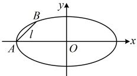

的方程.

解：如图，由题意，椭圆的长半轴长 a=2，所以左顶点 A 的坐标为  $ (-2,0) $，

（已有直线 $l$ 上的一个点，且该点在 $x$ 轴上，可考虑设 $l$ 的横截式方程，用 $L = \sqrt{1 + m^2} \cdot |y_1 - y_2|$ 计算 $|AB|$，结合已知建立方程求 $m$，但需注意，横截式方程不能表示与 $y$ 轴垂直的直线，故需单独考虑此情形）

当直线 $l$ 垂直于 $y$ 轴时，$|AB| = 2a = 4 \neq \frac{4\sqrt{2}}{5}$，不合题意；当直线 $l$ 不垂直于 $y$ 轴时，可设其方程为 $x = my - 2$，代入 $\frac{x^2}{4} + y^2 = 1$ 消去 $x$ 整理得：$(m^2 + 4)y^2 - 4my = 0$，解得：$y = 0$ 或 $\frac{4m}{m^2 + 4}$，

（由于 $A$ 的纵坐标是 $0$，所以 $B$ 的纵坐标是 $\frac{4m}{2}$，有了坐标，直接代入 $L = \sqrt{1 + m^2} \cdot |y_1 - y_2|$ 就能得到弦长）

由弦长公式，$|AB| = \sqrt{1 + m^2} \cdot |y_A - y_B| = \sqrt{1 + m^2} \cdot \left|0 - \frac{4m}{m^2 + 4}\right| = \frac{4|m|\sqrt{1 + m^2}}{m^2 + 4}$，

又由题意， $ |AB|=\frac{4\sqrt{2}}{5} $，所以 $ \frac{4|m|\sqrt{1+m^2}}{m^2+4}=\frac{4\sqrt{2}}{5} $，故 $ 5|m|\sqrt{1+m^2}=\sqrt{2}(m^2+4) $，

 $$ 25m^{2}(1+m^{2})=2(m^{4}+8m^{2}+16) $$ 

 $$ 23m^{4}+9m^{2}-32=0 $$ 

故 $ (23m^{2}+32)(m^{2}-1)=0 $，解得： $ m=\pm1 $，所以直线l的方程为 $ x=\pm y-2 $，即x-y+2=0或 $ x+y+2=0 $。

## 类型IV：基于椭圆方程的一类距离最值问题

【例 13】已知  $ P $ 是椭圆  $ C: \frac{x^2}{5} + y^2 = 1 $ 上的动点， $ B $ 是椭圆  $ C $ 的上顶点，则  $ |PB| $ 的最大值为___。

解法 1： $ |PB| $ 可由  $ P $、 $ B $ 的坐标计算，故可考虑先求  $ B $ 的坐标。设  $ P $ 的坐标。

由所给方程可知椭圆 $C$ 的上顶点为 $B(0,1)$，设 $P(x_0,y_0)$，则 $|PB|=\sqrt{(0-x_0)^2+(1-y_0)^2}=\sqrt{x_0^2+y_0^2-2y_0}+1$ ①，

式①有 $x_0$，$y_0$ 两个变量，考虑消元，点 $P$ 在椭圆 $C$ 上，其坐标满足椭圆的方程，故可由此来消元，消谁？由于 $x_0$ 只有平方项，故消 $x_0$ 比较方便，

将 $P(x_0,y_0)$ 代入椭圆 $C$ 的方程得 $\frac{x_0^2}{5}+y_0^2=1$，所以 $x_0^2=5-5y_0^2$，代入①得 $|PB|=\sqrt{5-5y_0^2+y_0^2-2y_0}+1$

$=\sqrt{-4y_0^2-2y_0+6}=\sqrt{-4\left(y_0+\frac{1}{4}\right)^2+\frac{25}{4}}$，因为 $-1\leq y_0\leq1$，所以当 $y_0=-\frac{1}{4}$ 时，$|PB|$ 取得最大值 $\frac{5}{2}$。

解法2：椭圆的方程为平方和等于常数这种结构，也可考虑利用三角换元，将 $P$ 的坐标设为三角形式，

椭圆 $C$ 的方程可化为 $\left(\frac{x}{\sqrt{5}}\right)^2 + y^2 = 1$，令 $\begin{cases} \frac{x}{\sqrt{5}} = \cos\theta \\ y = \sin\theta \end{cases}$ 得 $\begin{cases} x = \sqrt{5} \cos\theta \\ y = \sin\theta \end{cases}$，点 $P$ 在 $C$ 上，故可设 $P(\sqrt{5} \cos\theta, \sin\theta)$，

又椭圆 $C$ 的上顶点为 $B(0,1)$，所以 $|PB| = \sqrt{(0 - \sqrt{5} \cos\theta)^2 + (1 - \sin\theta)^2} = \sqrt{5 \cos^2 \theta + 1 - 2 \sin\theta + \sin^2 \theta}$，

观察发现若将$\cos^2\theta$换成$1-\sin^2\theta$，则可将函数名统一成$\sin\theta$，再换元化二次函数分析最值。所以$|PB|=\sqrt{5(1-\sin^2\theta)+1-2\sin\theta+\sin^2\theta}=\sqrt{-4\sin^2\theta-2\sin\theta+6}$，令$t=\sin\theta$，则$-1\leq t\leq1$，且$|PB|=\sqrt{-4t^2-2t+6}=\sqrt{-4\left(t+\frac{1}{4}\right)^2+\frac{25}{4}}$，所以当$t=-\frac{1}{4}$时，$|PB|$取得最大值$\frac{5}{2}$。

答案： $ \frac{5}{2} $

【反思】与椭圆上的动点有关的最值问题，一种常用的思路是将动点坐标设为 $ (x_0, y_0) $，由此表示求最值的目标量，再利用椭圆的方程来消元分析最值；也可根据椭圆的方程 $ \frac{x^2}{a^2} + \frac{y^2}{b^2} = 1 $直接将动点的坐标设为 $ (a\cos\theta, b\sin\theta) $这种单变量形式，进而将求最值的目标表示成关于 $ \theta $的三角函数来分析最值。本题所求为椭圆上动点到定点的