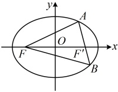
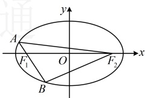

果点在椭圆上，也可以由椭圆的定义得到椭圆上的点到两焦点的距离之和为定值，我们常利用这一点对椭圆上的点到焦点的距离进行转化，比如下面的变式1和变式2.

【变式 1】已知椭圆 $ \Gamma:\frac{x^2}{4}+\frac{y^2}{2}=1 $的左焦点为 $ F $， $ A $， $ B $为椭圆上两点，且直线 $ AB $经过椭圆的右焦点，则 $ \triangle FAB $的周长为___.

解析：如图，$\triangle FAB$ 的周长即 $|AF| + |BF| + |AB|$，显然无法单独求出这三条线段的长，怎么办呢？注意到 $A, B$ 在椭圆上，又涉及椭圆的焦点，故考虑联系椭圆定义处理，

由所给椭圆的方程可知  $ a^2 = 4 $，结合  $ a > 0 $ 可得  $ a = 2 $，设椭圆  $ \Gamma $ 的右焦点为  $ F' $，因为  $ A $， $ B $ 是椭圆上的点，所以由椭圆的定义， $ |AF| + |AF'| = 2a = 4 $，同理， $ |BF| + |BF'| = 4 $，所以  $ \triangle FAB $ 的周长  $ L = |AF| + |BF| + |AB| = |AF| + |AF'| + |BF| + |BF'| = 4 + 4 = 8 $。

答案：8

【变式 2】已知  $ F_1 $， $ F_2 $ 为椭圆  $ \frac{x^2}{25} + \frac{y^2}{9} = 1 $ 的两个焦点，过  $ F_1 $ 的直线交椭圆于  $ A $， $ B $ 两点，若  $ |F_2A| + |F_2B| = 12 $，则  $ |AB| = $ ___。

解析：题设条件涉及椭圆上的  $ A $， $ B $ 两点到焦点  $ F_2 $ 的距离，想到联系椭圆的定义处理，可先把定义式写出来，由  $ \frac{x^2}{25} + \frac{y^2}{9} = 1 $ 可知  $ a^2 = 25 $，结合  $ a > 0 $ 可知  $ a = 5 $，由椭圆的定义， $ \begin{cases}|F_1A| + |F_2A| = 2a = 10\①|F_1B| + |F_2B| = 2a = 10\②\end{cases} $，

条件给出的是 $ \left|F_{2}A\right|+\left|F_{2}B\right| $，故考虑将上述两式相加，再观察形式，

将①②相加得 $ \left|F_{1}A\right|+\left|F_{2}A\right|+\left|F_{1}B\right|+\left|F_{2}B\right|=20 $，结合 $ \left|F_{2}A\right|+\left|F_{2}B\right|=12 $可得

 $ \left|F_{1}A\right|+\left|F_{1}B\right|=20-\left(\left|F_{2}A\right|+\left|F_{2}B\right|\right)=20-12=8 $，由图可知 $ \left|AB\right|=\left|F_{1}A\right|+\left|F_{1}B\right|=8 $。

答案：8

【反思】从上面两个变式可以看出，当已知条件或所求涉及椭圆上的点到两个焦点的距离时，常考虑联系椭圆定义处理.

## 类型Ⅱ：求椭圆的标准方程

【例9】求满足下列条件的椭圆的标准方程.

（1）两个焦点的坐标分别为 $ F_1(-1,0) $， $ F_2(1,0) $，且椭圆上一点 $ M $满足 $ |MF_1| + |MF_2| = 2\sqrt{5} $；

（2）焦点的坐标分别为 $ (- \sqrt{2}, 0) $， $ (\sqrt{2}, 0) $，且经过点 $ \left(2, \frac{2\sqrt{3}}{3}\right) $;

（3）经过两点 $ \left(1,-\frac{\sqrt{3}}{2}\right) $， $ \left(-\sqrt{2},\frac{\sqrt{2}}{2}\right) $.

解：（1）（由焦点坐标可求出  $ c $，由  $ \left|MF_{1}\right| + \left|MF_{2}\right| = 2\sqrt{5} $ 可求出  $ a $，那么  $ b^{2} $ 就可按  $ b^{2} = a^{2} - c^{2} $ 求出了）