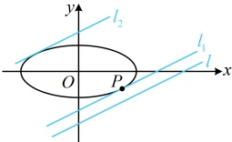

距离的最大值，若是求椭圆上的动点到定直线距离的最值，又怎么分析呢？我们来看下面的变式

【变式】已知 $P$ 是椭圆 $C: \frac{x^2}{5} + y^2 = 1$ 上的动点，直线 $l: x - 2y - 4 = 0$，则点 $P$ 到直线 $l$ 的距离的最小值为___.

解法1：目标距离可用点P的坐标表示，故考虑设坐标，怎么设？可以想象，若设 $ P(x_0,y_0) $，则目标距离 $ d=\frac{|x_0-2y_0-4|}{\sqrt{5}} $，该式中 $ x_0 $， $ y_0 $都只有一次项，不方便利用椭圆的方程消元，故考虑设三角形式，

由题意，可设  $ P(\sqrt{5}\cos\theta,\sin\theta) $，则点  $ P $ 到直线  $ l $ 的距离  $ d=\frac{\left|\sqrt{5}\cos\theta-2\sin\theta-4\right|}{\sqrt{1^2+(-2)^2}}=\frac{\left|2\sin\theta-\sqrt{5}\cos\theta+4\right|}{\sqrt{5}}=\frac{\left|3\sin(\theta+\varphi)+4\right|}{\sqrt{5}} $，其中  $ \varphi $ 满足  $ \tan\varphi=-\frac{\sqrt{5}}{2} $，且  $ \varphi\in\left(-\frac{\pi}{2},0\right) $，

因为  $ -1\leq\sin(\theta+\varphi)\leq1 $，所以  $ 1\leq3\sin(\theta+\varphi)+4\leq7 $，从而  $ \frac{\sqrt{5}}{5}\leq\frac{\left|3\sin(\theta+\varphi)+4\right|}{\sqrt{5}}\leq\frac{7\sqrt{5}}{5} $，故  $ d_{\min}=\frac{\sqrt{5}}{5} $。

解法2：如图，可以想象，若将直线 $l$ 不断向上平移，当它首次与椭圆相切时（图中的 $l_1$），切点到直线 $l$ 的距离最小，且该最小距离等于平行线 $l$ 与 $l_1$ 之间的距离，故若能求出 $l_1$ 的方程，就能求得答案，怎样求 $l_1$ 的方程？可根据 $l_1$ 与 $l$ 平行设出 $l_1$ 的方程，与椭圆联立，用 $\Delta = 0$ 建立方程求所设参数，

设图中 $l_1$ 的方程为 $x - 2y + m = 0$，即 $x = 2y - m$，代入 $\frac{x^2}{5} + y^2 = 1$ 整理得：$9y^2 - 4my + m^2 - 5 = 0$，

因为 $l_1$ 与椭圆 $C$ 相切，所以判别式 $\Delta = (-4m)^2 - 4 \times 9 \times (m^2 - 5) = 180 - 20m^2 = 0$，解得：$m = \pm 3$，

有两个 $m$，显然分别对应图中的 $l_1$ 和 $l_2$，那 $l_1$ 取哪个 $m$ 呢？可结合 $l_1$ 在 $y$ 轴上截距的正负来看，

将  $ x-2y+m=0 $ 化为斜截式方程得  $ y=\frac{x}{2}+\frac{m}{2} $，由图可知  $ l_1 $ 在  $ y $ 轴上的截距  $ \frac{m}{2}<0 $，所以  $ m<0 $，故  $ m=-3 $，所以  $ l_1 $ 的方程为  $ x-2y-3=0 $，从而  $ l_1 $ 与  $ l $ 之间的距离  $ d'=\frac{|-3-(-4)|}{\sqrt{1^2+(-2)^2}}=\frac{\sqrt{5}}{5} $，故椭圆上的动点  $ P $ 到直线  $ l $ 的距离的最小值为  $ \frac{\sqrt{5}}{5} $。

答案： $ \frac{\sqrt{5}}{5} $

【反思】将椭圆上的动点坐标设为 $ (x_0, y_0) $，还是 $ (a\cos\theta, b\sin\theta) $，可以根据问题的需要来决定；另外，求椭圆上动点到定直线距离的最值这类问题，也可通过画图找到取得最值的状态，再用代数的方法求解该状态，这种代数与几何相结合的方法，在解析几何中也比较常用。

## 补充、拓展

在各类考试中，椭圆容易出现偏难的解答题，本节我们先给大家拓展一些难度适中的考查直线与椭圆位置关系的综合题（例如简单条件翻译、弦长计算等），在本章的最后，我们还会以微专题的形式详细归纳一些难度较高的题型.

类型V：直线与椭圆位置关系综合题

【例 14】已知椭圆的中心是坐标原点 O，它的短轴长为  $ 2\sqrt{2} $，一个焦点 F 的坐标为  $ (c,0)(c>0) $，