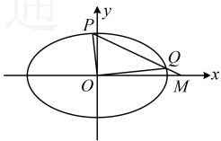

点 $M$ 的坐标为 $\left(\frac{10}{c}-c,0\right)$，且 $\overrightarrow{OF}=2\overrightarrow{FM}$。

（1）求椭圆的方程及离心率；

（2）如果过点 $M$ 的直线与椭圆相交于 $P$，$Q$ 两点，且 $OP \perp OQ$，求直线 $PQ$ 的方程。

解：（1）由题意，椭圆的短轴长 $2b = 2\sqrt{2}$，所以 $b = \sqrt{2}$，

又 $F(c,0)$，$M\left(\frac{10}{c}-c,0\right)$，所以 $\overrightarrow{OF} = (c,0)$，$\overrightarrow{FM} = \left(\frac{10}{c}-2c,0\right)$，

因为 $\overrightarrow{OF} = 2\overrightarrow{FM}$，所以 $c = 2\left(\frac{10}{c}-2c\right)$，解得：$c = 2$ 或 $-2$（不满足 $c > 0$，舍去），所以 $a^2 = b^2 + c^2 = 6$。

由 $F(2,0)$ 可知椭圆焦点在 $x$ 轴上，所以椭圆的方程为 $\frac{x^2}{6} + \frac{y^2}{2} = 1$，离心率 $e = \frac{c}{a} = \frac{2}{\sqrt{6}} = \frac{\sqrt{6}}{3}$。

（2）（怎样翻译  $ OP \perp OQ $？可按  $ \overrightarrow{OP} \cdot \overrightarrow{OQ} = 0 $ 来翻译，计算此数量积需要  $ P $， $ Q $ 的坐标，先把它们设出来）

由（1）可得  $ M(3,0) $，设  $ P(x_1,y_1) $， $ Q(x_2,y_2) $，则  $ \overrightarrow{OP} = (x_1,y_1) $， $ \overrightarrow{OQ} = (x_2,y_2) $，

因为  $ OP \perp OQ $，所以  $ \overrightarrow{OP} \cdot \overrightarrow{OQ} = x_1x_2 + y_1y_2 = 0 $ ①，（看到  $ x_1x_2 $ 和  $ y_1y_2 $，想到设直线  $ PQ $ 的方程，与椭圆联立，结合韦达定理计算它们。直线  $ PQ $ 过 x 轴上定点，这种情况常设横截式方程，但需单独考虑垂直于 y 轴的情形）

当直线  $ PQ \perp y $ 轴时， $ P $， $ O $， $ \overrightarrow{OQ} $ 三点共线，不满足  $ OP \perp OQ $；

当直线  $ PQ $ 不与  $ y $ 轴垂直时，因为直线  $ PQ $ 过点  $ M(3,0) $，所以可设其方程为  $ x = my + 3 $，

代入  $ \frac{x^2}{6} + \frac{y^2}{2} = 1 $ 整理得： $ (m^2 + 3)y^2 + 6my + 3 = 0 $，判别式  $ \Delta = (6m)^2 - 4(m^2 + 3) \times 3 > 0 $，所以  $ m^2 > \frac{3}{2} $，

由韦达定理， $ y_1 + y_2 = -\frac{6m}{m^2 + 3} $， $ y_1 y_2 = \frac{3}{m^2 + 3} $，（计算式①还差  $ x_1 x_2 $，可由直线  $ PQ $ 的方程转化为  $ y_1 $， $ y_2 $ 来）

 $$ x_{1}x_{2}=(m y_{1}+3)(m y_{2}+3)=m^{2}y_{1}y_{2}+3m(y_{1}+y_{2})+9 $$ 

$$=m^{2}\cdot\frac{3}{m^{2}+3}+3m\cdot\left(-\frac{6m}{m^{2}+3}\right)+9=\frac{27-6m^{2}}{m^{2}+3},$$

代入①得 $ \frac{27-6m^{2}}{m^{2}+3}+\frac{3}{m^{2}+3}=0 $，解得： $ m=\pm\sqrt{5} $，都满足 $ m^{2}>\frac{3}{2} $，

所以直线  $ PQ $ 的方程为  $ x = \pm\sqrt{5}y + 3 $，即  $ x - \sqrt{5}y - 3 = 0 $ 或  $ x + \sqrt{5}y - 3 = 0 $。

【反思】解析几何中翻译垂直关系，以  $ OP \perp OQ $ 为例，最常用的方法有两种：①按  $ \overrightarrow{OP} \cdot \overrightarrow{OQ} = 0 $ 来翻译，这种翻译方法需注意单独考虑  $ P $ 或  $ Q $ 与  $ O $ 重合的情形；②按  $ k_{OP} \cdot k_{OQ} = -1 $ 来翻译，这种翻译方法需注意单独考虑  $ OP $ 或  $ OQ $ 斜率不存在的情况。除了上述两种方法外，有时也可以选择  $ |OM| = \frac{1}{2}|PQ| $ 来翻译（ $ M $ 为  $ PQ $ 中点）。

【例 15】已知直线  $ y = kx $ 与椭圆  $ C: \frac{x^2}{4} + y^2 = 1 $ 交于  $ A $,  $ B $ 两点,  $ P $ 是椭圆  $ C $ 上一动点（不同于  $ A $,  $ B $），记  $ k_{OP} $,  $ k_{PA} $,  $ k_{PB} $ 分别为直线  $ OP $,  $ PA $,  $ PB $ 的斜率，且满足  $ k \cdot k_{OP} = k_{PA} \cdot k_{PB} $.

（1）求点P的坐标（用k表示）；

（2）求 $ \left|OP\right|\cdot\left|AB\right| $的取值范围.

解：（1）（条件涉及 OP，PA，PB 的斜率，计算这些斜率需要 P，A，B 的坐标，故先设坐标）

如图，由对称性，直线 y = kx 与椭圆 C 的交点 A，B 关于原点对称，设  $ A(x_1, y_1) $， $ P(x_2, y_2) $，则  $ B(-x_1, -y_1) $，

由题意， $ k \cdot k_{OP} = k_{PA} \cdot k_{PB} $，所以  $ k \cdot \frac{y_2}{x_2} = \frac{y_2 - y_1}{x_2 - x_1} \cdot \frac{y_2 + y_1}{x_2 + x_1} $，故  $ k \cdot \frac{y_2}{x_2} = \frac{y_2^2 - y_1^2}{x_2^2 - x_1^2} $ ①，