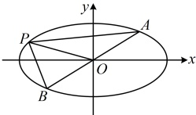

（式①中有 $ x_{1}^{2} $， $ x_{2}^{2} $， $ y_{1}^{2} $， $ y_{2}^{2} $，想到可利用椭圆方程消去两项，再看能否进一步化简）

因为 A，P 两点在椭圆 C 上，所以  $ \left\{\begin{aligned}\frac{x_{1}^{2}}{4}+y_{1}^{2}&=1\\ \frac{x_{2}^{2}}{4}+y_{2}^{2}&=1\end{aligned}\right. $，故  $ \left\{\begin{aligned}y_{1}^{2}&=1-\frac{x_{1}^{2}}{4}\\ y_{2}^{2}&=1-\frac{x_{2}^{2}}{4}\end{aligned}\right. $，

代入①得  $ k \cdot \frac{y_{2}}{x_{2}} = \frac{1 - \frac{x_{2}^{2}}{4} - 1 + \frac{x_{1}^{2}}{4}}{x_{2}^{2} - x_{1}^{2}} = -\frac{1}{4} $，所以  $ x_{2} = -4ky_{2} $，

代入 $ \frac{x_{2}^{2}}{4}+y_{2}^{2}=1 $得 $ (4k^{2}+1)y_{2}^{2}=1 $，解得： $ y_{2}=\pm\frac{1}{\sqrt{4k^{2}+1}} $，

当  $ y_2 = \frac{1}{\sqrt{4k^2 + 1}} $ 时， $ x_2 = -4ky_2 = -\frac{4k}{\sqrt{4k^2 + 1}} $，当  $ y_2 = -\frac{1}{\sqrt{4k^2 + 1}} $ 时， $ x_2 = -4ky_2 = \frac{4k}{\sqrt{4k^2 + 1}} $

所以点  $ P $ 的坐标为  $ \left(-\frac{4k}{\sqrt{4k^2 + 1}}, \frac{1}{\sqrt{4k^2 + 1}}\right) $ 或  $ \left(\frac{4k}{\sqrt{4k^2 + 1}}, -\frac{1}{\sqrt{4k^2 + 1}}\right) $，其中  $ k \ne 0 $。

(2) (已将 $P$ 的坐标用 $k$ 表示，故 $|OP|$ 也能用 $k$ 表示，于是考虑把 $|AB|$ 也用 $k$ 表示，用弦长公式计算 $|AB|$ 即由 (1) 得 $|OP| = \sqrt{\frac{16k^2 + 1}{4k^2 + 1}}$，将 $y = kx$ 代入 $\frac{x^2}{4} + y^2 = 1$ 整理得：(4$k^2 + 1$)$x^2 = 4$，解得：$x = \pm \frac{2}{\sqrt{4k^2 + 1}}$，由弦长公式，$|AB| = \sqrt{1 + k^2} \cdot \left| \frac{2}{\sqrt{4k^2 + 1}} - \left( -\frac{2}{\sqrt{4k^2 + 1}} \right) \right| = \frac{4\sqrt{1 + k^2}}{\sqrt{4k^2 + 1}}$，$k \neq 0$，所以 $|OP| \cdot |AB| = \sqrt{\frac{16k^2 + 1}{4k^2 + 1}} \cdot \frac{4\sqrt{k^2 + 1}}{\sqrt{1 + 4k^2}} = 4\sqrt{\frac{16k^4 + 17k^2 + 1}{16k^4 + 8k^2 + 1}} = 4\sqrt{1 + \frac{9k^2}{16k^4 + 8k^2 + 1}} = 4\sqrt{1 + \frac{9}{16k^2 + \frac{1}{k^2} + 8}}$，因为 $16k^2 + \frac{1}{k^2} + 8 \geq 2\sqrt{16k^2 \cdot \frac{1}{k^2}} + 8 = 16$，当且仅当 $16k^2 = \frac{1}{k^2}$，即 $k = \pm \frac{1}{2}$ 时取等号，所以 $1 < 1 + \frac{9}{16k^2 + 8 + \frac{1}{k^2}} \leq \frac{25}{16}$，从而 $4 < |OP| \cdot |AB| \leq 5$，故 $|OP| \cdot |AB|$ 的取值范围是 $(4, 5]$.

 $$  \left|AB\right| 即可 ) $$ 

【反思】可以看到，本题的一大核心是用弦长公式计算 $ |AB| $，弦长计算是诸多综合题中的一个常见步骤。题干不仅可以直接涉及弦长，也可以间接涉及。例如在某些面积问题中，也可能需要弦长，我们来看下面的变式。

【变式】已知椭圆 $ \frac{x^2}{a^2}+\frac{y^2}{b^2}=1(a>b>0) $的左焦点为 $ F $，椭圆上的点到点 $ F $距离的最大值和最小值分别为 $ \sqrt{2}+1 $和 $ \sqrt{2}-1 $。

（1）求该椭圆的方程：

（2）对椭圆上不在上下顶点的任意一点 P，其关于 y 轴的对称点记为  $ P' $，求  $ \left|PF\right| + \left|P'F\right| $；

（3）过点 $ Q(2,0) $作直线交椭圆于不同的两点A，B，求 $ \triangle FAB $面积的最大值.

解：（1）（椭圆上的点M到焦点F的距离可用M，F的坐标表示，故先设坐标）

设  $ M(x_0, y_0) $ 为椭圆上一点， $ F(-c, 0) $，则  $ c^2 = a^2 - b^2 $，且  $ \left| MF \right| = \sqrt{(x_0 + c)^2 + y_0^2} = \sqrt{x_0^2 + 2cx_0 + c^2 + y_0^2} $ ①，（变量较多，考虑消元，可利用椭圆方程来消元）因为  $ M $ 在椭圆上，所以  $ \frac{x_0^2}{a^2} + \frac{y_0^2}{b^2} = 1 $，故  $ y_0^2 = b^2 - \frac{b^2}{a^2}x_0^2 $，代入①得  $ \left| MF \right| = \sqrt{x_0^2 + 2cx_0 + c^2 + b^2 - \frac{b^2}{a^2}x_0^2} = \sqrt{\left(1 - \frac{b^2}{a^2}\right)x_0^2 + 2cx_0 + (b^2 + c^2)} $ =  $ \sqrt{\frac{c^2}{a^2}x_0^2 + 2cx_0 + a^2} = \sqrt{\left(\frac{c}{a}x_0 + a\right)^2} $