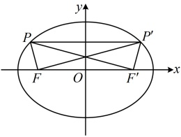
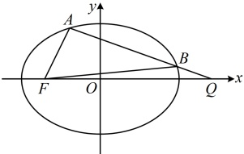

$$= \left| \frac{c}{a} x_0 + a \right| $$，因为 $-a \leq x_0 \leq a$，所以 $0 < a - c \leq \frac{c}{a} x_0 + a \leq a + c$，故 $\left| MF \right| = \left| \frac{c}{a} x_0 + a \right| = \frac{c}{a} x_0 + a \in [a - c, a + c]$，

所以 $\left| MF \right|$ 最小值为 $a - c$，最大值为 $a + c$，由题意，$\begin{cases} a - c = \sqrt{2} - 1 \\ a + c = \sqrt{2} + 1 \end{cases}$，解得：$\begin{cases} a = \sqrt{2} \\ c = 1 \end{cases}$，

所以 $b = \sqrt{a^2 - c^2} = 1$，故椭圆的方程为 $\frac{x^2}{2} + y^2 = 1$。

（2）（涉及$|PF|$，想到椭圆定义，故考虑把椭圆的右焦点也取出米进行分析）

如图1，记椭圆的右焦点为$F'$，由椭圆的对称性，$|P'F|=|PF|$，所以$|PF|+|P'F|=|PF|+|PF|=2a=2\sqrt{2}$。

图1

图2

（3）解法1：（如图2，怎样计算  $ S_{\triangle FAB} $？可考虑以 AB 为底，F 到直线 AB 的距离为高来算，其中  $ |AB| $ 可通过联立直线 AB 与椭圆的方程，由弦长公式计算，故先设直线 AB 的方程和 A，B 的坐标，AB 过 x 轴上定点，考虑设横截式方程）由题意，直线 AB 过点  $ Q(2,0) $，所以直线 AB 不与 y 轴垂直，否则 A，B，F 共线，不构成三角形，故可设直线 AB 的方程为  $ x = mv + 2 $，设  $ A(x_1, v_1) $， $ B(x_2, v_2) $，

联立 $ \left\{\begin{aligned}&x=my+2\\ &\frac{x^{2}}{2}+y^{2}=1\end{aligned}\right. $消去x整理得： $ (m^{2}+2)y^{2}+4my+2=0 $，判别式 $ \Delta=(4m)^{2}-4(m^{2}+2)\times2=8(m^{2}-2)>0 $，

所以  $ m^2 > 2 $，由弦长公式， $ |AB| = \sqrt{1 + m^2} \cdot |y_1 - y_2| = \sqrt{1 + m^2} \cdot \frac{\sqrt{8(m^2 - 2)}}{m^2 + 2} $，

直线 $AB$ 的方程 $x = my + 2$ 可化为 $x - my - 2 = 0$，所以点 $F(-1,0)$ 到直线 $AB$ 的距离 $d = \frac{|-1-2|}{\sqrt{1^2 + (-m)^2}} = \frac{3}{\sqrt{1+m^2}}$，故 $S_{\triangle FAB} = \frac{1}{2}|AB| \cdot d = \frac{1}{2}\sqrt{1 + m^2} \cdot \frac{\sqrt{8(m^2 - 2)}}{m^2 + 2} \cdot \frac{3}{\sqrt{1 + m^2}} = \frac{3\sqrt{2} \cdot \sqrt{m^2 - 2}}{m^2 + 2}$ ②，

（分子中的  $ \sqrt{m^2 - 2} $ 可看成一次的，分母  $ m^2 + 2 $ 为二次的，所以式②可看成 “ $ \frac{一次函数}{二次函数} $” 结构，这种结构常将“一次函数”部分换元成  $ t $，并上下同除以  $ t $，再作分析）

令  $ t = \sqrt{m^2 - 2} > 0 $，则  $ m^2 - 2 = t^2 $，所以  $ m^2 + 2 = t^2 + 4 $，代入②得  $ S_{\triangle FAB} = \frac{3\sqrt{2}t}{t^2 + 4} = \frac{3\sqrt{2}}{t + \frac{4}{t}} \leq \frac{3\sqrt{2}}{2\sqrt{t \cdot \frac{4}{t}}} = \frac{3\sqrt{2}}{4} $，

当且仅当  $ t = \frac{4}{t} $，即  $ t = 2 $ 时等号成立，此时  $ \sqrt{m^2 - 2} = 2 $，解得： $ m = \pm\sqrt{6} $，满足  $ m^2 > 2 $，所以  $ (S_{\triangle FAB})_{\max} = \frac{3\sqrt{2}}{4} $

解法 2：（由图 2 可知， $ S_{\triangle FAB} = |S_{\triangle FAQ} - S_{\triangle FBQ}| $，故也可按此计算  $ \triangle FAB $ 的面积）由图 2 可知  $ y_1 $， $ y_2 $ 同号，

所以  $ S_{\triangle FAB} = |S_{\triangle FAQ} - S_{\triangle FBQ}| = \left| \frac{1}{2} |FQ| \cdot |y_1| - \frac{1}{2} |FQ| \cdot |y_2| \right| = \frac{1}{2} |FQ| \cdot |y_1 - y_2| = \frac{1}{2} \times |2 - (-1)| \cdot |y_1 - y_2| = \frac{3}{2} |y_1 - y_2| $ ③，（设直线 AB 的方程，并与椭圆联立求  $ \Delta $ 的过程同解法 1，下面直接给出  $ |y_1 - y_2| $）

由韦达定理推论， $ \left|y_1-y_2\right|=\frac{\sqrt{8(m^2-2)}}{m^2+2} $，代入③得 $ S_{\triangle FAB}=\frac{3}{2}\times\frac{\sqrt{8(m^2-2)}}{m^2+2}=\frac{3\sqrt{2}\cdot\sqrt{m^2-2}}{m^2+2} $，接下来同解法1.