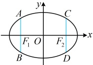

# 微专题3：椭圆常用二级结论

习题：P1

## 内容提要

椭圆有很多的二级结论，但其中很大一部分的应用频率较低，用得少，就难以记住，所以这部分结论本节不会涉及，我们只筛选出了一些在高考中比较常用的椭圆二级结论供大家学习，记住这些结论可适当缩短解题时间。另外，下面的结论都是椭圆焦点在x轴上的情形，对于焦点在y轴的情形，可自行尝试推导。

1. 通径公式：过椭圆的焦点且垂直于长轴的弦叫做椭圆的通径（如图1

中的两条蓝色线段)，其长度为 $ \frac{2b^{2}}{a} $.

证明：将x=-c代入 $ \frac{x^2}{a^2}+\frac{y^2}{b^2}=1 $可得 $ \frac{c^2}{a^2}+\frac{y^2}{b^2}=1 $，所以 $ y^2=b^2\left(1-\frac{c^2}{a^2}\right) $

图1

$$=b^{2}\cdot\frac{a^{2}-c^{2}}{a^{2}}=b^{2}\cdot\frac{b^{2}}{a^{2}}=\frac{b^{4}}{a^{2}},$$ 从而 $y=\pm\frac{b^{2}}{a}$，故$$|AB|=\left|\frac{b^{2}}{a}-\left(-\frac{b^{2}}{a}\right)\right|=\frac{2b^{2}}{a}$$，由对称性，$$|CD|=\frac{2b^{2}}{a}$$

2. 坐标版焦半径公式：设椭圆  $ \frac{x^{2}}{a^{2}}+\frac{y^{2}}{b^{2}}=1(a>b>0) $ 的左、右焦点分别为  $ F_{1} $， $ F_{2} $， $ P(x_{0},y_{0}) $ 为椭圆上任意一点，则左焦半径  $ \left|PF_{1}\right|=a+ex_{0} $，右焦半径  $ \left|PF_{2}\right|=a-ex_{0} $，其中 e 为椭圆的离心率.

证明：设  $ F_{1}(-c,0) $，则  $ c^{2}=a^{2}-b^{2} $， $ \left|PF_{1}\right|=\sqrt{(x_{0}+c)^{2}+y_{0}^{2}} $ ①，

因为点P在椭圆上，所以 $ \frac{x_{0}^{2}}{a^{2}}+\frac{y_{0}^{2}}{b^{2}}=1 $，故 $ y_{0}^{2}=b^{2}-\frac{b^{2}}{a^{2}}x_{0}^{2} $，

代入①得 $ |PF_1| = \sqrt{x_0^2 + 2cx_0 + c^2 + b^2 - \frac{b^2}{a^2}x_0^2} = \sqrt{(1 - \frac{b^2}{a^2})x_0^2 + 2cx_0 + a^2} $

 $ = \sqrt{\frac{a^2 - b^2}{a^2}x_0^2 + 2cx_0 + a^2} = \sqrt{\frac{c^2}{a^2}x_0^2 + 2cx_0 + a^2} = \sqrt{\left(\frac{c}{a}x_0 + a\right)^2} = \left|\frac{c}{a}x_0 + a\right| = |ex_0 + a| = |a + ex_0| $，

因为 $ 0 \leq a \leq 1 $， $ a \leq x \leq a $，所以 $ a + ax = 0 $，故 $ |PE| = a + ax $，同理可证 $ |PE| = a $，

因为  $ 0 < e < 1 $， $ -a \leq x_0 \leq a $，所以  $ a + ex_0 > 0 $，故  $ \left|PF_1\right| = a + ex_0 $；同理可证  $ \left|PF_2\right| = a - ex_0 $。

3. 角版焦半径、焦点弦公式

（1）角版焦半径公式：如图2，设  $ P $ 为椭圆  $ \frac{x^2}{a^2} + \frac{y^2}{b^2} = 1 (a > b > 0) $ 上任意一点， $ F_1 $， $ F_2 $ 分别是椭圆的左、右焦点，记  $ \angle PF_1O = \alpha $， $ \angle PF_2O = \beta $，则  $ \left|PF_1\right| = \frac{b^2}{a - c\cos\alpha} $， $ \left|PF_2\right| = \frac{b^2}{a - c\cos\beta} $。

（2）角版焦点弦公式：如图3，设F是椭圆 $ \frac{x^{2}}{a^{2}}+\frac{y^{2}}{b^{2}}=1(a>b>0) $的一个焦点（左、右焦点均