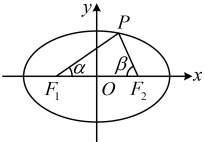
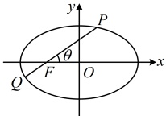

可)，过 $F$ 的直线与椭圆交于 $P$，$Q$ 两点，$\angle PFO = \theta$，则 $\frac{1}{|PF|} + \frac{1}{|QF|} = \frac{2a}{b^2}$，$|PQ| = \frac{2ab^2}{a^2 - c^2 \cos^2 \theta}$。

（3）在图 3 中，设 $|PF| = \lambda |QF|$，则 $|e \cos \theta| = \left| \frac{\lambda - 1}{\lambda + 1} \right|$。此结论可简记为“一口干”，“一口”谐音左边的“$e \cos \theta$”，“干”对应右边的上减下加，合在一起为“干”，像“干”字。

图2

图3

证明：（1）设 $ |PF_1|=m $，则 $ |PF_2|=2a-m $，当 $ P $不为左、右顶点时，

在 $ \triangle PF_1F_2 $中，由余弦定理， $ |PF_2|^2=|PF_1|^2+|F_1F_2|^2-2|PF_1|\cdot|F_1F_2|\cdot\cos\angle PF_1O $，

 $$ (2a-m)^{2}=m^{2}+4c^{2}-2m\cdot2c\cdot\cos\alpha\Rightarrow m=\frac{a^{2}-c^{2}}{a-c\cos\alpha}=\frac{b^{2}}{a-c\cos\alpha}\Rightarrow\left|PF_{1}\right|=\frac{b^{2}}{a-c\cos\alpha}\quad\textcircled{1} ; $$ 

当 $P$ 为左顶点时，$|PF_1|=a-c$，而此时 $\alpha=\angle PF_1O=\pi$，

所以 $ \frac{b^2}{a-c\cos\alpha}=\frac{b^2}{a-c\cos\pi}=\frac{b^2}{a+c}=\frac{a^2-c^2}{a+c}=a-c $，故式①也成立；

当 $P$ 为右顶点时，$|PF_1|=a+c$，而此时

所以 $ \frac{b^2}{a-c\cos\alpha}=\frac{b^2}{a-c\cos0}=\frac{b^2}{a-c}=\frac{a^2-c^2}{a-c}=a+c $，故式①仍然成立；

综上所述，对椭圆上任意的点P，都有 $ |PF_1|=\frac{b^2}{a-c\cos\alpha} $，同理可证 $ |PF_2|=\frac{b^2}{a-c\cos\beta} $。

（2）因为  $ \angle PFO = \theta $，所以  $ \angle QFO = \pi - \theta $，由（1）得  $ |PF| = \frac{b^2}{a - c \cos \theta} $， $ |QF| = \frac{b^2}{a - c \cos (\pi - \theta)} = \frac{b^2}{a + c \cos \theta} $，所以  $ \frac{1}{|PF|} + \frac{1}{|QF|} = \frac{a - c \cos \theta}{b^2} + \frac{a + c \cos \theta}{b^2} = \frac{2a}{b^2} $，且  $ |PQ| = |PF| + |QF| = \frac{b^2}{a - c \cos \theta} + \frac{b^2}{a + c \cos \theta} = \frac{b^2 (a + c \cos \theta) + b^2 (a - c \cos \theta)}{(a - c \cos \theta)(a + c \cos \theta)} = \frac{2ab^2}{a^2 - c^2 \cos^2 \theta} $，由此我们还可发现，当  $ \theta = \frac{\pi}{2} $ 时， $ |PQ| $ 取得最小值  $ \frac{2b^2}{a} $，所以通径是最短的焦点弦。

（3）由（1）可得 $ |PF|=\frac{b^2}{a-c\cos\theta} $， $ |QF|=\frac{b^2}{a+c\cos\theta} $，所以 $ \lambda=\frac{|PF|}{|QF|}=\frac{a+c\cos\theta}{a-c\cos\theta} $，