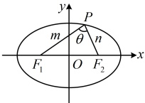

 $$ \left|\frac{\lambda-1}{\lambda+1}\right|=\left|\frac{\frac{a+c\cos\theta}{a-c\cos\theta}-1}{\frac{a+c\cos\theta}{a-c\cos\theta}+1}\right|=\left|\frac{a+c\cos\theta-(a-c\cos\theta)}{a+c\cos\theta+(a-c\cos\theta)}\right|=\left|\frac{c\cos\theta}{a}\right|=\left|e\cos\theta\right|. $$ 

4. 焦点三角形面积公式：如图4，设P是椭圆 $ \frac{x^2}{a^2}+\frac{y^2}{b^2}=1(a>b>0) $上一点， $ F_1(-c,0) $， $ F_2(c,0) $分别是椭圆的左、右焦点， $ \angle F_1PF_2=\theta $，则 $ S_{\triangle PF_1F_2}=c|y_P|=b^2\tan\frac{\theta}{2} $。

证明：一方面， $ \triangle PF_1F_2 $ 的边  $ F_1F_2 $ 上的高  $ h = |y_P| $

所以 $ S_{\triangle PF_1F_2} = \frac{1}{2}|F_1F_2| \cdot h = \frac{1}{2} \times 2c \times |y_P| = c|y_P| $;

图4

另一方面，记 $ \left|PF_{1}\right|=m,\quad\left|PF_{2}\right|=n $，则由椭圆定义， $ m+n=2a $ ①，

在$\triangle PF_1F_2$中，由余弦定理，$|F_1F_2|^2 = |PF_1|^2 + |PF_2|^2 - 2|PF_1| \cdot |PF_2| \cdot \cos \angle F_1PF_2$，

所以  $ 4c^{2}=m^{2}+n^{2}-2mn\cos\theta=(m+n)^{2}-2mn-2mn\cos\theta=(m+n)^{2}-2mn(1+\cos\theta) $ ②,

将式①代入式②可得 $ 4c^{2}=4a^{2}-2mn(1+\cos\theta) $，所以 $ mn=\frac{4a^{2}-4c^{2}}{2(1+\cos\theta)}=\frac{2b^{2}}{1+\cos\theta} $，

 $$ S_{\triangle PF_{1}F_{2}}=\frac{1}{2}mn\sin\theta=\frac{1}{2}\cdot\frac{2b^{2}}{1+\cos\theta}\cdot\sin\theta=b^{2}\cdot\frac{\sin\theta}{1+\cos\theta}=b^{2}\cdot\frac{2\sin\frac{\theta}{2}\cos\frac{\theta}{2}}{2\cos^{2}\frac{\theta}{2}}=b^{2}\tan\frac{\theta}{2}. $$ 

### 5. 椭圆的斜率积结论

（1）第三定义的斜率积结论：如图5，设 $ A $， $ B $分别是椭圆 $ \frac{x^2}{a^2}+\frac{y^2}{b^2}=1(a>b>0) $的左、右顶点， $ P $是椭圆上不与 $ A $， $ B $重合的任意一点，则 $ k_{PA}\cdot k_{PB}=-\frac{b^2}{a^2} $。

注：上述结论中 A，B 是椭圆的左、右顶点，可将其推广为椭圆上关于原点对称的任意两点，如图6，只要直线 PA，PB 的斜率都存在，就仍然满足  $ k_{PA} \cdot k_{PB} = -\frac{b^2}{a^2} $，下面给出证明.

证明：设  $ A(x_1,y_1) $， $ P(x_2,y_2) $，则  $ B(-x_1,-y_1) $，所以  $ k_{PA} \cdot k_{PB} = \frac{y_2 - y_1}{x_2 - x_1} \cdot \frac{y_2 + y_1}{x_2 + x_1} = \frac{y_2^2 - y_1^2}{x_2^2 - x_1^2} $ ①

因为点  $ A $ 在椭圆上，所以  $ \frac{x_1^2}{a^2} + \frac{y_1^2}{b^2} = 1 $，故  $ y_1^2 = -\frac{b^2}{a^2}(x_1^2 - a^2) $，同理， $ y_2^2 = -\frac{b^2}{a^2}(x_2^2 - a^2) $，

所以  $ y_2^2 - y_1^2 = -\frac{b^2}{a^2}(x_2^2 - a^2 - x_1^2 + a^2) = -\frac{b^2}{a^2}(x_2^2 - x_1^2) $，代入①得  $ k_{PA} \cdot k_{PB} = -\frac{b^2}{a^2} $；

在上述条件中令  $ A(-a,0) $， $ B(a,0) $，即得椭圆第三定义斜率积结论。