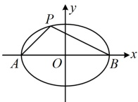
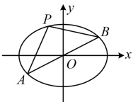
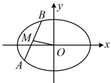
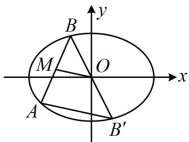
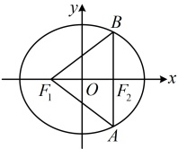

（2）中点弦斜率积结论：如图7，AB是椭圆 $ \frac{x^{2}}{a^{2}}+\frac{y^{2}}{b^{2}}=1(a>b>0) $的一条不与坐标轴垂直且不过原点的弦，M为AB中点，则 $ k_{AB}\cdot k_{OM}=-\frac{b^{2}}{a^{2}} $，此结论可用下面的点差法来证明.

证明：设 $ A(x_1,y_1) $， $ B(x_2,y_2) $， $ x_1 \ne x_2 $， $ y_1 \ne y_2 $，因为 $ A $， $ B $都在椭圆上，所以 $ \begin{cases}\frac{x_1^2}{a^2}+\frac{y_1^2}{b^2}=1\\\frac{x_2^2}{a^2}+\frac{y_2^2}{b^2}=1\end{cases} $，两式作差得 $ \frac{x_1^2-x_2^2}{a^2}+\frac{y_1^2-y_2^2}{b^2}=0 $，整理得： $ \frac{y_1-y_2}{x_1-x_2}\cdot\frac{y_1+y_2}{x_1+x_2}=-\frac{b^2}{a^2} $ ①，

注意到 $ \frac{y_1-y_2}{x_1-x_2}=k_{AB} $， $ \frac{y_1+y_2}{x_1+x_2}=\frac{2y_M}{2x_M}=\frac{y_M-0}{x_M-0}=k_{OM} $，所以式①即为 $ k_{AB}\cdot k_{OM}=-\frac{b^2}{a^2} $。

图5

图6

图7

图8

注：中点弦斜率积结论和上面的第三定义斜率积结论结果都是 $ -\frac{b^2}{a^2} $，这是巧合吗？不是，两者之间有必然的联系。如上面图8，设 $ B' $为 $ B $关于原点的对称点，则 $ B' $也在该椭圆上，且 $ O $为 $ BB' $中点，结合 $ M $为 $ AB $中点可得 $ OM//AB' $，所以 $ k_{AB} \cdot k_{OM} = k_{AB} \cdot k_{AB'} $，于是又回到了椭圆上的点 $ A $与椭圆上关于原点对称的 $ B $和 $ B' $的连线的斜率积。

## 典型例题

## 类型 I：椭圆通径公式的应用

【例 1】已知椭圆  $ C: \frac{x^2}{4} + \frac{y^2}{3} = 1 $ 的左、右焦点分别为  $ F_1 $， $ F_2 $，过  $ F_2 $ 且垂直于  $ x $ 轴的直线与椭圆  $ C $ 交于  $ A $， $ B $ 两点，则  $ \triangle ABF_1 $ 的面积为___。

解析：如图，可以 $AB$ 为底，$F_1F_2$ 为高来求 $S_{\triangle ABF_1}$，且 $|AB|$ 可用通径公式计算，由题意，椭圆 $C$ 的半焦距 $c = \sqrt{4-3} = 1$，所以 $|F_1F_2| = 2c = 2$，

由通径公式， $ |AB|=\frac{2b^2}{a}=\frac{2\times3}{2}=3 $，所以 $ S_{\triangle ABF_1}=\frac{1}{2}|AB|\cdot|F_1F_2|=\frac{1}{2}\times3\times2=3 $。

答案：3

【反思】在椭圆的小题中，若需要通径AB的长，则可代公式 $ |AB|=\frac{2b^{2}}{a} $来快速计算.