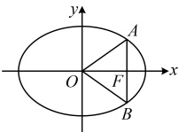
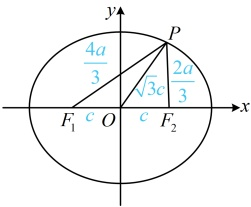

【变式】已知椭圆  $ C: \frac{x^2}{m^2} + y^2 = 1 (m > 1) $ 的右焦点为  $ F $， $ O $ 为坐标原点，过  $ F $ 作平行于  $ y $ 轴的直线交  $ C $ 于  $ A $， $ B $ 两点，若  $ \tan \angle AOB = 2\sqrt{2} $，则椭圆  $ C $ 的离心率为（ ）

A.  $ \frac{1}{4} $  B.  $ \frac{\sqrt{2}}{4} $  C.  $ \frac{\sqrt{2}}{2} $  D.  $ \frac{1}{2} $

解析：求离心率应先求参数 $m$，怎样由 $\tan \angle AOB = 2\sqrt{2}$ 建立方程求 $m$？如图，直接计算 $\tan \angle AOB$ 较麻烦，观察发现 $\triangle AOF$ 为直角三角形，故可考虑先用 $\tan \angle AOB = 2\sqrt{2}$ 求 $\tan \angle AOF$，再到 $\triangle AOF$ 中分析，由椭圆的对称性，$\angle AOB = 2\angle AOF$，所以 $\tan \angle AOB = \tan 2\angle AOF = \frac{2\tan \angle AOF}{1 - \tan^2 \angle AOF^2E}$，由椭圆的对称性，$\angle AOB = 2\angle AOF$，所以 $\tan \angle AOB = \tan 2\angle AOF = \frac{2\tan^2 \angle AOF}{1 - \tan^2 \angle AOF}$，由题意，$\tan \angle AOB = 2\sqrt{2}$，所以 $\frac{2\tan \angle AOF}{1 - \tan^2 \angle AOF} = 2\sqrt{2}$，解得：$\tan \angle AOF = \frac{\sqrt{2}}{2}$ 或 $-\sqrt{2}$，结合 $\angle AOF$ 为锐角可得 $\tan \angle AOF = \frac{\sqrt{2}}{2}$，在直角 $\triangle AOF$ 中，$\tan \angle AOF = \left| \frac{AF}{|OF|} \right| $，$|AF|$ 可由通径公式求得，$|OF|$ 即为半焦距，故由此能建立方程求参数 $m$，又由通径公式，$|AF| = \frac{1}{2} |AB| = \frac{1}{2} \times \frac{2 \times 1}{m} = \frac{1}{m}$，所以 $\tan \angle AOF = \left| \frac{AF}{|OF|} \right| = \frac{\frac{1}{m}}{\sqrt{m^2 - 1}} = \frac{1}{m \sqrt{m^2 - 1}}$，故 $\frac{1}{m \sqrt{m^2 - 1}} = \frac{\sqrt{2}}{2}$，解得：$m = \sqrt{2}$，所以椭圆 $C$ 的离心率 $e = \frac{\sqrt{m^2 - 1}}{m} = \frac{\sqrt{2}}{2}$。

## 类型Ⅱ：椭圆焦半径、焦点弦公式的应用

【例 2】已知  $ F_1 $， $ F_2 $ 是椭圆  $ \frac{x^2}{a^2} + \frac{y^2}{b^2} = 1 (a > b > 0) $ 的左、右焦点， $ P $ 是椭圆上一点，且  $ |PF_1| = 2|PF_2| $， $ |OP| = \frac{\sqrt{3}}{2}|F_1F_2| $，则椭圆的离心率为（ ）

A.  $ \frac{\sqrt{5}}{3} $ B.  $ \frac{\sqrt{10}}{4} $ C.  $ \frac{\sqrt{5}}{4} $ D.  $ \frac{\sqrt{10}}{6} $

解法1：条件涉及$|PF_1|=2|PF_2|$，一般会想到结合椭圆定义求出$|PF_1|$和$|PF_2|$，下面我们按此尝试，由$\begin{cases}|PF_1|=2|PF_2|\\\left|PF_1\right|+\left|PF_2\right|=2a\end{cases}$解得：$|PF_1|=\frac{4a}{3}$，$|PF_2|=\frac{2a}{3}$，又由题意，$|OP|=\frac{\sqrt{3}}{2}|F_1F_2|=\frac{\sqrt{3}}{2}\times2c=\sqrt{3}c$，

怎样建立方程求离心率？如图，所有线段的长都有了，可考虑用“双余弦法”建立方程，在$\triangle POF_1$中，由余弦定理推论，$\cos \angle POF_1 = \frac{|OP|^2 + |OF_1|^2 - |PF_1|^2}{2|OP| \cdot |OF_1|}$

$$= \frac{(\sqrt{3}c)^2 + c^2 - \left(\frac{4a}{3}\right)^2}{2\sqrt{3}c \cdot c} = \frac{18c^2 - 8a^2}{9\sqrt{3}c^2} \text{，同理，在 } \triangle POF_2 \text{ 中，}$$

 $$ \cos\angle POF_{2}=\frac{\left|OP\right|^{2}+\left|OF_{2}\right|^{2}-\left|PF_{2}\right|^{2}}{2\left|OP\right|\cdot\left|OF_{2}\right|}=\frac{\left(\sqrt{3}c\right)^{2}+c^{2}-\left(\frac{2a}{3}\right)^{2}}{2\sqrt{3}c\cdot c}=\frac{18c^{2}-2a^{2}}{9\sqrt{3}c^{2}}, $$ 

由图可知， $ \angle POF_1 = \pi - \angle POF_2 $，所以  $ \cos \angle POF_1 = \cos(\pi - \angle POF_2) = -\cos \angle POF_2 $，

