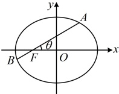
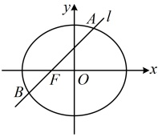

如图，由题意，\angle AFO=30^\circ，\angle BFO=150^\circ，所以由角版焦半径公式，

 $$ |AF|=\frac{b^2}{a-c\cos30^\circ}=\frac{b^2}{a-\frac{\sqrt{3}}{2}c} $$ ， $ [BF]=\frac{b^2}{a-c\cos150^\circ}=\frac{b^2}{a+\frac{\sqrt{3}}{2}c} $，

代入  $ [AF]=3|BF| $ 得  $ \frac{b^2}{a-\frac{\sqrt{3}}{2}c}=3\cdot\frac{b^2}{a+\frac{\sqrt{3}}{2}c} $，化简得  $ C $ 的离心率  $ e=\frac{\sqrt{3}}{3} $。

解法 2：已知焦点弦上两段焦半径的长度之比，也可联想到用“一口干”结论处理，

如图，直线  $ AB $ 的倾斜角为  $ 30^\circ \Rightarrow $ 图中  $ \theta=30^\circ $，由“一口干”结论， $ [\cos\theta]=\left|\frac{\lambda-1}{\lambda+1}\right| $，其中  $ \theta=30^\circ $，

又  $ \lambda=\frac{|AF|}{|BF|}=3 $，所以  $ [\cos30^\circ]=\left|\frac{3-1}{3+1}\right| $，结合  $ 0<e<1 $ 可得  $ e=\frac{\sqrt{3}}{3} $。

答案：B

【反思】当条件给出或问题需要像本题这样的  $ \angle AFO $， $ \angle BFO $，又涉及  $ |AF| $ 或  $ |BF| $ 时，可考虑用角版焦半径公式来计算  $ |AF| $， $ |BF| $，翻译已知或所求。

【变式 3】过椭圆  $ C: \frac{x^2}{5} + \frac{y^2}{4} = 1 $ 的左焦点  $ F $ 作倾斜角为  $ 45^\circ $ 的直线  $ l $ 与椭圆  $ C $ 交于  $ A, B $ 两点，则  $ \frac{1}{|AF|} + \frac{1}{|BF|} = (\quad) $

A.  $ \frac{5}{4} $ B.  $ \frac{4}{5} $ C.  $ \frac{\sqrt{5}}{2} $ D.  $ \frac{2\sqrt{5}}{5} $

解法 1: 由题设条件容易求得直线  $ l $ 的方程, 故  $ |AF| $ 和  $ |BF| $ 容易由弦长公式  $ L = \sqrt{1 + k^2} \cdot |x_1 - x_2| = \sqrt{1 + m^2} \cdot |y_1 - y_2| $ 求出, 故可考虑按此处理, 考虑到  $ F $ 的纵坐标为 0, 方便起见, 我们选择  $ L = \sqrt{1 + m^2} \cdot |y_1 - y_2| $, 由题意, 椭圆的半焦距  $ c = \sqrt{5 - 4} = 1 $, 所以  $ F(-1,0) $, 又直线  $ l $ 过点  $ F $ 且倾斜角为  $ 45^\circ $, 所以其斜率为 1, 故  $ l $ 的方程为  $ y = x + 1 $, 即  $ x = y - 1 $, 所以  $ |AF| = \sqrt{1 + 1^2} \cdot |y_A - 0| = \sqrt{2} |y_A| $, 同理,  $ |BF| = \sqrt{2} |y_B| $, 所以  $ \frac{1}{|AF|} + \frac{1}{|BF|} = \frac{1}{\sqrt{2} |y_A|} + \frac{1}{\sqrt{2} |y_B|} = \frac{|y_A| + |y_B|}{\sqrt{2} |y_A y_B|} $, 如图,  $ A $,  $ B $ 位于  $ x $ 轴两侧, 所以  $ y_A $ 与  $ y_B $ 异号, 从而  $ |y_A| + |y_B| = |y_A - y_B| $, 故  $ \frac{1}{|AF|} + \frac{1}{|BF|} = \frac{|y_A - y_B|}{\sqrt{2} |y_A y_B|} $ ①, 涉及  $ y_A y_B $ 和  $ |y_A - y_B| $, 可联立直线  $ l $ 与椭圆  $ C $ 的方程, 结合韦达定理及其推论计算它们, 联立  $ \begin{cases} x = y - 1 \\ \frac{x^2}{5} + \frac{y^2}{4} = 1 \end{cases} $ 消去  $ x $ 整理得:  $ 9y^2 - 8y - 16 = 0 $, 判别式  $ \Delta = (-8)^2 - 4 \times 9 \times (-16) = 640 > 0 $, 由韦达定理,  $ y_{A} y_{B} = -\frac{16}{9} $

由韦达定理推论， $ \left|y_{A}-y_{B}\right|=\frac{\sqrt{640}}{|9|}=\frac{8\sqrt{10}}{9} $，代入①得 $ \frac{1}{\left|AF\right|}+\frac{1}{\left|BF\right|}=\frac{\frac{8\sqrt{10}}{9}}{\sqrt{2}\left|-\frac{16}{9}\right|}=\frac{\sqrt{5}}{2} $。

解法2：给出了直线 $ l $的倾斜角，所求又涉及 $ |AF| $和 $ |BF| $，可考虑用角版焦半径公式计算 $ |AF| $和 $ |BF| $，如图，由题意， $ \angle AFO=45^\circ $， $ \angle BFO=135^\circ $，由角版焦半径公式，

