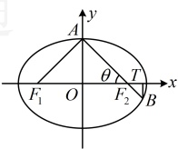

 $ |AF| = \frac{b^2}{a - c \cos 45^\circ} = \frac{4}{\sqrt{5} - \frac{\sqrt{2}}{2}} $， $ |BF| = \frac{b^2}{a - c \cos 135^\circ} = \frac{4}{\sqrt{5} + \frac{\sqrt{2}}{2}} $，所以 $ \frac{1}{|AF|} + \frac{1}{|BF|} = \frac{\sqrt{5} - \frac{\sqrt{2}}{2}}{4} + \frac{\sqrt{5} + \frac{\sqrt{2}}{2}}{4} = \frac{\sqrt{5}}{2} $。

解法 3：计算 $ \frac{1}{|AF|} + \frac{1}{|BF|} $，也可直接代结论 $ \frac{1}{|AF|} + \frac{1}{|BF|} = \frac{2a}{b^2} $，由题意， $ \frac{1}{|AF|} + \frac{1}{|BF|} = \frac{2a}{b^2} = \frac{2\sqrt{5}}{4} = \frac{\sqrt{5}}{2} $。

答案：C

【变式 4】已知椭圆  $ C: \frac{x^{2}}{a^{2}} + \frac{y^{2}}{b^{2}} = 1 (a > b > 0) $ 的离心率为  $ \frac{\sqrt{2}}{2} $，左、右焦点分别为  $ F_{1} $， $ F_{2} $，过  $ F_{2} $ 的直线交 C 于 A，B 两点，若  $ AF_{1} \perp AF_{2} $，则  $ \frac{|AF_{2}|}{|BF_{2}|} = (\quad) $

A. 1 B. 2 C. 3 D. 4

解法1：由题意，椭圆 C 的离心率  $ e = \frac{c}{a} = \frac{\sqrt{2}}{2} $，所以  $ a = \sqrt{2}c $， $ b = \sqrt{a^2 - c^2} = \sqrt{(\sqrt{2}c)^2 - c^2} = c $，故椭圆方程即为  $ \frac{x^2}{2c^2} + \frac{y^2}{c^2} = 1 $，也即  $ x^2 + 2y^2 = 2c^2 $ ①，

由于$b=c$，故可发现$\triangle AOF_1$和$\triangle AOF_2$都是等腰直角三角形，于是可结合$AF_1 \perp AF_2$确定$A$的位置，因为$b=c$，且$AF_1 \perp AF_2$，所以$A$为椭圆的短轴端点，不妨设$A$为上顶点，则$A(0,c)$，

怎样求  $ \left|\frac{AF_2}{BF_2}\right| $？如图，在椭圆中涉及  $ \left|\frac{AF_2}{BF_2}\right| $，常将其看成相似比，构造相似三角形，并由此研究点  $ B $ 的坐标，设  $ \frac{|AF_2|}{|BF_2|} = \lambda $，作  $ BT \perp x $ 轴于点  $ T $，则  $ \triangle AOF_2 \sim \triangle BTF_2 $，所以  $ \frac{|OA|}{|TB|} = \frac{|OF_2|}{|TF_2|} = \frac{|AF_2|}{|BF_2|} = \lambda $，从而  $ |TB| = \frac{|OA|}{\lambda} = \frac{c}{\lambda} $， $ |TF_2| = \frac{|OF_2|}{\lambda} = \frac{c}{\lambda} $， $ |OT| = |OF_2| + |TF_2| = c + \frac{c}{\lambda} = c\left(1 + \frac{1}{\lambda}\right) $，故  $ B\left(c\left(1 + \frac{1}{\lambda}\right), -\frac{c}{\lambda}\right) $，代入①得  $ c^2\left(1 + \frac{1}{\lambda}\right)^2 + \frac{2c^2}{\lambda^2} = 2c^2 $，解得： $ \lambda = 3 $ 或  $ -1 $（舍去）。

解法 2：得到  $ A $ 为椭圆短轴端点的过程同解法 1，看到  $ \frac{|AF_2|}{|BF_2|} $，想到“一口干”结论  $ |e\cos\theta| = \left|\frac{\lambda-1}{\lambda+1}\right| $，设  $ \frac{|AF_2|}{|BF_2|} = \lambda $，因为  $ \triangle AF_1F_2 $ 为等腰直角三角形，所以  $ \angle AF_2O = 45^\circ $，故由“一口干”结论， $ |e\cos\theta| = \left|\frac{\lambda-1}{\lambda+1}\right| $，即  $ \left|\frac{\sqrt{2}}{2}\cos45^\circ\right| = \left|\frac{\lambda-1}{\lambda+1}\right| $，解得： $ \lambda = 3 $ 或  $ \frac{1}{3} $，由图可知， $ |AF_2| > |BF_2| $，所以  $ \frac{|AF_2|}{|BF_2|} = \lambda > 1 $，故  $ \lambda = 3 $，即  $ \frac{|AF_2|}{|BF_2|} = 3 $。

答案：C

## 类型Ⅲ：椭圆焦点三角形面积公式的应用

【例 3】已知椭圆  $ \frac{x^2}{4} + \frac{y^2}{3} = 1 $ 中，点  $ P $ 是椭圆上一点， $ F_1 $， $ F_2 $ 是椭圆的焦点，且  $ \angle F_1PF_2 = 60^\circ $，则  $ \triangle PF_1F_2 $ 的面积为___.