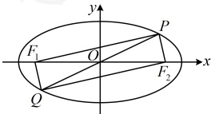

解法 1：因为 $\angle F_1PF_2 = 60^\circ$，所以 $S_{\triangle PF_1F_2} = \frac{1}{2}|PF_1| \cdot |PF_2| \cdot \sin \angle F_1PF_2 = \frac{\sqrt{3}}{4}|PF_1| \cdot |PF_2|$ ①，

故核心是求 $|\overrightarrow{PF_1}| \cdot \overrightarrow{PF_2}|$，怎么求？条件给出了 $\angle F_1PF_2 = 60^\circ$，有角，又涉及边长 $|\overrightarrow{PF_1}|$ 和 $|\overrightarrow{PF_2}|$，可考虑对该角用余弦定理，联系椭圆定义处理，椭圆的半焦距 $c = \sqrt{4-3}=1$，所以 $|\overrightarrow{F_1F_2}| = 2c=2$，在 $\triangle PF_1F_2$ 中，由余弦定理，$|\overrightarrow{F_1F_2}|^2 = |\overrightarrow{PF_1}|^2 + |\overrightarrow{PF_2}|^2 - 2|\overrightarrow{PF_1}| \cdot |\overrightarrow{PF_2}| \cdot \cos \angle F_1PF_2$，所以 $|\overrightarrow{PF_1}|^2 + |\overrightarrow{PF_2}|^2 - |\overrightarrow{PF_1}| \cdot |\overrightarrow{PF_2}| = 4$ ②，

由椭圆定义，$|\overrightarrow{PF_1}| + |\overrightarrow{PF_2}| = 4$，所以 $|\overrightarrow{PF_1}|^2 + |\overrightarrow{PF_2}|^2 + 2|\overrightarrow{PF_1}| \cdot |\overrightarrow{PF_2}| = 16$ ③，

由③-②得 $3|\overrightarrow{PF_1}| \cdot |\overrightarrow{PF_2}| = 12 \Rightarrow |\overrightarrow{PF_1}| \cdot |\overrightarrow{PF_2}| = 4$，代入①得 $S_{\triangle PF_1F_2} = \frac{\sqrt{3}}{4} \times 4 = \sqrt{3}$。

解法2：$\triangle F_1PF_2$是焦点三角形，题干直接给出了$\angle F_1PF_2$，也可考虑代公式$S = b^2 \tan \frac{\theta}{2}$求$\triangle F_1PF_2$的面积，由焦点三角形面积公式，$S_{\triangle PF_1F_2} = b^2 \tan \frac{\theta}{2} = 3 \tan 30^\circ = 3 \times \frac{\sqrt{3}}{3} = \sqrt{3}$。

答案： $ \sqrt{3} $

【反思】计算椭圆焦点三角形的面积，常考虑公式  $ S = c|y_0| = b^2 \tan \frac{\theta}{2} $，至于如何选择，要看题干的条件。本题给出了  $ \angle F_1PF_2 $，故选择  $ S = b^2 \tan \frac{\theta}{2} $ 比较方便。若条件给出（或好求）点  $ P $ 的坐标，也可代  $ S = c|y_0| $ 求焦点三角形的面积。有的题不会直接给  $ P $ 的坐标或  $ \angle F_1PF_2 $，那么就需要先求出它们，再代公式，比如下面的变式 1。

【变式 1】（2021·新高考Ⅱ卷）已知  $ F_1 $， $ F_2 $ 为椭圆  $ C:\frac{x^2}{16}+\frac{y^2}{4}=1 $ 的两个焦点， $ P $， $ Q $ 为  $ C $ 上关于坐标原点对称的两点，且  $ \left|PQ\right|=\left|F_1F_2\right| $，则四边形  $ PF_1QF_2 $ 的面积为___。

解法 1：如图，四边形  $ PF_1QF_2 $ 的面积是  $ \triangle PF_1F_2 $ 面积的 2 倍，故只需求  $ S_{\triangle PF_1F_2} $，怎么求？ $ \triangle PF_1F_2 $ 是焦点三角形，可考虑公式  $ S=c\left|y_0\right| $ 或  $ S=b^2\tan\frac{\theta}{2} $ 来求，我们先试试前者，设  $ P(x_0,y_0) $，由题意，椭圆的半焦距  $ c=\sqrt{16-4}=2\sqrt{3}\Rightarrow\left|F_1F_2\right|=4\sqrt{3} $，所以  $ \left|OP\right|=\frac{1}{2}\left|PQ\right|=\frac{1}{2}\left|F_1F_2\right|=2\sqrt{3} $，故  $ x_0^2+y_0^2=12 $，结合  $ \frac{x_0^2}{16}+\frac{y_0^2}{4}=1 $ 可得  $ \left|y_0\right|=\frac{2\sqrt{3}}{3} $，所以四边形  $ PF_1QF_2 $ 的面积  $ S=2S_{\triangle PF_1F_2}=2\times c\left|y_0\right|=2\times2\sqrt{3}\times\frac{2\sqrt{3}}{3}=8 $。

解法 2：能否用公式  $ S=b^2\tan\frac{\theta}{2} $ 求  $ \triangle PF_1F_2 $ 的面积？可以，需要先分析  $ \angle F_1PF_2 $ 的大小，

如图，由对称性，四边形  $ PF_1QF_2 $ 是平行四边形，又  $ |PQ| = |F_1F_2| $，所以四边形  $ PF_1QF_2 $ 是矩形  $ \Rightarrow \angle F_1PF_2 = 90^\circ $，所以  $ S_{\triangle PF_1F_2} = b^2 \tan \frac{\theta}{2} = 4 \times \tan 45^\circ = 4 $，故四边形  $ PF_1QF_2 $ 的面积  $ S = 2S_{\triangle PF_1F_2} = 8 $。

答案：8

【变式2】（2023·全国甲卷）椭圆 $ \frac{x^2}{9}+\frac{y^2}{6}=1 $的两焦点为 $ F_1 $， $ F_2 $， $ O $为原点， $ P $为椭圆上一点， $ \cos\angle F_1PF_2=\frac{3}{5} $，则 $ |OP|= $（ ）

A.  $ \frac{2}{5} $ B.  $ \frac{\sqrt{30}}{2} $ C.  $ \frac{3}{5} $ D.  $ \frac{\sqrt{35}}{2} $