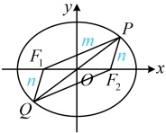

解法1：条件给出$\cos\angle FPF_2$，可考虑先到$\triangle PF_1F_2$中用余弦定理，再作观察，

解法1：条件给出$\cos\angle FPF_2$，可考虑先到$\triangle PF_1F_2$中用余弦定理，再作观察，

椭圆的长半轴长$a=3$，短半轴长$b=\sqrt{6}$，半焦距$c=\sqrt{a^2-b^2}=\sqrt{3}$，

如图，设$|PF_1|=m$，$|PF_2|=n$，则由椭圆定义，$m+n=2a=6$ ①，

在$\triangle PF_1F_2$中，由余弦定理，$m^2+n^2-2mn\cos\angle FPF_2=|F_1F_2|^2$，

结合$|F_1F_2|=2\sqrt{3}$，$\cos\angle F_1PF_2=\frac{3}{5}$可得$m^2+n^2-\frac{6}{5}mn=12$，

所以$(m+n)^2-\frac{16}{5}mn=12$，结合式①可得$mn=\frac{15}{2}$ ②，要求的$|OP|$怎样用$m$，$n$表示呢？注意到$O$是$F_1F_2$的中点，所以$PO$是$\triangle PF_1F_2$的中线，可将$\triangle PF_1F_2$补全为平行四边形来看，

延长$PO$交椭圆于另一点$Q$，由对称性，$O$为$PQ$的中点，所以四边形$PF_1QF_2$是平行四边形，

故$|QF_1|=|PF_2|=n$，$\cos\angle PF_1Q=\cos(\pi-\angle F_1PF_2)=-\cos\angle F_1PF_2=-\frac{3}{5}$，

在$\triangle PF_1Q$中，由余弦定理，$|PQ|^2=m^2+n^2-2mn\cos\angle PF_1Q=m^2+n^2+\frac{6}{5}mn=(m+n)^2-\frac{4}{5}mn$，

结合①②得$|PQ|^2=30$，所以$|PQ|=\sqrt{30}$，故$|OP|=\frac{1}{2}|PQ|=\frac{\sqrt{30}}{2}$。

解法2：由题意，椭圆的长半轴长$a=3$，短半轴长$b=\sqrt{6}$，半焦距$c=\sqrt{a^2-b^2}=\sqrt{3}$，

$|OP|$可由点$P$的坐标求得，能否求点$P$的坐标？已知$\cos\angle F_1PF_2$，可先由它求$\tan\frac{\angle F_1PF_2}{2}$，进而能求$S_{\triangle PF_1F_2}$，

而$S_{\triangle PF_1F_2}=c|y_P|$，故可建立方程求$y_P$，代入椭圆方程又可得到$x_P$，

记$\angle F_1PF_2=\theta$，则由题意，$\cos\theta=\frac{3}{5}$，又$\cos\theta=\cos^2\frac{\theta}{2}-\sin^2\frac{\theta}{2}=\frac{\cos^2\frac{\theta}{2}-\sin^2\frac{\theta}{2}}{\cos^2\frac{\theta}{2}+\sin^2\frac{\theta}{2}}=\frac{1-\tan^2\frac{\theta}{2}}{1+\tan^2\frac{\theta}{2}}$，

所以$\frac{1-\tan^2\frac{\theta}{2}}{1+\tan^2\frac{\theta}{2}}=\frac{3}{5}$，结合$\frac{\theta}{2}$为锐角可解得：$\tan\frac{\theta}{2}=\frac{1}{2}$，所以$S_{\triangle PF_1F_2}=b^2\tan\frac{\theta}{2}=3$，又$S_{\triangle PF_1F_2}=c|y_P|=\sqrt{3}|y_P|$，

所以$\sqrt{3}|y_P|=3$，故$y_P^2=3$，代入椭圆方程得$\frac{x_P^2}{9}+\frac{3}{6}=1\Rightarrow x_P^2=\frac{9}{2}$，所以$|OP|=\sqrt{x_P^2+y_P^2}=\frac{\sqrt{30}}{2}$。

【变式 3】（2019·新课标Ⅱ卷）已知  $ F_1 $， $ F_2 $ 分别是椭圆  $ C: \frac{x^2}{a^2} + \frac{y^2}{b^2} = 1 (a > b > 0) $ 的左、右焦点， $ P $ 为  $ C $ 上一点， $ O $ 为坐标原点。

（1）若 $ \triangle POF_2 $为等边三角形，求 $ C $的离心率；

（2）如果存在点 $P$，使得 $PF_1 \perp PF_2$，且 $\triangle F_1PF_2$ 的面积等于 16，求 $b$ 的值和 $a$ 的取值范围。

解：（1）解法 1：（如图，由 $\triangle POF_2$ 为等边三角形可将点 $P$ 的坐标用 $c$ 表示，代入椭圆即可建立方程求离心率）

设椭圆 $C$ 的半焦距为 $c$，由 $\triangle POF_2$ 为等边三角形知 $P\left(\frac{c}{2}, \pm \frac{\sqrt{3}}{2}c\right)$，代入椭圆方程得 $\frac{c^2}{4a^2} + \frac{3c^2}{4b^2} = 1$，

所以 $\frac{e^2}{4} + \frac{3c^2}{4(a^2 - c^2)} = 1$，故 $\frac{e^2}{4} + \frac{3e^2}{4(1 - e^2)} = 1$，解得：$e = \sqrt{3} - 1$ 或 $\sqrt{3} + 1$（舍去）。

解法 2：（观察发现由 $\triangle POF_2$ 为等边三角形能分析焦点 $\triangle PF_1F_2$ 的三边比值，由此也能求离心率）

如图，连接 $PF_1$，由 $\triangle POF_2$ 为等边三角形知 $|OP| = |OF_2| = c = \frac{1}{2}|F_1F_2|$，所以 $PF_1 \perp PF_2$，