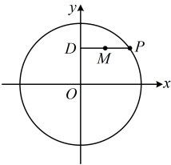
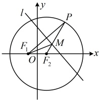

因为椭圆 $ \frac{x^2}{3-m} + \frac{y^2}{2m-1} = 1 $的焦点在 $ y $轴上，所以 $ 2m-1 > 3-m > 0 $，解得： $ \frac{4}{3} < m < 3 $。

答案： $ \left(\frac{4}{3}, 3\right) $

## 类型IV：与椭圆有关的求轨迹方程问题

【例 11】点  $ A, B $ 的坐标分别是  $ (-3,0) $， $ (3,0) $，直线  $ AM, BM $ 相交于点  $ M $，且它们的斜率之积是  $ -\frac{2}{3} $，求点  $ M $ 的轨迹方程.

解：（条件给出的$AM$，$BM$斜率之积容易直接用$M$的坐标翻译，故直接设坐标处理）

设$M(x,y)$，则直线$AM$的斜率$k_1=\frac{y-0}{x-(-3)}=\frac{y}{x+3}$，直线$BM$的斜率$k_2=\frac{y-0}{x-3}=\frac{y}{x-3}$，

由题意，$k_1k_2=-\frac{2}{3}$，所以$\frac{y}{x+3}\cdot\frac{y}{x-3}=-\frac{2}{3}$，整理得：$2x^2+3y^2=18$，即$\frac{x^2}{9}+\frac{y^2}{6}=1$，（结果了吗？务必注意，条件既然提到了$AM$，$BM$的斜率，那这两个斜率必须存在，故还需考虑这一限制）

要使$AM$，$BM$的斜率存在，则$x\neq\pm3$，所以点$M$的轨迹方程为$\frac{x^2}{9}+\frac{y^2}{6}=1(x\neq\pm3)$。

【反思】当已知条件容易用动点的坐标翻译时，可直接设动点的坐标，建立所设坐标的方程并化简，得到动点的轨迹方程（注意检验是否要排除一些特殊点），这种求轨迹方程的方法叫做“直译法”。直译法不能解决所有的求轨迹方程问题，我们来看下面的几个变式。

【变式1】已知P为圆 $ O:x^{2}+y^{2}=4 $上的动点，过P作y轴的垂线段PD，垂足为D，求线段PD的中点M的轨迹方程（当点P是圆与y轴的交点时，规定点M与点P重合）.

解：（如图，显然不易直接翻译已知条件，建立关于点M坐标的方程，怎么办呢？观察发现点M随点P一起运动，P的轨迹方程已知，P与M的坐标关系明显，故可考虑用“相关点法”求点M的轨迹方程）

设 $ M(x,y) $， $ P(x_0,y_0) $，则 $ D(0,y_0) $，由点P在圆O上运动可得 $ x_0^2+y_0^2=4 $ ①，

因为M是PD的中点，所以 $ \left\{\begin{aligned}\frac{x_0+0}{2}&=x\textcircled{2}\\ \frac{y_0+y_0}{2}&=y\textcircled{3}\end{aligned}\right. $，（所求为点M的轨迹方程，故应考虑消

去 $ x_0 $， $ y_0 $，可由②③反解出 $ x_0 $， $ y_0 $，代入①得到关于x，y的方程）

由②③可得 $ x_0=2x $ 且 $ y_0=y $，代入①得 $ (2x)^2+y^2=4 $，即 $ \frac{y^2}{4}+x^2=1 $，

所以点M的轨迹方程为 $ \frac{y^2}{4}+x^2=1 $。

【变式2】已知平面直角坐标系中，定点 $ F_1(-1,0) $， $ F_2(1,0) $，点P是圆 $ (x-1)^2+y^2=16 $上的动点，

线段 $ F_1P $的垂直平分线 $ l $与半径 $ F_2P $交于点M，求动点M的轨迹方程.

， $ \uparrow y $

解：（可以想象，直译法行不通，相关点法呢？这里M虽然是随P一起运动，但二者的坐标关系不好找，所以也不方便用相关点法，怎么办呢？我们发现题干的 $ F_1 $和 $ F_2 $关于原点对称，由此联想到焦点，于是我们画图来看看，看能否通过分析几何关系，直接找到点M的轨迹是何种曲线）

