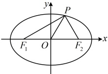
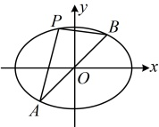

又$\angle PF_2F_1 = 60^\circ$，所以$|PF_1| = \sqrt{3}c$，$|PF_2| = c$，故$|PF_1| + |PF_2| = (\sqrt{3} + 1)c$，

又$|PF_1| + |PF_2| = 2a$，所以$(\sqrt{3} + 1)c = 2a$，故$C$的离心率$e = \frac{c}{a} = \frac{2}{\sqrt{3} + 1} = \sqrt{3} - 1$。

（2）解法1：（已知  $ \angle F_1PF_2 = 90^\circ $，若是小题，则可由  $ S_{\triangle PF_1F_2} = b^2 \tan 45^\circ = 16 $ 求得  $ b $，但解答题不宜直接代公式，可由椭圆定义结合勾股定理来求该面积）设  $ |PF_1| = m $， $ |PF_2| = n $，则由椭圆定义， $ m + n = 2a $ ①，又  $ PF_1 \perp PF_2 $，所以  $ \left|PF_1\right|^2 + \left|PF_2\right|^2 = \left|F_1F_2\right|^2 $，故  $ m^2 + n^2 = 4c^2 $ ②，由  $ \triangle F_1PF_2 $ 的面积等于 16 知  $ S_{\triangle F_1PF_2} = \frac{1}{2}mn = 16 $，所以  $ mn = 32 $ ③，

（要求的是 $b$，故应消去 $m$ 和 $n$，观察发现将式②配方，再将①③代入即可消去 $m$，$n$）

由②得 $m^2 + n^2 = (m+n)^2 - 2mn = 4c^2$，结合①③可得 $4a^2 - 64 = 4c^2$，所以 $a^2 - c^2 = b^2 = 16$，故 $b = 4$，

由②得  $ m^2 + n^2 = (m+n)^2 - 2mn = 4c^2 $，结合①③可得  $ 4a^2 - 64 = 4c^2 $，所以  $ a^2 - c^2 = b^2 = 16 $，故  $ b = 4 $，

（再求  $ a $ 的范围，观察式①和式③可发现这是在  $ mn $ 为定值的条件下求  $ m+n $ 的取值范围的问题，可用基本不等式处理）由①③得  $ 2a = m + n \geq 2\sqrt{mn} = 8\sqrt{2} $，所以  $ a \geq 4\sqrt{2} $，取等条件是  $ m = n $，故  $ a $ 的取值范围为  $ [4\sqrt{2}, +\infty) $。

解法 2：（注意到  $ S_{\triangle DEF} $ 可由点  $ P $ 的坐标来算， $ PF_1 \perp PF_2 $，也能坐标化，故也可设  $ P $ 的坐标，并翻译已知条件，

建立方程组来分析）设  $ P(x, y) $，则由题意， $ \begin{cases} \dfrac{x^2}{a^2} + \dfrac{y^2}{b^2} = 1 \textcircled{4} \text{（点} P \text{在椭圆上）} \\ \dfrac{y}{x+c} \cdot \dfrac{y}{x-c} = -1 \textcircled{5} \text{（} PF_1 \perp PF_2 \text{）} \\ S_{\triangle F_1PF_2} = \dfrac{1}{2} \cdot 2c \cdot |y| = 16 \textcircled{6} \end{cases} $

（我们的目标是求  $ b $，而  $ a $， $ c $ 与  $ b $ 有天然的关系，故应消去  $ x $， $ y $，可先由④⑤解出  $ y $，再代入⑥）

由⑤得  $ x^2 + y^2 = c^2 $，与④联立可解得： $ |y| = \dfrac{b^2}{c} $，代入⑥可得  $ c \cdot \dfrac{b^2}{c} = 16 $，解得： $ b = 4 $，

（再求求  $ a $ 的范围，观察发现式⑥有  $ c $ 和  $ y $ 的关系，由  $ P $ 在椭圆上可得到  $ y $ 的范围，自然就可求得  $ c $ 的范围，而  $ b $ 又已知，故可再由  $ a = \sqrt{b^2 + c^2} $ 得到  $ a $ 的范围）

因为点  $ P $ 在椭圆上，所以  $ |y| \leq b = 4 $，代入⑥得  $ 16 = c|y| \leq 4c $，所以  $ c \geq 4 $，故  $ a = \sqrt{b^2 + c^2} = \sqrt{16 + c^2} \geq 4\sqrt{2} $，

取等条件是  $ |y| = b = c = 4 $，所以  $ a $ 的取值范围为  $ [4\sqrt{2}, +\infty) $。

【反思】通过本题可以看到，对于焦点三角形的面积，不能只记公式，它的常规计算方法（联系椭圆定义、勾股定理或余弦定理、面积公式处理）也需要掌握，因为在解答题中不宜直接用结论计算焦点三角形的面积.

## 类型IV：椭圆第三定义斜率积结论的应用

【例 4】已知椭圆  $ C: \frac{x^2}{a^2} + \frac{y^2}{b^2} = 1 (a > b > 0) $，直线  $ y = x $ 与椭圆相交于  $ A $， $ B $ 两点，若椭圆上存在异于  $ A $， $ B $ 两点的点  $ P $ 使  $ -\frac{1}{3} < k_{PA} \cdot k_{PB} < 0 $，则椭圆离心率  $ e $ 的取值范围是___。

解析：如图，由椭圆的对称性， $ A, B $ 关于原点对称，又涉及  $ k_{PA} \cdot k_{PB} $，想到椭圆第三定义斜率积结论，由椭圆第三定义斜率积结论， $ k_{PA} \cdot k_{PB} = -\frac{b^2}{a^2} $，

由题意， $ -\frac{1}{3}<k_{PA}\cdot k_{PB}<0 $，所以 $ -\frac{1}{3}<-\frac{b^2}{a^2}<0\Rightarrow a^2>3b^2\Rightarrow a^2>3(a^2-c^2) $，

化简得： $ 2a^2 < 3c^2 $，故椭圆的离心率 $ e = \frac{c}{a} > \frac{\sqrt{6}}{3} $，结合 $ 0 < e < 1 $得 $ e \in \left(\frac{\sqrt{6}}{3}, 1\right) $。

答案： $ \left(\frac{\sqrt{6}}{3},1\right) $