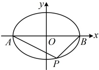
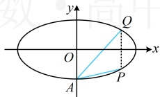
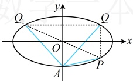

【变式 1】椭圆  $ C: \frac{x^2}{4} + \frac{y^2}{2} = 1 $ 的左、右顶点分别为  $ A, B $，点  $ P $ 在  $ C $ 上且直线  $ PA $ 的斜率的取值范围是  $ [-1, 0) $，那么直线  $ PB $ 斜率的取值范围是___。

解析：如图，条件涉及 $PA$，$PB$ 的斜率，$A$，$B$ 又是椭圆的左、右顶点，想到椭圆第三定义斜率积结论。设 $PA$，$PB$ 的斜率分别为 $k_1$，$k_2$，由椭圆第三定义，$k_1k_2 = -\frac{2}{4} = -\frac{1}{2} \Rightarrow k_2 = -\frac{1}{2k_1}$。

又 $k_1 \in [-1,0)$，所以 $\frac{1}{k_1} \leq -1$，从而 $-\frac{1}{2k_1} \geq \frac{1}{2}$，故 $k_2 \in \left[\frac{1}{2},+\infty\right)$。

答案： $ \left[\frac{1}{2},+\infty\right) $

【反思】看到椭圆上关于原点对称的两点时，要联想到用第三定义斜率积结论建立方程，求解需要的量。有时椭圆上的两点虽不关于原点对称，但可以通过适当的转化，构造出关于原点对称的两点，比如下面的变式2.

【变式 2】椭圆  $ C: \frac{x^{2}}{a^{2}} + \frac{y^{2}}{b^{2}} = 1 (a > b > 0) $ 的下顶点为  $ A $，点  $ P $， $ Q $ 均在  $ C $ 上，且关于  $ x $ 轴对称，若直线  $ AP $， $ AQ $ 的斜率之积为  $ \frac{1}{4} $，则  $ C $ 的离心率为___。

解法1：如图1，条件虽然涉及AP，AQ的斜率积，但观察图形发现P，Q不关于原点对称，不符合第三定义斜率积结论的场景，怎么办呢？若无思路，可尝试直接设点，翻译题干的斜率积，

图1

图2

设  $ P(x_0, y_0) $，则  $ Q(x_0, -y_0) $，又  $ A(0, -b) $，所以直线 AP，AQ 的斜率之积  $ k_{AP} \cdot k_{AQ} = \frac{y_0 + b}{x_0} \cdot \frac{-y_0 + b}{x_0} = \frac{b^2 - y_0^2}{x_0^2} $，由题意， $ k_{AP} \cdot k_{AQ} = \frac{1}{4} $，所以  $ \frac{b^2 - y_0^2}{x_0^2} = \frac{1}{4} $ ①，

求离心率需建立关于 $a, b, c$ 的齐次方程，故考虑消去式①中的 $x_0$，$y_0$，怎么消？可考虑利用椭圆方程来消元，因为点 $P$ 在椭圆 $C$ 上，所以 $\frac{x_0^2}{a^2} + \frac{y_0^2}{b^2} = 1$，故 $x_0^2 = a^2 \left(1 - \frac{y_0^2}{b^2}\right) = \frac{a^2}{b^2}(b^2 - y_0^2)$，

代入①得 $ \frac{b^{2}-y_{0}^{2}}{\frac{a^{2}}{b^{2}}(b^{2}-y_{0}^{2})}=\frac{1}{4} $，所以 $ \frac{b^{2}}{a^{2}}=\frac{1}{4} $，故 $ a^{2}=4b^{2}=4(a^{2}-c^{2}) $，化简得C的离心率 $ e=\frac{c}{a}=\frac{\sqrt{3}}{2} $

解法2：AP，AQ的斜率积没有直接满足第三定义斜率积结论，能否通过适当的转化，使其满足该结论呢？能，我们试试用P，Q两点构造出椭圆上关于原点对称的两点来看，

如图2，设点 Q 关于 y 轴的对称点为  $ Q_{1} $，则 P， $ Q_{1} $ 关于原点对称，且  $ k_{AQ_{1}} = -k_{AQ} $ ②，

如图2，设点  $ Q $ 关于  $ y $ 轴的对称点为  $ Q_1 $，则  $ P $， $ Q_1 $ 关于原点对称，且  $ k_{AQ_1} = -k_{AQ} $ ②，

由椭圆第三定义斜率积结论， $ k_{AP} \cdot k_{AQ_1} = -\frac{b^2}{a^2} $，将式②代入得  $ k_{AP} \cdot (-k_{AQ}) = -\frac{b^2}{a^2} $，所以  $ k_{AP} \cdot k_{AQ} = \frac{b^2}{a^2} $，

又  $ k_{AP} \cdot k_{AQ} = \frac{1}{4} $，所以  $ \frac{b^2}{a^2} = \frac{1}{4} $，接下来同解法 1.