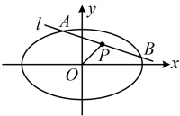

答案： $ \frac{\sqrt{3}}{2} $

## 类型V：椭圆中点弦斜率积结论的应用

【例 5】已知 O 为原点，椭圆  $ C: \frac{x^{2}}{a^{2}} + \frac{y^{2}}{b^{2}} = 1 (a > b > 0) $ 与直线  $ l: x - y + 1 = 0 $ 交于 A, B 两点，线段 AB 的中点为 M，若直线 OM 的斜率为  $ -\frac{1}{3} $，则椭圆 C 的离心率为（）

A.  $ \frac{1}{2} $ B.  $ \frac{\sqrt{3}}{2} $ C.  $ \frac{\sqrt{5}-1}{2} $ D.  $ \frac{\sqrt{6}}{3} $

解法1：条件给出直线 $OM$ 的斜率，该斜率可由点 $M$ 的坐标求得，$M$ 为 $AB$ 的中点，故可考虑联立直线 $l$ 与椭圆 $C$ 的方程，结合韦达定理来求 $M$ 的坐标，

联立 $\begin{cases} x - y + 1 = 0 \\ \frac{x^2}{a^2} + \frac{y^2}{b^2} = 1 \end{cases}$ 消去 $y$ 整理得：$(a^2 + b^2)x^2 + 2a^2x + a^2 - a^2b^2 = 0$，设 $A(x_1, y_1)$，$B(x_2, y_2)$，

则由韦达定理， $ x_1 + x_2 = -\frac{2a^2}{a^2 + b^2} $，怎样求  $ y_1 + y_2 $？可利用直线的方程转化为  $ x_1 + x_2 $ 来算，

因为  $ A $， $ B $ 两点都在直线  $ l $ 上，所以  $ \begin{cases} x_1 - y_1 + 1 = 0 \\ x_2 - y_2 + 1 = 0 \end{cases} $，从而  $ \begin{cases} y_1 = x_1 + 1 \\ y_2 = x_2 + 1 \end{cases} $，

故  $ y_1 + y_2 = x_1 + 1 + x_2 + 1 = x_1 + x_2 + 2 = -\frac{2a^2}{a^2 + b^2} + 2 = \frac{2b^2}{a^2 + b^2} $，

 $$ \left(-\frac{a^{2}}{a^{2}+b^{2}},\frac{b^{2}}{a^{2}+b^{2}}\right) $$ 

 $$ k_{OM}=\frac{\frac{b^{2}}{a^{2}+b^{2}}-0}{-\frac{a^{2}}{a^{2}+b^{2}}-0}=-\frac{b^{2}}{a^{2}} $$ 

 $$ k_{OM}=-\frac{1}{3} $$ 

 $$ -\frac{b^{2}}{a^{2}}=-\frac{1}{3} $$ 

 $$ a^{2}=3b^{2}=3(a^{2}-c^{2}) $$ 

 $$ 2a^{2}=3c^{2}\Rightarrow $$ 

 $$ e=\frac{c}{a}=\frac{\sqrt{6}}{3} $$ 

解法2：题干涉及椭圆的弦$AB$的中点$M$，想到中点弦斜率积结论，

由椭圆的中点弦斜率积结论，$k_{AB}\cdot k_{OM}=-\frac{b^{2}}{a^{2}}$，直线$l$的方程可化为$y=x+1$，所以$k_{AB}=1$，

又直线$OM$的斜率为$-\frac{1}{3}$，所以$k_{AB}\cdot k_{OM}=1\times\left(-\frac{1}{3}\right)=-\frac{1}{3}$，故$-\frac{b^{2}}{a^{2}}=-\frac{1}{3}$，接下来同解法1.

答案：D

【反思】在椭圆中，看到弦和弦中点，要联想到用中点弦斜率积结论建立方程，求解需要的量。本题是用该结论建立方程求离心率，也可用它建立方程求其它量，例如直线/的方程等，我们来看下面的变式1.

【变式 1】已知椭圆  $ C: \frac{x^{2}}{9} + \frac{y^{2}}{3} = 1 $，过点  $ P(1,1) $ 的直线  $ l $ 交椭圆  $ C $ 于  $ A $， $ B $ 两点，且  $ P $ 为线段  $ AB $ 的中点，则直线  $ l $ 的方程为（ ）

A.  $ x + 3y - 4 = 0 $  B.  $ 3x + y - 4 = 0 $  C.  $ x - 3y + 2 = 0 $  D.  $ 3x - y - 2 = 0 $

解析：如图，已有点  $ P $，求直线  $ l $ 的方程还差斜率，怎样求斜率？条件涉及弦  $ AB $ 的中点，当然想到用中点弦斜率积结论求直线  $ l $ 的斜率，

由椭圆的中点弦斜率积结论， $ k_{AB} \cdot k_{OP} = -\frac{3}{9} = -\frac{1}{3} $，又  $ k_{OP} = \frac{1 - 0}{1 - 0} = 1 $，所以  $ k_{AB} = -\frac{1}{3} $，

