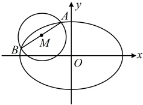

又因为直线 $l$ 过点 $P$，所以其方程为 $y-1=-\frac{1}{3}(x-1)$，整理得：$x+3y-4=0$。

答案：A

【变式 2】（2015·陕西卷）已知椭圆  $ E:\frac{x^2}{a^2}+\frac{y^2}{b^2}=1(a>b>0) $ 的半焦距为  $ c $，原点  $ O $ 到经过两点  $ (c,0) $， $ (0,b) $ 的直线的距离为  $ \frac{c}{2} $。

（1）求椭圆 E 的离心率；

（2）如图，$AB$ 是圆 $M:(x+2)^2+(y-1)^2=\frac{5}{2}$ 的一条直径，若椭圆 $E$

经过 $A$，$B$ 两点，求椭圆 $E$ 的方程。

解：（1）经过 $(c,0)$ 和 $(0,b)$ 两点的直线的截距式方程为 $\frac{x}{c}+\frac{y}{b}=1$，即 $bx+cy-bc=0$，

所以原点到该直线的距离 $d=\frac{|-bc|}{\sqrt{b^2+c^2}}=\frac{bc}{\sqrt{a^2}}=\frac{bc}{a}$，由题意，$\frac{bc}{a}=\frac{c}{2}$，所以 $a=2b$，

故 $a^2=4b^2=4a^2-4c^2$，化简得椭圆 $E$ 的离心率 $e=\frac{c}{a}=\frac{\sqrt{3}}{2}$。

（2）（已有 $a=2b$，为方便分析，可将其代入椭圆方程，减少字母的个数）

将 $a=2b$ 代入椭圆的方程可得 $\frac{x^2}{(2b)^2} + \frac{y^2}{b^2} = 1$，两端同乘以 $4b^2$ 得 $x^2 + 4y^2 = 4b^2$，

（怎样求 $b$？椭圆的弦 $AB$ 是圆 $M$ 的直径，这意味着圆心 $M$ 为弦 $AB$ 的中点，涉及弦中点，想到中点弦斜率积结论。由于是解答题，我们先用点差法推导该结论，看能得到什么，再作观察）

设 $A(x_1, y_1)$，$B(x_2, y_2)$，因为 $AB$ 是圆 $M$ 的直径，所以 $AB$ 中点为 $M(-2,1)$，故 $\begin{cases} x_1 + x_2 = -4 \quad ① \\ y_1 + y_2 = 2 \quad ② \end{cases}$，

又 $A$，$B$ 在椭圆上，所以 $\begin{cases} x_1^2 + 4y_1^2 = 4b^2 \\ x_2^2 + 4y_2^2 = 4b^2 \end{cases}$，两式作差得：$(x_1 + x_2)(x_1 - x_2) + 4(y_1 + y_2)(y_1 - y_2) = 0$，

设  $ A(x_1, y_1) $， $ B(x_2, y_2) $，因为  $ AB $ 是圆  $ M $ 的直径，所以  $ AB $ 中点为  $ M(-2,1) $，故  $ \begin{cases} x_1 + x_2 = -4 \\ y_1 + y_2 = 2 \end{cases} $ ①，

又  $ A $， $ B $ 在椭圆上，所以  $ \begin{cases} x_1^2 + 4y_1^2 = 4b^2 \\ x_2^2 + 4y_2^2 = 4b^2 \end{cases} $，两式作差得： $ (x_1 + x_2)(x_1 - x_2) + 4(y_1 + y_2)(y_1 - y_2) = 0 $，

结合①②得  $ -4(x_1 - x_2) + 8(y_1 - y_2) = 0 $，所以  $ k_{AB} = \frac{y_1 - y_2}{x_1 - x_2} = \frac{1}{2} $，故  $ AB $ 的方程为  $ y - 1 = \frac{1}{2}(x + 2) $，即  $ x = 2y - 4 $，

（有了  $ AB $ 的方程，怎样建立方程求  $ b $？注意到圆  $ M $ 的直径  $ |AB| $ 是已知的，故可将直线  $ AB $ 的方程代入椭圆，用椭圆的弦长公式计算弦长  $ |AB| $，从而建立方程求  $ b $）

联立  $ \begin{cases} x = 2y - 4 \\ x^2 + 4y^2 = 4b^2 \end{cases} $ 消去  $ x $ 整理得： $ 2y^2 - 4y + 4 - b^2 = 0 $，判别式  $ \Delta = 8b^2 - 16 $，

由弦长公式， $ |AB| = \sqrt{1 + 2^2} \cdot |y_1 - y_2| = \sqrt{5} \cdot \frac{\sqrt{8b^2 - 16}}{2} $，又由所给圆  $ M $ 的方程可知  $ |AB| = 2r = \sqrt{10} $，

所以  $ \sqrt{5} \cdot \frac{\sqrt{8b^2 - 16}}{2} = \sqrt{10} $，解得： $ b^2 = 3 $，从而  $ a^2 = 4b^2 = 12 $，故椭圆  $ E $ 的方程为  $ \frac{x^2}{12} + \frac{y^2}{3} = 1 $。

【反思】①有时弦中点不会明确给出，需要我们自己去发现。例如本题AB为圆M的直径就隐藏了M为弦AB的中点，从而识别出这是中点弦问题；②中点弦斜率积结论的推导方法（点差法）也需掌握，在解答题中，不宜直接用结论，所以在解答题中遇到中点弦问题，可考虑用点差法处理。