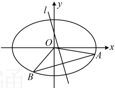

### 12. （2018·新课标Ⅲ卷（节选））

斜率为 k 的直线 l 与椭圆  $ C: \frac{x^{2}}{4} + \frac{y^{2}}{3} = 1 $ 交于 A, B 两点，线段 AB 的中点为  $ M(1, m) (m > 0) $，证明： $ k < -\frac{1}{2} $.

### 13. （2015·浙江卷（节选））

已知椭圆  $ \frac{x^{2}}{2}+y^{2}=1 $ 上两个不同的点 A，B 关于直线 l:  $ y=mx+\frac{1}{2} $ 对称，求实数 m 的取值范围.

