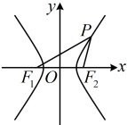
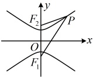

# 3.2.1 双曲线及其标准方程

习题：P1

## 知识梳理

## 知识点1：双曲线的定义

一般地，我们把平面内与两个定点 $ F_1 $， $ F_2 $的距离之差的绝对值等于非零常数（该常数记作 $ 2a $，且 $ 2a < |F_1F_2| $）的点的轨迹叫做双曲线。这两个定点叫做双曲线的焦点，两焦点间的距离叫做双曲线的焦距（记作 $ 2c $）。

注：①由双曲线的定义，双曲线可以看成是点集  $ P = \left\{ M \left| \left| M F_{1} \right| - \left| M F_{2} \right| \right| = 2a, 0 < 2a < \left| F_{1} F_{2} \right| \right\} $.

②定义中的限制条件“ $ 0 < 2a < |F_1 F_2| $”怎么理解？2a

与 $ |F_1 F_2| $的大小关系不同，所得图形的形状不同：

(i) 若  $ 0 < 2a < |F_1F_2| $，则点  $ M $ 的轨迹为双曲线；

(ii) 若  $ 2a = |F_1F_2| $，则点  $ M $ 的轨迹为分别以  $ F_1 $， $ F_2 $ 为端点，与  $ \overrightarrow{F_2F_1} $， $ \overrightarrow{F_1F_2} $ 同向的射线；

(iii) 若  $ 2a > |F_1F_2| $，则点  $ M $ 不存在；

(iv) 若 2a = 0，则点 M 的轨迹为线段  $ F_{1}F_{2} $ 的中垂线.

## 知识点2：双曲线的标准方程

### 1. 双曲线的标准方程

<table border=1 style='margin: auto; word-wrap: break-word;'><tr><td style='text-align: center; word-wrap: break-word;'>标准方程</td><td style='text-align: center; word-wrap: break-word;'>$ \frac{x^{2}}{a^{2}}-\frac{y^{2}}{b^{2}}=1(a&gt;0,b&gt;0) $</td><td style='text-align: center; word-wrap: break-word;'>$ \frac{y^{2}}{a^{2}}-\frac{x^{2}}{b^{2}}=1(a&gt;0,b&gt;0) $</td></tr><tr><td style='text-align: center; word-wrap: break-word;'>图形</td><td style='text-align: center; word-wrap: break-word;'></td><td style='text-align: center; word-wrap: break-word;'></td></tr><tr><td style='text-align: center; word-wrap: break-word;'>焦点位置</td><td style='text-align: center; word-wrap: break-word;'>x轴上</td><td style='text-align: center; word-wrap: break-word;'>y轴上</td></tr><tr><td style='text-align: center; word-wrap: break-word;'>焦点坐标</td><td style='text-align: center; word-wrap: break-word;'>$ F_{1}(-c,0) $， $ F_{2}(c,0) $</td><td style='text-align: center; word-wrap: break-word;'>$ F_{1}(0,-c) $， $ F_{2}(0,c) $</td></tr><tr><td style='text-align: center; word-wrap: break-word;'>焦距</td><td colspan="2">$ |F_{1}F_{2}|=2c $</td></tr><tr><td style='text-align: center; word-wrap: break-word;'>异同点</td><td colspan="2">相同点：大小、形状相同，a,b,c&gt;0，且c最大，满足 $ c^{2}=a^{2}+b^{2} $，是轴对称与中心对称图形；不同点：焦点位置和坐标不同。</td></tr></table>

## 知识点1、2

【例1】设 $ F_{1} $， $ F_{2} $是双曲线 $ \frac{x^{2}}{9}-\frac{y^{2}}{7}=1 $的左、右焦点，点P在双曲线上，若 $ \left|PF_{2}\right|=8 $，则 $ \left|PF_{1}\right|= $___。

解析：由所给双曲线方程， $ a^2 = 9 $， $ b^2 = 7 $，结合 $ a > 0 $得 $ a = 3 $， $ c = \sqrt{a^2 + b^2} = 4 $，由双曲线的定义， $ \|PF_1| - |PF_2| = 2a = 6 $，所以 $ |PF_1| - |PF_2| = \pm 6 $，又 $ |PF_2| = 8 $，所以 $ |PF_1| = |PF_2| \pm 6 = 8 \pm 6 = 14 $或2，因为 $ |PF_2| = 8 \geq c + a = 7 $，所以P可能在左支或右支，故两个解都可取。

答案：14或2

【例2】双曲线 $ x^{2}-\frac{y^{2}}{4}=1 $的焦点为___.

解析：由 $ x^{2}-\frac{y^{2}}{4}=1 $可知 $ a^{2}=1 $， $ b^{2}=4 $，

所以 $ c^{2}=a^{2}+b^{2}=1+4=5 $，结合c>0可得 $ c=\sqrt{5} $，又因为双曲线的焦点在x轴上，所以焦点为 $ (\sqrt{5},0) $和 $ (-\sqrt{5},0) $.

答案： $ (\sqrt{5},0) $ 和  $ (-\sqrt{5},0) $

【例3】下列双曲线，焦点在y轴上的是（ ）

A.  $ \frac{x^2}{3} - \frac{y^2}{7} = 1 $      B.  $ \frac{x^2}{7} - \frac{y^2}{3} = 1 $

C.  $ \frac{y^2}{3} - \frac{x^2}{7} = 1 $      D.  $ \frac{x^2}{5} - \frac{y^2}{5} = 1 $

解析：焦点在 y 轴上的双曲线，其标准方程中  $ y^{2} $ 的系数为正数，选项中只有 C 项  $ y^{2} $ 的系数为正数  $ \frac{1}{3} $，故选 C.

答案：C