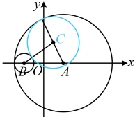

如图，连接 $MF_1$，因为点 $M$ 是 $PF_1$ 的垂直平分线 $l$ 上的点，所以 $|MF_1|=|MP|$，

从而 $|MF_2| + |MF_1| = |MF_2| + |MP| = |PF_2| = 4 > |F_1F_2| = 2$，故点 $M$ 的轨迹是以 $F_1$，$F_2$ 为焦点的椭圆，

（已经确定轨迹为椭圆，接下来六，需求出椭圆的参数，就能待到其标准方程）

可设该椭圆的方程为  $ \frac{x^2}{a^2} + \frac{y^2}{b^2} = 1 (a > b > 0) $，则  $ 2a = 4 $， $ c = 1 $，所以  $ a = 2 $， $ b = \sqrt{a^2 - c^2} = \sqrt{2^2 - 1^2} = \sqrt{3} $，

故动点  $ M $ 的轨迹方程为  $ \frac{x^2}{4} + \frac{y^2}{3} = 1 $。

【反思】当直译法和相关点法都失效时，还可尝试通过分析几何关系，直接得到动点的轨迹满足何种曲线的定义，并由此出发求出其轨迹方程，这种求轨迹方程的方法叫做“定义法”，我们再来看一个变式3.

【变式 3】已知动圆  $ C $ 与圆  $ A:(x-2)^2+y^2=25 $ 内切，同时与圆  $ B:(x+2)^2+y^2=1 $ 外切，求动圆  $ C $ 的圆心的轨迹方程。

解：（条件涉及圆与圆内切、外切，可按圆心距与两圆的半径关系来翻译，我们先把条件翻译出来，再作观察）

由题意， $ A(2,0) $，圆  $ A $ 半径  $ r_1=5 $， $ B(-2,0) $，圆  $ B $ 半径  $ r_2=1 $，设圆  $ C $ 的半径为  $ r $，

如图，因为圆  $ C $ 与圆  $ A $ 内切，与圆  $ B $ 外切，所以  $ \begin{cases}|CA|=r_1-r=5-r\quad①\\|CB|=r_2+r=1+r\quad②\end{cases} $，

（要求的是点 $C$ 的轨迹方程，故考虑消去上述两式中的 $r$，得到点 $C$ 满足的关系式，

观察发现直接将两式相加即可）①+②可得 $|CA| + |CB| = 5 - r + 1 + r = 6$，

所以点 $C$ 到 $A$，$B$ 的距离之和为 6，且 $6 > |AB| = 4$，

故点 $C$ 的轨迹是以 $A$，$B$ 为焦点的椭圆，可设其方程为 $\frac{x^2}{a^2} + \frac{y^2}{b^2} = 1$ ($a > b > 0$)，则 $2a = 6$，$c = 2$，

所以 $a = 3$，$b = \sqrt{a^2 - c^2} = \sqrt{3^2 - 2^2} = \sqrt{5}$，故点 $C$ 的轨迹方程为 $\frac{x^2}{9} + \frac{y^2}{5} = 1$，

（结果了吗？观察图形发现圆 $A$ 与圆 $B$ 相切于点 $(-3,0)$，该点也在上述椭圆上，当点 $C$ 运动至 $(-3,0)$ 时，圆 $C$ 的半径为 0，此时圆 $C$ 不存在，所以这个点要剔除）

当 $x = -3$ 时，圆 $C$ 不存在，不合题意，所以点 $C$ 的轨迹方程为 $\frac{x^2}{9} + \frac{y^2}{5} = 1$ ($x \ne -3$).

## 类型V：椭圆定义与几何性质综合题

【例 12】设  $ F_1 $， $ F_2 $ 分别为椭圆  $ C: \frac{x^2}{25} + \frac{y^2}{16} = 1 $ 的左、右焦点， $ P $ 是椭圆上一点， $ M $ 是  $ F_1P $ 的中点， $ \left|OM\right| = 3 $，则点  $ P $ 到椭圆左焦点的距离为（ ）

A. 4          B. 3          C. 2          D. 1

解法 1：$|PF_1|$ 可由点 $P$ 的坐标计算，故可尝试设 $P$ 的坐标，翻译已知条件，求解所设坐标，

由题意，椭圆的半焦距 $c = \sqrt{25 - 16} = 3$，所以 $F_1(-3,0)$，设 $P(x_0,y_0)$，则 $PF_1$ 的中点为 $M\left(\frac{x_0 - 3}{2}, \frac{y_0}{2}\right)$，

因为 $|OM| = 3$，所以 $\sqrt{\left(\frac{x_0 - 3}{2}\right)^2 + \left(\frac{y_0}{2}\right)^2} = 3$，化简得：$(x_0 - 3)^2 + y_0^2 = 36$ ①，

求 $x_0$，$y_0$ 还差一个方程，可将点 $P$ 的坐标代入椭圆方程，第二个方程就有了，

因为点 $P$ 在椭圆 $C$ 上，所以 $\frac{x_0^2}{25} + \frac{y_0^2}{16} = 1$，故 $y_0^2 = 16 - \frac{16}{25}x_0^2$，代入①得 $(x_0 - 3)^2 + 16 - \frac{16}{25}x_0^2 = 36$，