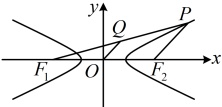
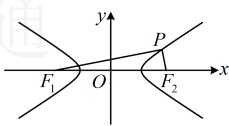
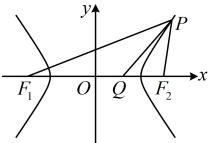

A. 2 B. 4 C. 6 D. 8

解析：条件涉及中点，联想到中位线，注意到 O 是  $ F_1F_2 $ 的中点，所以有中位线，故由此出发分析几何特征，如图，因为点 Q 为线段  $ PF_1 $ 的中点，点 O 是  $ F_1F_2 $ 的中点，所以  $ |PF_2|=2|OQ|=2 $，如图，因为点 Q 为线段  $ PF_1 $ 的中点，点 O 是  $ F_1F_2 $ 的中点，所以  $ |PF_2|=2|OQ|=2 $，在双曲线 C 中， $ a^2=4\Rightarrow a=2 $，由双曲线的定义， $ |PF_1|-|PF_2|=2a=4 $，所以  $ \left|PF_1\right|=4+\left|PF_2\right|=4+2=6 $。

答案：C

【反思】①与椭圆中同类问题的处理方法类似，双曲线中隐藏了原点 O 是  $ F_1F_2 $ 的中点，所以若题干还给出了其它中点，则可考虑由此构造中位线分析；②在双曲线中，涉及焦点三角形（以两个焦点和双曲线上一点为顶点的三角形，例如本题的  $ \triangle PF_1F_2 $），常考虑联系双曲线定义处理，我们来看几个变式。

【变式 1】已知双曲线的中心在原点，两个焦点分别为  $ F_1(-\sqrt{5},0) $， $ F_2(\sqrt{5},0) $，点  $ P $ 在双曲线上，且  $ PF_1 \perp PF_2 $， $ \triangle PF_1F_2 $ 的面积为 1，则双曲线的方程为（ ）

A.  $ \frac{x^2}{2} - \frac{y^2}{3} = 1 $      B.  $ \frac{x^2}{3} - \frac{y^2}{2} = 1 $      C.  $ x^2 - \frac{y^2}{4} = 1 $      D.  $ \frac{x^2}{4} - y^2 = 1 $

解析：如图，因为  $ PF_1 \perp PF_2 $，所以  $ S_{\triangle PF_1F_2} = \frac{1}{2}|PF_1| \cdot |PF_2| $，结合题意可知  $ \frac{1}{2}|PF_1| \cdot |PF_2| = 1 \Rightarrow |PF_1| \cdot |PF_2| = 2 $ ①，在  $ \mathrm{Rt}\triangle PF_1F_2 $ 中，斜边  $ F_1F_2 $ 长度已知，式①又涉及  $ |PF_1| $ 和  $ |PF_2| $，考虑用勾股定理翻译  $ PF_1 \perp PF_2 $，由题意， $ \left|F_1F_2\right| = 2\sqrt{5} $，因为  $ PF_1 \perp PF_2 $，所以  $ \left|PF_1\right|^2 + \left|PF_2\right|^2 = \left|F_1F_2\right|^2 $，故  $ \left|PF_1\right|^2 + \left|PF_2\right|^2 = 20 $ ②，

怎样求双曲线的方程？观察发现由①②容易求出 $ \|PF_1| - |PF_2| $，故联系双曲线定义可求出 $ a $，由②可得 $ (|PF_1| - |PF_2|)^2 + 2|PF_1| \cdot |PF_2| = 20 $，结合①得 $ (|PF_1| - |PF_2|)^2 = 16 $，所以 $ \|PF_1| - |PF_2| = 4 $，又由双曲线定义， $ \|PF_1| - |PF_2| = 2a $，所以 $ 2a = 4 \Rightarrow a = 2 $，又 $ c = \sqrt{5} $，所以 $ b^2 = c^2 - a^2 = (\sqrt{5})^2 - 2^2 = 1 $，故该双曲线的方程为 $ \frac{x^2}{4} - y^2 = 1 $。

答案：D

【变式 2】已知双曲线  $ C: \frac{x^2}{4} - \frac{y^2}{5} = 1 $ 的左、右焦点分别为  $ F_1 $， $ F_2 $，点  $ P $ 在  $ C $ 上，若  $ \angle F_1PF_2 $ 的角平分线交  $ x $ 轴与点  $ Q $，且  $ |F_1Q| = 2|F_2Q| $，则  $ \triangle PF_1F_2 $ 的周长为（ ）

A. 24

B. 22

C. 20

D. 18

解析：求$\triangle PF_1F_2$的周长需要$|PF_1|$，$|PF_2|$和$|F_1F_2|$，其中$|F_1F_2|$容易求得，那$|PF_1|$和$|PF_2|$呢？首先当然联想到双曲线的定义，在双曲线$C$中，$a^2=4$，$b^2=5$，所以$a=2$，$c=\sqrt{a^2+b^2}=3$，由双曲线的定义，$||PF_1|-|PF_2||=2a=4$ ①，求$|PF_1|$和$|PF_2|$还差一个方程，如何建立？如图，题干涉及$\angle F_1PF_2$

的角平分线，又有$|F_1Q|=2|F_2Q|$，联想到可用角平分线定理研究$|PF_1|$与$|PF_2|$的比值。因为$PQ$平分$\angle F_1PF_2$，所以由角平分线性质定理，$\frac{|PF_1|}{|PF_2|}=\frac{|F_1Q|}{|F_2Q|}=2\Rightarrow|PF_1|=2|PF_2|$，结合式①可求得$|PF_1|=8$，$|PF_2|=4$，又$|F_1F_2|=2c=2\times3=6$，所以$\triangle PF_1F_2$的周长$L=|PF_1|+|PF_2|+|F_1F_2|=8+4+6=18$。

答案：D