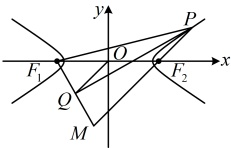
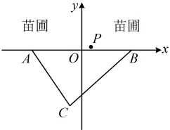

【变式 3】双曲线  $ \frac{x^2}{9} - \frac{y^2}{b^2} = 1 (b > 0) $ 的左、右焦点分别为  $ F_1 $， $ F_2 $，点  $ P $ 在双曲线的右支上，过  $ F_1 $ 作  $ \angle F_1PF_2 $ 角平分线的垂线，垂足为  $ Q $， $ O $ 为坐标原点，则  $ |OQ| = (\quad) $

A. 9 \quad B. 6 \quad C. 3 \quad D. 1

解析：如图，$PQ$ 既是 $\angle F_1PF_2$ 的角平分线，同时又垂直于 $F_1Q$，联想到等腰三角形的“三线合一”，故尝试按此作辅助线，分析几何特征，如图，不妨设点 $P$ 在第一象限，延长 $PF_2$ 交直线 $F_1Q$ 于点 $M$，因为 $PQ$ 平分 $\angle F_1PF_2$，且 $PQ \perp F_1Q$，所以 $|PF_1|=|PM|$，且点 $Q$ 为线段 $F_1M$ 的中点，出现了中点，又联想到中位线，$O$ 为 $F_1F_2$ 的中点，由此可构造中位线分析，因为 $O$ 是 $F_1F_2$ 的中点，$Q$ 为线段 $F_1M$ 的中点，所以 $|OQ|=\frac{1}{2}|F_2M|$ ①，故只需求 $|F_2M|$，怎么求？从图上看，$|F_2M|=|PM|-|PF_2|$，观察发现，将 $|PM|$ 换成 $|PF_1|$，恰好产生 $|PF_1|-|PF_2|$，可由双曲线的定义计算，思路就有了，由题意，$a^2=9 \Rightarrow a=3$，由双曲线的定义，$|PF_1|-|PF_2|=2a=6$，结合 $|PF_1|=|PM|$ 可得 $|F_2M|=|PM|-|PF_2|=6$，代入①得 $|OQ|=\frac{1}{2}|F_2M|=\frac{1}{2} \times 6=3$。

答案：C

【反思】遇到“角平分线+垂直”的情况，要想到可通过“三线合一”构造等腰三角形分析，这是这一模型中常用的添加辅助线的方法。

## 类型V：双曲线有关的应用题

【例 10】如图，某苗圃有两个入口  $ A $， $ B $， $ |AB|=100 $，现欲在苗圃内开辟一块区域来种植观赏植物，现有若干树苗放在苗圃外的 C 处，已知  $ |CA|=80 $， $ |CB|=88 $，以 AB 所在直线为 x 轴，AB 中点为原点建立如图所示的平面直角坐标系。

（1）工人计划将树苗分别沿 C-A-P 和 C-B-P 两条折线路线搬运至 P(7,1)，请判断哪条搬运路线最短？并说明理由.

（2）工人准备将 C 处树苗运送到苗圃内的点 P 处，计划合理设计点 P 的位置，使得沿 C-A-P 和 C-B-P 两条折线路线运输的距离相等. 请写出所有满足要求的点 P 的轨迹方程.

解：（1）（ $ \left|CA\right| 和 \left|CB\right| $ 已知，只要求出  $ \left|PA\right| $ 和  $ \left|PB\right| $，就能得到两条路径各自的长，进而比较哪条路更短。有  $ P, A, B $ 的坐标，可用平面两点间的距离公式求  $ \left|PA\right| $ 和  $ \left|PB\right| $ 由题意， $ A(-50,0) $， $ B(50,0) $， $ P(7,1) $，所以  $ \left|AP\right| = \sqrt{[7 - (-50))^2 + (1 - 0)^2} = 5\sqrt{130} $， $ \left|BP\right| = \sqrt{(7 - 50)^2 + (1 - 0)^2} = 5\sqrt{74} $，

故路径 $C-A-P$ 的长 $L_1 = |CA| + |AP| = 80 + 5\sqrt{130}$，路径 $C-B-P$ 的长 $L_2 = |CB| + |BP| = 88 + 5\sqrt{74}$，（不易直接看出 $L_1$，$L_2$ 谁更大，可考虑作差比较）$L_1 - L_2 = 80 + 5\sqrt{130} - (88 + 5\sqrt{74}) = 5(\sqrt{130} - \sqrt{74}) - 8$