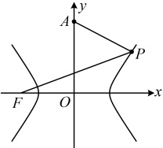
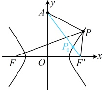

 $ >5(\sqrt{125}-\sqrt{80})-8=5\sqrt{5}-8>5\times2-8=2>0 $，所以 $ L_{1}>L_{2} $，故路线C-B-P更短.

（2）由题意， $ |CA| + |AP| = |CB| + |BP| $，（所求为  $ P $ 的轨迹方程，可以将含有  $ P $ 的部分移到等号一侧，再作观察）所以  $ |AP| - |BP| = |CB| - |CA| = 88 - 80 = 8 < |AB| $，故点  $ P $ 在以  $ A $， $ B $ 为焦点的双曲线的右支上，可设该双曲线的方程为  $ \frac{x^2}{a^2} - \frac{y^2}{b^2} = 1 (a > 0, b > 0) $，则  $ |AP| - |BP| = 2a = 8 $，且半焦距  $ c = 50 $，所以  $ 4\sqrt{a^2 + b^2} = \sqrt{2^2 + 50^2} = 4^2 = 2484 $。

所以a=4，故 $ b^{2}=c^{2}-a^{2}=50^{2}-4^{2}=2484 $，

又由题意，点 P 在苗圃内（第一象限），所以点 P 的轨迹方程为  $ \frac{x^{2}}{16}-\frac{y^{2}}{2484}=1(x>0,y>0) $.

【反思】对于与双曲线有关的实际应用题，解题的关键是将实际问题翻译成与双曲线有关的数学模型，再结合双曲线的知识求解问题.

## 补充、拓展

当点在双曲线上运动时，可以衍生出一些有关的最值问题，这类问题按解决方法不同，主要有两类，本节我们先给大家拓展基于双曲线定义的这一类最值问题，还有一类基于双曲线方程的最值问题，因为要用到双曲线中变量 x，y 的范围，我们下一节再涉及.

## 类型VI：基于双曲线定义的最值问题

【例 11】已知双曲线  $ C: \frac{x^2}{4} - \frac{y^2}{5} = 1 $ 的左焦点为  $ F $，点  $ A(0,4) $，若  $ P $ 为双曲线  $ C $ 右支上的动点，则  $ |PA| + |PF| $ 的最小值为___。

解析：如图1，A，F在双曲线右支的同侧，不易直接观察出P在右支上何处时， $ \left|PA\right|+\left|PF\right| $最小，涉及 $ \left|PF\right| $，可考虑利用双曲线定义，转化为P到右焦点的距离来看，

在双曲线  $ C $ 中， $ a^2 = 4 \Rightarrow a = 2 $， $ b^2 = 5 $， $ c = \sqrt{a^2 + b^2} = 3 $，设双曲线  $ C $ 的右焦点为  $ F'' $，则  $ F'(3,0) $ 且由双曲线定义， $ |PF| - |PF'| = 2a = 4 $，所以  $ |PF| = |PF''| + 4 $，故  $ |PA| + |PF| = |PA| + |PF''| + 4 $ ①，于是只需求  $ |PA| + |PF'| $ 的最小值，由图2容易看出该最小值在  $ P $ 与  $ P_0 $ 重合时取得，

如图2，由三角形两边之和大于第三边， $ |PA| + |PF'| \geq |AF'| = \sqrt{(3 - 0)^2 + (0 - 4)^2} = 5 $，

代入①得 $ \left|PA\right|+\left|PF\right|=\left|PA\right|+\left|PF'\right|+4\geq5+4=9 $

取等条件是 P 为线段  $ AF' $ 与双曲线 C 的右支的交点（图 2 中  $ P_{0} $），所以  $ \left|PA\right| + \left|PF\right| $ 的最小值为 9.

图1

图2

答案：9

【反思】涉及双曲线上的动点到一个焦点距离的最值，若直接分析不易，则常考虑利用双曲线定义转化到另一焦点上来看。本题只涉及一个动点，若要增加难度，还可以增加一个动点，我们来看下面的变式。

【变式】已知点 $F$ 是双曲线 $C_1: \frac{y^2}{4} - x^2 = 1$ 的上焦点，$M$ 是 $C_1$ 下支上的一点，点 $N$ 是圆 $C_2: x^2 + y^2$