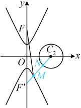

-4x+3=0 上一点，则 $ |MF|+|MN| $的最小值是___.

解析：如图，涉及 $M$，$N$ 两个动点，直接分析 $|MF| + |MN|$ 的最小值不易，可考虑先取定一个，取定谁？由于圆上动点与定点之间的距离最值更容易分析，故取定 $M$，考虑 $N$ 在圆上运动，$x^2 + y^2 - 4x + 3 = 0 \Leftrightarrow (x-2)^2 + y^2 = 1$，所以圆 $C_2$ 的圆心为 $C_2(2,0)$，半径 $r = 1$，对双曲线 $C_1$ 上任意的点 $M$，由图可知 $M$ 必定在圆 $C_2$ 的外部，所以当 $N$ 在圆 $C_2$ 上运动时，$|MN| \geq |MC_2| - r = |MC_2| - 1$，故 $|MF| + |MN| \geq |MF| + |MC_2| - 1$ ①，

故接下来只需再分析当 $M$ 在双曲线 $C_1$ 的下支上运动时，$|MF| + |MC_2|$ 的最小值，经尝试，此最小值在何处取得不易由图直接看出，怎么办呢？涉及 $|MF|$，可考虑利用双曲线定义，转化为 $M$ 到下焦点的距离再看，设双曲线 $C_1$ 的下焦点为 $F'$，在双曲线 $C_1$ 中，$a^2 = 4 \Rightarrow a = 2$，$b^2 = 1$，$c = \sqrt{a^2 + b^2} = \sqrt{5}$，所以 $F'(0, -\sqrt{5})$，因为 $M$ 是 $C_1$ 下支上的一点，所以由双曲线的定义，$|MF| - |MF'| = 2a = 4$，

因为  $ M $ 是  $ C_1 $ 下文工的点，所以由双曲线的定义， $ |MF| - |NF| = 2a = 4 $，

从而  $ \left|MF\right| = 4 + \left|MF\right| $，故  $ \left|MF\right| + \left|MC_2\right| - 1 = 4 + \left|MF\right| + \left|MC_2\right| - 1 = \left|MF\right| + \left|MC_2\right| + 3 $ ②，

故又只需求  $ \left|MF\right| + \left|MC_2\right| $ 的最小值，观察发现可直接看出该最小值在何处取得，

由图可知， $ \left|MF\right| + \left|MC_2\right| \geq \left|C_2F\right| = \sqrt{(0 - 2)^2 + (-\sqrt{5} - 0)^2} = 3 $，

代入②得  $ \left|MF\right| + \left|MC_2\right| - 1 = \left|MF\right| + \left|MC_2\right| + 3 \geq 3 + 3 = 6 $，

结合①得  $ \left|MF\right| + \left|MN\right| \geq \left|MF\right| + \left|MC_2\right| - 1 \geq 6 $，当  $ M $， $ N $ 分别为线段  $ F'C_2 $ 与双曲线  $ C_1 $ 和圆  $ C $，的交点时，两个不等号同时取等号，所以  $ \left|MF\right| + \left|MN\right| $ 的最小值为 6。

答案：6

## 强化训练

## A 组 夯实基础

1. (2025 · 北京海淀二模)

已知  $ A(-2,0) $， $ B(2,0) $，若动点 P 满足  $ \left|PA\right|-\left|PB\right|=2 $，则 P 的轨迹方程是（）

A.  $ x^{2}-\frac{y^{2}}{3}=1 $ B.  $ x^{2}-\frac{y^{2}}{3}=1(x\leq-1) $

C.  $ y^{2}-\frac{x^{2}}{3}=1 $ D.  $ x^{2}-\frac{y^{2}}{3}=1(x\geq1) $

2.（2025·河南模拟）

2.（2025·河南模拟）

若双曲线  $ C: \frac{x^{2}}{16} - \frac{y^{2}}{9} = 1 $ 上的点 A 到点 (5,0) 的距离为 4，则点 A 到点 (-5,0) 的距离为（）

A. 14 B. 12 C. 10 D. 8