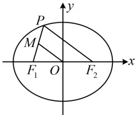
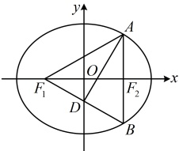

化简得： $ 9x_0^2 - 150x_0 - 275 = 0 $，解得： $ x_0 = \frac{55}{3} $ 或  $ -\frac{5}{3} $，又  $ -5 \leq x_0 \leq 5 $，所以  $ x_0 = -\frac{5}{3} $，从而  $ y_0^2 = 16 - \frac{16}{25}x_0^2 = 16 - \frac{16}{25} \times \left(-\frac{5}{3}\right)^2 = \frac{128}{9} $，故  $ \left|PF_1\right| = \sqrt{(-3 - x_0)^2 + (0 - y_0)^2} = \sqrt{(x_0 + 3)^2 + y_0^2} = \sqrt{\left(-\frac{5}{3} + 3\right)^2 + \frac{128}{9}} = 4 $。

解法2：当 $ F_{1}F_{2} $的中点，

可以构造中位线，故按此尝试分析几何关系，

如图，因为 $M$ 是 $F_1P$ 的中点，$O$ 是 $F_1F_2$ 的中点，所以 $OM$ 是 $\triangle PF_1F_2$ 的中位线，

故 $|PF_2|=2|OM|=2\times3=6$，在椭圆 $\frac{x^2}{25}+\frac{y^2}{16}=1$ 中，$a^2=25$，结合 $a>0$ 可得 $a=5$，

由椭圆的定义，$|PF_1|+|PF_2|=2a=2\times5=10$，所以 $|PF_1|=10-|PF_2|=10-6=4$。

答案：A

【反思】①看到中点，往中位线上联想是常用的思路，别忘了椭圆中天然隐藏了原点

是两焦点连线的中点；②解析几何的精髓是用代数的方法研究几何问题，但有时仅用代数的方法研究比较麻烦，若能将几何与代数相结合，则可以简化分析过程，本题就是如此，我们再来看一个变式.

【变式】椭圆  $ C: \frac{x^2}{a^2} + \frac{y^2}{b^2} = 1 (a > b > 0) $ 的左、右焦点分别为  $ F_1 $， $ F_2 $，过点  $ F_2 $ 作平行于  $ y $ 轴的直线与  $ C $ 交于  $ A $， $ B $ 两点， $ F_1B $ 与  $ y $ 轴交于点  $ D $， $ AD \perp F_1B $，且  $ |AD| = 4\sqrt{3} $，则  $ C $ 的方程为___。

解析：如图，有  $ OD \parallel AB $，又有  $ O $ 是  $ \overrightarrow{F_1F_2} $ 的中点，联想到中位线，故考虑由此出发分析几何关系，因为  $ O $ 是  $ \overrightarrow{F_1F_2} $ 中点，且  $ AB \parallel y $ 轴，所以  $ OD $ 是  $ \triangle BF_1F_2 $ 的中位线，故  $ D $ 是  $ \overrightarrow{BF_1} $ 中点 ①， $ D $ 为  $ \overrightarrow{BF_1} $ 的中点，于是  $ AD $ 是  $ \triangle ABF_1 $ 的中线，题干又给出了  $ AD \perp \overrightarrow{F_1B} $，联想到三线合一，由①结合  $ AD \perp \overrightarrow{F_1B} $ 可得  $ \left|\overrightarrow{AF_1}\right| = \left|\overrightarrow{AB}\right| $，又  $ \overrightarrow{AB} \parallel y $ 轴，所以  $ \left|\overrightarrow{F_1A}\right| = \left|\overrightarrow{F_1B}\right| $，故  $ \triangle ABF_1 $ 是等边三角形，接下来怎样求  $ a $， $ b $， $ c $？ $ a $ 与  $ \left|\overrightarrow{AF_1}\right| + \left|\overrightarrow{AF_2}\right| $ 有关， $ c $ 与  $ \left|\overrightarrow{F_1F_2}\right| $ 有关，故考虑由题干所给的  $ \left|\overrightarrow{AD}\right| $ 求这些线段的比因为  $ \left|\overrightarrow{AD}\right| = 4\sqrt{3} $，所以  $ \left|\overrightarrow{F_1F_2}\right| = \left|\overrightarrow{AD}\right| = 4\sqrt{3} $，从而  $ 2c = 4\sqrt{3} $，故  $ c = 2\sqrt{3} $

又 $ |AF_1|=\frac{|F_1F_2|}{\sin \angle F_1AF_2}=\frac{4\sqrt{3}}{\sin 60^\circ}=8 $， $ |AF_2|=\frac{|F_1F_2|}{\tan \angle F_1AF_2}=\frac{4\sqrt{3}}{\tan 60^\circ}=4 $，所以由椭圆的定义， $ |AF_1|+|AF_2|=2a=8+4=12 $，所以 $ a=6 $，从而 $ b=\sqrt{a^2-c^2}=\sqrt{6^2-(2\sqrt{3})^2}=2\sqrt{6} $，故椭圆 $ C $的方程为 $ \frac{x^2}{36}+\frac{y^2}{24}=1 $。答案： $ \frac{x^2}{36}+\frac{y^2}{24}=1 $

答案： $ \frac{x^2}{36} + \frac{y^2}{24} = 1 $

【例 13】设  $ F_1 $， $ F_2 $ 为椭圆  $ C: \frac{x^2}{8} + \frac{y^2}{4} = 1 $ 的两个焦点，点  $ P $ 在  $ C $ 上，若  $ \overrightarrow{PF_1} \cdot \overrightarrow{PF_2} = 0 $，则  $ |PF_1| \cdot |PF_2| = $ （ ）

A. 2       B. 4       C. 6       D. 8

解析： $ PF_1 \cdot PF_2 = 0 $ 意味着  $ PF_1 \perp PF_2 $，怎么翻译此条件呢？椭圆  $ C $ 中天然有  $ |PF_1| + |PF_2| = 2a $，既然已知和所求都涉及长度，那当然想到用勾股定理翻译  $ PF_1 \perp PF_2 $，

由所给椭圆方程可知  $ a^2 = 8 $， $ b^2 = 4 $，所以  $ c^2 = a^2 - b^2 = 8 - 4 = 4 $，结合  $ a > 0 $， $ c > 0 $ 可得  $ a = 2\sqrt{2} $， $ c = 2 $，

因为  $ \overrightarrow{PF_1} \cdot \overrightarrow{PF_2} = 0 $，所以  $ PF_1 \perp PF_2 $，故  $ |PF_1|^2 + |PF_2|^2 = |F_1F_2|^2 = (2c)^2 = 16 $ ①，

又由椭圆定义， $ |PF_1| + |PF_2| = 2a = 4\sqrt{2} $ ②，怎样由①②求  $ |PF_1| \cdot |PF_2| $？观察发现配方即可，