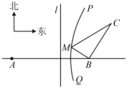

### 12. （2025 · 河南南阳期中）

已知  $ P $ 为曲线  $ C:x=\sqrt{1+\frac{y^2}{2}} $ 上任意一点， $ A(-\sqrt{3},0) $， $ B(0,\sqrt{22}) $，则  $ |PA|+|PB| $ 的最小值为___。

### 13. （2025·吉林延边模拟）

（1）在平面直角坐标系 xOy 中，已知动点 M 到点  $ F(2,0) $ 的距离是到直线  $ x=\frac{3}{2} $ 的距离的  $ \frac{2\sqrt{3}}{3} $ 倍，求点 M 的轨迹方程；

（2）若动圆 M 与圆  $ F_{1}:(x+3)^{2}+y^{2}=9 $，圆  $ F_{2}:(x-3)^{2}+y^{2}=1 $ 都外切，求动圆圆心 M 的轨迹方程.

## 一 数·高中数学一本通

### 14 \. （2025 · 全国模拟）

如图，B 地在 A 地的正东方向，相距 4km；C 地在 B 地的北偏东  $ 30^{\circ} $ 方向，相距 2km，河流沿岸 PQ（曲线）上任意一点 M 到 A 的距离比它到 B 的距离远 2km.

（1）已知直线  $ l \perp AB $ （ $ A, B $ 位于  $ l $ 两侧），且点  $ B $ 到直线  $ l $ 的距离为  $ \frac{3}{2} $，证明：点  $ M $ 到点  $ B $ 的距离与点  $ M $ 到直线  $ l $ 的距离之比为定值；

（2）现要在河流沿岸 PQ 上选一处 M 建一座码头，向 B，C 两地转运货物。经测算，从 M 到 B 地修建公路费用是 25 万元/km，从 M 到 C 地修建公路的费用为 50 万元/km，求修建的两条公路的最小总费用。

