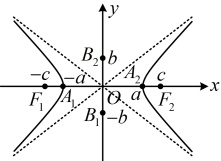
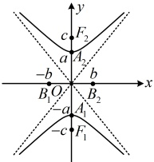

# 3.2.2 双曲线的简单几何性质

习题：P1

## 知识梳理

## 知识点 1：双曲线的简单几何性质

<table border=1 style='margin: auto; word-wrap: break-word;'><tr><td style='text-align: center; word-wrap: break-word;'>标准方程</td><td style='text-align: center; word-wrap: break-word;'>$ \frac{x^{2}}{a^{2}}-\frac{y^{2}}{b^{2}}=1(a&gt;0,b&gt;0) $</td><td style='text-align: center; word-wrap: break-word;'>$ \frac{y^{2}}{a^{2}}-\frac{x^{2}}{b^{2}}=1(a&gt;0,b&gt;0) $</td></tr><tr><td style='text-align: center; word-wrap: break-word;'>图形</td><td style='text-align: center; word-wrap: break-word;'></td><td style='text-align: center; word-wrap: break-word;'></td></tr><tr><td style='text-align: center; word-wrap: break-word;'>范围</td><td style='text-align: center; word-wrap: break-word;'>$ |x|\geq a,y\in\mathbb{R} $</td><td style='text-align: center; word-wrap: break-word;'>$ |y|\geq a,x\in\mathbb{R} $</td></tr><tr><td style='text-align: center; word-wrap: break-word;'>对称性</td><td colspan="2">关于x轴，y轴对称，关于原点中心对称</td></tr><tr><td style='text-align: center; word-wrap: break-word;'>顶点</td><td style='text-align: center; word-wrap: break-word;'>左顶点 $ A_{1} $(-a,0) 右顶点 $ A_{2} $(a,0)</td><td style='text-align: center; word-wrap: break-word;'>下顶点 $ A_{1} $(0,-a) 上顶点 $ A_{2} $(0,a)</td></tr><tr><td style='text-align: center; word-wrap: break-word;'>轴长</td><td colspan="2">实轴长 $ \left|A_{1}A_{2}\right|=2a $，实半轴长 $ \left|OA_{1}\right|=\left|OA_{2}\right|=a $ 虚轴长 $ \left|B_{1}B_{2}\right|=2b $，虚半轴长 $ \left|OB_{1}\right|=\left|OB_{2}\right|=b $</td></tr><tr><td style='text-align: center; word-wrap: break-word;'>渐近线</td><td style='text-align: center; word-wrap: break-word;'>$ y=\pm\frac{b}{a}x $</td><td style='text-align: center; word-wrap: break-word;'>$ y=\pm\frac{a}{b}x $</td></tr><tr><td style='text-align: center; word-wrap: break-word;'>离心率</td><td colspan="2">$ e=\frac{c}{a}(e&gt;1) $</td></tr></table>

注：①不同于椭圆，双曲线的实轴长和虚轴长没有确定的大小关系，谁更大都可以，也能相等，且虚轴的两个端点不在双曲线上.

②离心率 $ e=\frac{c}{a}=\sqrt{\frac{a^{2}+b^{2}}{a^{2}}}=\sqrt{1+\left(\frac{b}{a}\right)^{2}} $，而 $ \frac{b}{a} $决定双曲线的开口大小， $ \frac{b}{a} $越大，离心率越大，双曲线的开口也越大； $ \frac{b}{a} $越小，离心率越小，双曲线的开口也越小.

③对于双曲线 $ \frac{x^2}{a^2} - \frac{y^2}{b^2} = 1 (a > 0, b > 0) $，其渐近线也可写作 $ bx = \pm ay $，所以 $ b^2 x^2 = a^2 y^2 $，移项化简得 $ \frac{x^2}{a^2} - \frac{y^2}{b^2} = 0 $，对比双曲线的方程可知，渐近线的方程可以通过将双曲线

## 知识点1

【例1】若双曲线 $ C:x^{2}+\frac{y^{2}}{m}=1 $过点 $ M(-2,\sqrt{6}) $，则C的虚轴长为（）

A.  $ 2\sqrt{2} $ B. 2

C.  $ \sqrt{2} $ D. 1

解析：将点 $M$ 的坐标代入双曲线 $C$ 的方程可得 $(-2)^2 + \frac{(\sqrt{6})^2}{m} = 1$，解得： $m = -2$，

所以双曲线 $C$ 的方程为 $x^2 - \frac{y^2}{2} = 1$，

从而 $b = \sqrt{2}$，故 $C$ 的虚轴长为 $2b = 2\sqrt{2}$。

答案：A

【例2】双曲线 $ \frac{x^{2}}{2}-\frac{y^{2}}{8}=1 $的渐近线方程为（ ）

A.  $ 2x \pm y = 0 $ B.  $ x \pm 2y = 0 $

C.  $ 4x \pm y = 0 $ D.  $ x \pm 4y = 0 $

解法1：由双曲线的方程可知 $ a=\sqrt{2} $，

 $ b=2\sqrt{2} $，所以 $ \frac{b}{a}=\frac{2\sqrt{2}}{\sqrt{2}}=2 $，

故其渐近线方程为 $ y=\pm2x $，即 $ 2x\pm y=0 $。

解法2：由知识点1中渐近线的结论可知，

 $ \frac{x^{2}}{2}-\frac{y^{2}}{8}=1 $的渐近线方程为 $ \frac{x^{2}}{2}-\frac{y^{2}}{8}=0 $，

化简得： $ 2x\pm y=0 $。

答案：A

【例 3】若双曲线  $ \frac{x^2}{a^2} - \frac{y^2}{b^2} = 1 (a > 0, b > 0) $ 的一条渐近线方程为  $ y = 2x $，则该双曲线的离心率为___。

解析：由所给渐近线方程可知  $ \frac{b}{a} = 2 $，所以