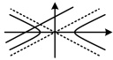
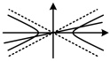
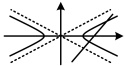
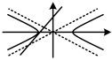
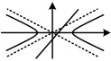

方程中等号右边的“1”改为“0”得到。此结论也适用于焦点在y轴上的情形。

## 知识点 2：直线与双曲线的位置关系

### 1. 直线与双曲线的位置关系

<table border=1 style='margin: auto; word-wrap: break-word;'><tr><td style='text-align: center; word-wrap: break-word;'>位置关系</td><td colspan="3">相交</td></tr><tr><td style='text-align: center; word-wrap: break-word;'>图示</td><td style='text-align: center; word-wrap: break-word;'>与渐近线平行，交于一点</td><td style='text-align: center; word-wrap: break-word;'>与两支都相交</td><td style='text-align: center; word-wrap: break-word;'>与一支交于两点</td></tr><tr><td style='text-align: center; word-wrap: break-word;'>位置关系</td><td style='text-align: center; word-wrap: break-word;'>相切</td><td colspan="2">相离</td></tr><tr><td style='text-align: center; word-wrap: break-word;'>图示</td><td colspan="2"></td><td style='text-align: center; word-wrap: break-word;'></td></tr></table>

### 2. 直线与双曲线的位置关系的判断

一般地，设直线的方程为  $ y = kx + m $，双曲线的方程为  $ \frac{x^2}{a^2} - \frac{y^2}{b^2} = 1 (a > 0, b > 0) $，将  $ y = kx + m $ 代入  $ \frac{x^2}{a^2} - \frac{y^2}{b^2} = 1 $ 消去  $ y $ 并化简得： $ (b^2 - a^2k^2)x^2 - 2a^2mkx - a^2m^2 - a^2b^2 = 0 $。

①当 $ b^{2}-a^{2}k^{2}=0 $，即 $ k=\pm\frac{b}{a} $时，若 $ m\neq0 $，则直线与渐近线平行，直线与双曲线相交，只有一个公共点；若m=0，则直线与渐近线重合，直线与双曲线相离，没有公共点.

②当 $ b^2 - a^2k^2 \ne 0 $，即 $ k \ne \pm \frac{b}{a} $时，

判别式 $ \Delta > 0 \Leftrightarrow $直线与双曲线相交，有两个公共点；

判别式 $ \Delta = 0 \Leftrightarrow $直线与双曲线相切，有一个公共点；

判别式 $ \Delta < 0 \Leftrightarrow $直线与双曲线相离，没有公共点。

## 知识点 3：共轭双曲线和等轴双曲线

1. 共轭双曲线

如果一双曲线的实轴及虚轴分别为另一双曲线的虚轴

及实轴，则这两条双曲线互为共轭双曲线，即 $ \frac{x^{2}}{a^{2}}-\frac{y^{2}}{b^{2}}=1 $

离心率  $ e=\frac{c}{a}=\sqrt{\frac{c^{2}}{a^{2}}}=\sqrt{\frac{a^{2}+b^{2}}{a^{2}}}=\sqrt{1+\left(\frac{b}{a}\right)^{2}} $

 $ \sqrt{1+2^{2}}=\sqrt{5} $

答案： $ \sqrt{5} $

## 知识点2

【例 4】直线  $ l: y = \frac{1}{3} \left( x - \frac{7}{2} \right) $ 与双曲线  $ C: \frac{x^2}{9} - y^2 = 1 $ 交点的个数为___。

解析：由双曲线的方程可知  $ a = 3 $， $ b = 1 $，

所以其渐近线的斜率  $ k = \pm \frac{b}{a} = \pm \frac{1}{3} $，

从而直线  $ y = \frac{1}{3} \left( x - \frac{7}{2} \right) $ 与渐近线平行，故直线  $ l $ 与双曲线  $ C $ 有且仅有 1 个交点。

答案：1

【反思】渐近线的平行线与双曲线必只有1个交点，若直线与渐近线不平行（也不重合），再通过联立直线和双曲线的方程，由判别式 $ \Delta $的正负来判断直线与双曲线的交点个数.

## 知识点3

【例5】若双曲线C为等轴双曲线，

且过点 $ M(2,4) $，则双曲线C的标准方程为 ___.

解析：设 C 的方程为  $ x^{2}-y^{2}=\lambda (\lambda \neq 0) $，

将点 M 的坐标代入可得  $ \lambda = 2^{2} - 4^{2} = -12 $，

所以双曲线 C 的方程为  $ x^{2} - y^{2} = -12 $，

化为标准方程得： $ \frac{y^{2}}{12} - \frac{x^{2}}{12} = 1 $.

答案： $ \frac{y^{2}}{12}-\frac{x^{2}}{12}=1 $

【例6】双曲线 $ \frac{y^{2}}{4}-x^{2}=1 $的共轭双曲线的离心率为___.

解析：由共轭双曲线的定义可知， $ \frac{y^{2}}{4}- $