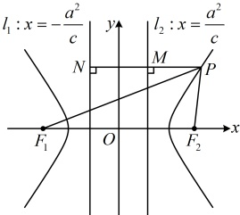

 $ (a>0,b>0) $ 的共轭双曲线为  $ \frac{y^{2}}{b^{2}}-\frac{x^{2}}{a^{2}}=1(a>0,b>0) $

### 2. 等轴双曲线

实轴和虚轴等长的双曲线叫做等轴双曲线，其方程形式为 $ \frac{x^2}{\lambda} - \frac{y^2}{\lambda} = 1 (\lambda \ne 0) $，即 $ x^2 - y^2 = \lambda $。等轴双曲线的渐近线方程为 $ y = \pm x $（或 $ x \pm y = 0 $），离心率 $ e = \sqrt{2} $。

## 知识点 4：双曲线的第二定义

平面上到定点和到不过该定点的定直线的距离之比等于常数 $ e(e>1) $的点的轨迹是双曲线，该定点是双曲线的焦点，定直线是与焦点对应的准线，常数e即为离心率.

以焦点在 x 轴上的双曲线为例，有左焦点  $ F_1(-c,0) $ 和右焦点  $ F_2(c,0) $，与之对应的也有左准线  $ l_1: x = -\frac{a^2}{c} $ 和右准线  $ l_2: x = \frac{a^2}{c} $。如图，双曲线上任意一点  $ P $ 满足  $ \frac{|PF_1|}{d_1} = \frac{|PF_2|}{d_2} = e $，其中  $ d_1 $， $ d_2 $ 分别表示点  $ P $ 到左准线  $ l_1 $ 和右准线  $ l_2 $ 的距离。

由双曲线的第二定义，双曲线上的点构成的集合可以

表示为 $ \left\{P\left|\frac{\left|PF_{1}\right|}{d_{1}}=e,e>1\right.\right\} $或 $ \left\{P\left|\frac{\left|PF_{2}\right|}{d_{2}}=e,e>1\right.\right\} $。

 $ x^{2}=1 $ 的共轭双曲线为  $ x^{2}-\frac{y^{2}}{4}=1 $，

所以 $ a^{2}=1,\quad b^{2}=4 $，故 $ c^{2}=4+1=5 $

故该双曲线的离心率  $ e=\sqrt{\frac{c^{2}}{a^{2}}}=\sqrt{5} $.

答案： $ \sqrt{5} $

## 知识点4

【例 7】已知双曲线  $ C: \frac{x^{2}}{3} - \frac{y^{2}}{6} = 1 $ 的右焦点为 F，直线 l: x = 1，点 P 在双曲线 C 上，证明：点 P 到 F 的距离与 P 到直线 l 的距离之比为常数.

证明：结论涉及的两个距离都能用点  $ P $ 的坐标表示，故设点  $ P $ 的坐标处理，

设  $ P(x_0, y_0) $，由题意，半焦距  $ c = \sqrt{a^2 + b^2} = \sqrt{3 + 6} = 3 $，所以  $ F(3,0) $，故  $ |PF| = \sqrt{(3 - x_0)^2 + (0 - y_0)^2} = \sqrt{x_0^2 - 6x_0 + 9 + y_0^2} $，设点  $ P $ 到直线  $ l $ 的距离为  $ d $，则  $ d = |x_0 - 1| $

所以  $ \frac{|PF|}{d} = \frac{\sqrt{x_0^2 - 6x_0 + 9 + y_0^2}}{|x_0 - 1|} $ ①，

式①涉及  $ x_0 $， $ y_0 $ 两个变量，要进一步化简考虑消元，可利用双曲线方程来消元，观察发现  $ y_0 $ 只有平方项，故消  $ y_0 $，

由点  $ P $ 在双曲线  $ C $ 上可得  $ \frac{x_0^2}{3} - \frac{y_0^2}{6} = 1 $，

所以  $ y_0^2 = 2x_0^2 - 6 $，代入①得  $ \frac{|PF|}{d} = \frac{\sqrt{x_0^2 - 6x_0 + 9 + 2x_0^2 - 6}}{|x_0 - 1|} = \frac{\sqrt{3x_0^2 - 6x_0 + 3}}{|x_0 - 1|} = \sqrt{3} \cdot \frac{\sqrt{x_0^2 - 2x_0 + 1}}{|x_0 - 1|} = \sqrt{3} \cdot \frac{\sqrt{(x_0 - 1)^2}}{|x_0 - 1|} $

 $ = \sqrt{3} \cdot \frac{|x_0 - 1|}{|x_0 - 1|} = \sqrt{3} $，故结论成立。

## 本节核心题型

双曲线的简单几何性质涉及的概念较多，考查的难度跨度较大，本节我们先设计了类型Ⅰ来帮助大家强化对双曲线简单几何性质有关概念的理解；在各大性质中，离心率是常考的性质，于