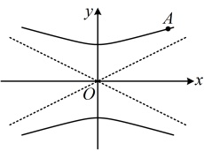

是我们又设计了类型Ⅱ由浅入深地讲解离心率问题；另外，与双曲线有关的诸多难题会涉及直线与双曲线的位置关系，所以我们设计了类型Ⅲ来给大家初步分析直线与双曲线的位置关系的判断方法和双曲线弦长的计算方法；考虑到双曲线的简单几何性质还可能与平面几何综合考查，于是我们设计了类型Ⅳ来给大家讲解一些常见的模型；最后，我们设计了一类基于双曲线方程的距离最值问题，让大家熟悉双曲线上动点的设法.

## 类型Ⅰ：考查双曲线简单几何性质的基础题

【例 8】根据下列条件求双曲线的标准方程.

（1）与椭圆 $ \frac{x^{2}}{9}+\frac{y^{2}}{4}=1 $共焦点，且虚轴长为2；

（2）焦点在 x 轴上，离心率为  $ \sqrt{5} $，且过点  $ A(\sqrt{2},2) $；

（3）经过点(4,3)，且一条渐近线为 $ y=\frac{1}{2}x $；

（4）与双曲线 $ \frac{x^2}{16} - \frac{y^2}{4} = 1 $有公共焦点，且经过点 $ (3\sqrt{2}, 2) $.

## 解：（1）（椭圆的焦点好求，可先求出其焦点，得到双曲线的焦点）

椭圆的半焦距  $ c $ 满足  $ c = \sqrt{9 - 4} = \sqrt{5} $，且椭圆的焦点在  $ x $ 轴上，所以两个焦点分别为  $ F_1(-\sqrt{5}, 0) $， $ F_2(\sqrt{5}, 0) $，由题意， $ F_1 $， $ F_2 $ 也是双曲线的焦点，所以可设双曲线的方程为  $ \frac{x^2}{a^2} - \frac{y^2}{b^2} = 1 (a > 0, b > 0) $，则  $ a^2 + b^2 = c^2 = 5 $ ①，又因为双曲线的虚轴长  $ 2b = 2 $，所以  $ b = 1 $，结合①得  $ a^2 = 5 - b^2 = 4 $，故双曲线的方程为  $ \frac{x^2}{a^2} - y^2 = 1 $。

（2）（由离心率结合  $ a^2 + b^2 = c^2 $ 可得到  $ a $,  $ b $,  $ c $ 的比例关系，故可由此将双曲线的方程化为单参数形式）设双曲线的方程为  $ \frac{x^2}{a^2} - \frac{y^2}{b^2} = 1 (a > 0, b > 0) $，由  $ e = \frac{c}{a} = \sqrt{5} $ 得  $ c = \sqrt{5}a $，所以  $ b = \sqrt{c^2 - a^2} = 2a $，故双曲线的方程可化为  $ \frac{x^2}{a^2} - \frac{y^2}{4a^2} = 1 $，又因为双曲线过点  $ A(\sqrt{2}, 2) $，所以  $ \frac{(\sqrt{2})^2}{a^2} - \frac{2^2}{4a^2} = 1 \Rightarrow a^2 = 1 $，故双曲线的方程为  $ x^2 - \frac{y^2}{4} = 1 $。

（3）（不知道焦点在哪条坐标轴上，考虑先进行判断，可结合渐近线以及经过的点，画图来看）

如图，双曲线要经过点(4,3)，且以  $ y = \frac{1}{2}x $ 为一条渐近线，则双曲线的焦点只能在 y 轴上，

所以可设双曲线的方程为  $ \frac{y^2}{a^2} - \frac{x^2}{b^2} = 1 (a > 0, b > 0) $，

由渐近线为  $ y=\frac{1}{2}x $ 可得  $ \frac{a}{b}=\frac{1}{2} $，所以 b=2a，

故双曲线方程可化为 $ \frac{y^2}{a^2} - \frac{x^2}{4a^2} = 1 $，将 $ (4,3) $代入得 $ \frac{3^2}{a^2} - \frac{4^2}{4a^2} = 1 $，解得： $ a^2 = 5 $，

所以 $ b^2 = (2a)^2 = 4a^2 = 20 $，故双曲线的方程为 $ \frac{y^2}{5} - \frac{x^2}{20} = 1 $。

（4）解法1：（所给双曲线的焦点好求，可先求出该双曲线的焦点，得到所求双曲线的焦点）

所给双曲线的半焦距 $ c = \sqrt{16 + 4} = 2\sqrt{5} $，且焦点在 $ x $轴上，所以它的两个焦点分别为 $ F_1(-2\sqrt{5},0) $， $ F_2(2\sqrt{5},0) $，

故可设所求双曲线的方程为 $ \frac{x^2}{a^2} - \frac{y^2}{b^2} = 1 (a > 0, b > 0) $，则 $ a^2 + b^2 = c^2 = 20 $ ②，

