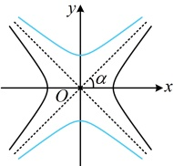

又因为所求双曲线经过点 $ (3\sqrt{2},2) $，所以 $ \frac{(3\sqrt{2})^2}{a^2}-\frac{2^2}{b^2}=1 $，即 $ \frac{18}{a^2}-\frac{4}{b^2}=1 $，

结合②解得： $ a^2=12 $， $ b^2=8 $，故所求双曲线的方程为 $ \frac{x^2}{12}-\frac{y^2}{8}=1 $。

解法2：（共焦点的双曲线有没有统一的设法？可以想象，与 $ \frac{x}{a^2}-\frac{y}{b^2}=1 $共焦点的双曲线，只需满足 $ x^2 $的分母与 $ y^2 $的分母之和与 $ a^2+b^2 $相等，有了这一点，就可将其方程设为 $ \frac{x^2}{a^2-\lambda}-\frac{y^2}{b^2+\lambda}=1(-b^2<\lambda<a^2) $，此时两个分母之和仍为 $ a^2+b^2 $，能满足与双曲线 $ \frac{x^2}{a^2}-\frac{y^2}{b^2}=1 $有相同的焦点）

由题意，可设双曲线的方程为 $ \frac{x^2}{16-\lambda}-\frac{y^2}{4+\lambda}=1(-4<\lambda<16) $，将 $ (3\sqrt{2},2) $代入可得 $ \frac{(3\sqrt{2})^2}{16-\lambda}-\frac{2^2}{4+\lambda}=1 $，

整理得； $ \lambda^2+10\lambda-56=0 $，解得： $ \lambda=-14 $（舍去）或4，所以双曲线的方程为 $ \frac{x^2}{12}-\frac{y^2}{8}=1 $。

【反思】①在双曲线中，已知离心率或渐近线斜率，可研究出  $ a $， $ b $， $ c $ 的比例关系，进而将  $ a $， $ b $， $ c $ 统一起来；②与双曲线  $ \frac{x^2}{a^2} - \frac{y^2}{b^2} = 1 $ 共焦点的双曲线可统一设为  $ \frac{x^2}{a^2 - \lambda} - \frac{y^2}{b^2 + \lambda} = 1 (-b^2 < \lambda < a^2) $。

【例9】等轴双曲线经过点 $ (3,-1) $，则其焦点到渐近线的距离为（）

A.  $ 2\sqrt{2} $ B. 2 C. 4 D.  $ \sqrt{2} $

解析：没说焦点在哪条坐标轴，要先判断吗？不用，无论焦点在哪条坐标轴，等轴双曲线的方程都可统一设为  $ x^2 - y^2 = \lambda (\lambda \neq 0) $，因为双曲线为等轴双曲线，所以可设其方程为  $ x^2 - y^2 = \lambda (\lambda \neq 0) $，

将  $ (3, -1) $ 代入得  $ 3^2 - (-1)^2 = \lambda \Rightarrow \lambda = 8 $，所以双曲线的方程为  $ x^2 - y^2 = 8 $，即  $ \frac{x^2}{8} - \frac{y^2}{8} = 1 $，

该双曲线的渐近线方程为  $ x \pm y = 0 $，半焦距  $ c = \sqrt{8 + 8} = 4 $，所以焦点坐标为  $ (\pm 4, 0) $，

故焦点到渐近线的距离  $ d = \frac{|\pm 4 \pm 0|}{\sqrt{1^2 + (\pm 1)^2}} = 2\sqrt{2} $。

答案：A

【反思】对于等轴双曲线，其渐近线方程为  $ x \pm y = 0 $，其方程可统一设为  $ x^2 - y^2 = \lambda (\lambda \neq 0) $。当  $ \lambda > 0 $ 时，该方程表示焦点在  $ x $ 轴上的等轴双曲线；当  $ \lambda < 0 $ 时，该方程表示焦点在  $ y $ 轴上的等轴双曲线。

## 类型Ⅱ：双曲线的离心率问题

【例 10】已知双曲线 C 的两条渐近线互相垂直，则 C 的离心率等于（）

A.  $ \sqrt{3} $ B. 3 C.  $ \sqrt{2} $ D. 2

## 解法1：由渐近线垂直可找到渐近线的倾斜角，进而得到斜率，

如图，渐近线互相垂直$\Rightarrow$图中$\alpha=45^\circ\Rightarrow$渐近线斜率为$\pm1$，

没说双曲线焦点在哪个坐标轴上，所以需讨论，

若双曲线的焦点在$x$轴上，则渐近线为$y=\pm\frac{b}{a}x$，所以$\frac{b}{a}=1$，

从而$a=b$，故$a^2=b^2=c^2-a^2$，所以$c^2=2a^2$，故离心率$e=\frac{c}{a}=\sqrt{2}$，

同理，若双曲线焦点在$y$轴上，则渐近线为$y=\pm\frac{a}{b}x$，所以$\frac{a}{b}=1$，也得到$a=b$，故离心率$e=\frac{c}{a}=\sqrt{2}$。

解法2：按解法1得到渐近线斜率为 $ \pm1 $后，也可判断出该双曲线为等轴双曲线，快速得到离心率，