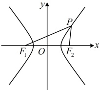

因为渐近线斜率为 $ \pm1 $，所以双曲线 C 为等轴双曲线，故离心率  $ e = \sqrt{2} $。

答案：C

【变式1】（2021·全国甲卷）已知 $ F_{1} $， $ F_{2} $是双曲线C的两个焦点，P为C上一点，且 $ \angle F_{1}PF_{2}=60^{\circ} $， $ \left|PF_{1}\right|=3\left|PF_{2}\right| $，则C的离心率为（ ）

A.  $ \frac{\sqrt{7}}{2} $ B.  $ \frac{\sqrt{13}}{2} $ C.  $ \sqrt{7} $ D.  $ \sqrt{13} $

解析：条件涉及 $ |PF_{1}| $和 $ |PF_{2}| $，想到联系双曲线定义处理，

由双曲线定义， $ \|PF_1\| - |PF_2\| = 2a $，结合 $ |PF_1| = 3|PF_2| $可得 $ |PF_1| = 3a $， $ |PF_2| = a $，注意到 $ |F_1F_2| = 2c $，于是 $ \triangle PF_1F_2 $三边都表示出来了，题干又给了 $ \angle F_1PF_2 $，可用余弦定理建立方程求离心率，又 $ |F_1F_2| = 2c $，在 $ \triangle PF_1F_2 $中，由余弦定理， $ \left|F_1F_2\right|^2 = \left|PF_1\right|^2 + \left|PF_2\right|^2 - 2\left|PF_1\right|\cdot\left|PF_2\right|\cdot\cos\angle F_1PF_2 $，所以 $ 4c^2 = 9a^2 + a^2 - 2 \times 3a \times a \times \frac{1}{2} $，整理得双曲线C的离心率 $ e = \frac{c}{a} = \frac{\sqrt{7}}{2} $。

答案：A

【反思】可以看到，求双曲线离心率的关键步骤是利用已知条件建立关于a，b，c的齐次方程。上面的两道题直接翻译题设条件就能建立关于a，b，c的齐次方程，有时需要经过较复杂的计算或分析几何关系，才能找到建立方程的方法，且这类题难度跨度大，我们通过下面几道题来逐步给大家分析。

【变式 2】已知双曲线  $ C: \frac{x^2}{a^2} - \frac{y^2}{b^2} = 1 (a > 0, b > 0) $ 的右焦点为  $ F $，左顶点为  $ A $，过  $ F $ 作  $ C $ 的一条渐近线的垂线，垂足为  $ P $，若  $ |PF| = \sqrt{3}|PA| $，则  $ C $ 的离心率为（ ）

A.  $ \sqrt{5} $  B.  $ \sqrt{3} $  C. 2  D. 3

解法1：|PF|容易求得，故只要再求出|PA|，就能由|PF|= $ \sqrt{3} $|PA|建立方程求离心率，怎么求？如图，可先联立直线PF和渐近线的方程求出点P的坐标，再用该坐标求|PA|，

由对称性，不妨设点P在渐近线 $ y=\frac{b}{a}x $上，双曲线的左顶点为 $ A(-a,0) $，右焦点为 $ F(c,0) $，

 $ y=\frac{b}{a}x $可化为 $ bx-ay=0 $，所以 $ |PF|=\frac{|bc-a\cdot0|}{\sqrt{b^{2}+(-a)^{2}}}=\frac{bc}{c}=b $，

因为PF⊥OP，所以直线PF的斜率 $ k=-\frac{a}{b} $，故直线PF的方程为 $ y-0=-\frac{a}{b}(x-c) $，即 $ y=-\frac{a}{b}x+\frac{ac}{b} $，

联立 $ \begin{cases}y=\frac{b}{a}x\\y=-\frac{a}{b}x+\frac{ac}{b}\end{cases} $消去y可得 $ (a^{2}+b^{2})x=a^{2}c $，解得： $ x=\frac{a^{2}}{c} $，代入 $ y=\frac{b}{a}x $得 $ y=\frac{b}{a}\cdot\frac{a^{2}}{c}=\frac{ab}{c} $，

所以 $ P\left(\frac{a^{2}}{c},\frac{ab}{c}\right) $，故 $ |PA|=\sqrt{\left(-a-\frac{a^{2}}{c}\right)^{2}+\left(0-\frac{ab}{c}\right)^{2}}=\sqrt{\frac{a^{2}(c+a)^{2}+a^{2}b^{2}}{c^{2}}} $，

因为 $ |PF|=\sqrt{3}|PA| $，所以 $ |PF|^{2}=3|PA|^{2} $，故 $ b^{2}=3\cdot\frac{a^{2}(c+a)^{2}+a^{2}b^{2}}{c^{2}} $ ①，离心率是a与c的关系，故考虑消去b，

将 $ b^{2}=c^{2}-a^{2} $代入①得 $ c^{2}-a^{2}=3\cdot\frac{a^{2}(c+a)^{2}+a^{2}(c^{2}-a^{2})}{c^{2}} $，所以 $ (c+a)(c-a)=3\cdot\frac{a^{2}(c+a)^{2}+a^{2}(c+a)(c-a)}{c^{2}} $，