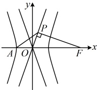
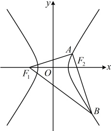
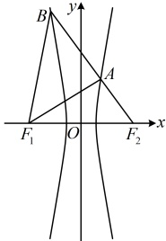

从而  $ c - a = 3 \cdot \frac{a^2(c + a) + a^2(c - a)}{c^2} $，故  $ c^3 - ac^2 = 6a^2c $，所以  $ c^2 - ac = 6a^2 $，故  $ c^2 - ac - 6a^2 = 0 $，两端同除以  $ a^2 $ 得  $ e^2 - e - 6 = 0 $，解得： $ e = 3 $ 或  $ -2 $（舍去）。

解法 2：按解法 1 求得  $ |PF|=b $ 后，观察图形发现  $ |OF| $ 和  $ |OA| $ 已知， $ |OP| $ 可由勾股定理求得， $ |PA| $ 可结合所给的  $ |PF|=\sqrt{3}|PA| $ 求得，于是图中涉及的线段都有了，想到可用 “双余弦法” 建立方程求离心率， $ |OF|=c $， $ |OA|=a $， $ |OP|=\sqrt{|OF|^2-|PF|^2}=\sqrt{c^2-b^2}=\sqrt{a^2}=a $， $ |PA|=\frac{\sqrt{3}}{3}|PF|=\frac{\sqrt{3}}{3}b $，在  $ \triangle POF $ 中， $ \cos\angle POF=\frac{|OP|}{|OF|}=\frac{a}{c} $，在  $ \triangle POA $ 中，由余弦定理推论，

 $$ \cos\angle POA=\frac{\left|OP\right|^{2}+\left|OA\right|^{2}-\left|PA\right|^{2}}{2\left|OP\right|\cdot\left|OA\right|}=\frac{a^{2}+a^{2}-\frac{1}{3}b^{2}}{2a\cdot a}=\frac{2a^{2}-\frac{1}{3}b^{2}}{2a^{2}}=\frac{6a^{2}-b^{2}}{6a^{2}}\ , $$ 

 $$ \angle POF=\pi-\angle POA $$ 

 $$ \cos\angle POF=\cos(\pi-\angle POA)=-\cos\angle POA $$ 

从而 $ \frac{a}{c}=-\frac{6a^{2}-b^{2}}{6a^{2}} $，故 $ \frac{a}{c}=-\frac{6a^{2}-(c^{2}-a^{2})}{6a^{2}}=\frac{c^{2}-7a^{2}}{6a^{2}}=\frac{1}{6}\cdot\frac{c^{2}}{a^{2}}-\frac{7}{6} $，

所以 $ \frac{1}{e}=\frac{1}{6}e^{2}-\frac{7}{6} $，故 $ e^{3}-7e-6=0 $ ②，此为单选题，直接代答案检验哪个选项满足此方程即可，

经检验，e=3 是方程②的解，所以选 D.

答案：D

【变式 3】设双曲线  $ C: \frac{x^2}{a^2} - \frac{y^2}{b^2} = 1 (a > 0, b > 0) $ 的左、右焦点分别为  $ F_1 $， $ F_2 $， $ A $ 是右支上一点，满足  $ AF_1 \perp AF_2 $，直线  $ AF_2 $ 交双曲线于另一点  $ B $，且  $ |BF_1| - |AF_1| = 2a $，则  $ C $ 的离心率的一个值为___。

解析：如图 1，条件  $ |BF_1| - |AF_1| = 2a $ 涉及  $ |BF_1| $ 和  $ |AF_1| $，想到双曲线定义。不妨先设一段长，结合定义求其他线段的长，设  $ |AF_1| = m $，则由  $ |BF_1| - |AF_1| = 2a $ 可得  $ |BF_1| = |AF_1| + 2a = m + 2a $，

又由双曲线定义， $ \begin{cases}|AF_1| - |AF_2| = 2a\\|BF_1| - |BF_2| = 2a\end{cases} $，所以  $ \begin{cases}|AF_2| = |AF_1| - 2a = m - 2a\\|BF_2| = |BF_1| - 2a = m\end{cases} $，故  $ |AB| = |AF_2| + |BF_2| = 2m - 2a $，

图1

图2

再来翻译条件  $ AF_{1} \perp AF_{2} $，上面得到的全是长度，当然想到用勾股定理来翻译，

因为 $AF_1 \perp AF_2$，所以 $\left|AF_1\right|^2 + \left|AB\right|^2 = \left|BF_1\right|^2$，故 $m^2 + (2m - 2a)^2 = (m + 2a)^2$，化简得：$m = 3a$，所以 $\left|AF_1\right| = 3a$，$\left|AF_2\right| = a$，又在 $\triangle AF_1F_2$ 中，$\left|F_1F_2\right| = 2c$，且 $AF_1 \perp AF_2$，所以 $\left|AF_1\right|^2 + \left|AF_2\right|^2 = \left|F_1F_2\right|^2$，从而 $9a^2 + a^2 = 4c^2$，故双曲线的离心率 $e = \frac{c}{a} = \frac{\sqrt{10}}{2}$；

由于只需填一个值，做到这里已可结束，考虑到题干的问法，可能还有其他情况，我们也来做个分析。可以想象，此时点 B 应该在左支上，分析的方法和图 1 的情况类似，