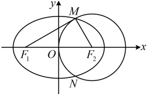
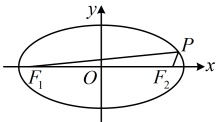
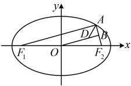

由①可得 $ 16=\left|PF_{1}\right|^{2}+\left|PF_{2}\right|^{2}=(\left|PF_{1}\right|+\left|PF_{2}\right|)^{2}-2\left|PF_{1}\right|\cdot\left|PF_{2}\right| $，结合②得 $ 16=(4\sqrt{2})^{2}-2\left|PF_{1}\right|\cdot\left|PF_{2}\right|\Rightarrow\left|PF_{1}\right|\cdot\left|PF_{2}\right|=8 $。答案：D

【反思】在椭圆中，遇到像本题这样的  $ PF_1 \perp PF_2 $ 的条件，常用勾股定理，联系椭圆定义处理。有时垂直关系不会给的这么明显，需要分析后才能发现，比如下面的变式1；也有时  $ PF_1 $ 与  $ PF_2 $ 不垂直，但给出了  $ \angle F_1PF_2 $，此时又怎么办呢？后面的变式2我们再来详细分析。

【变式 1】椭圆  $ \frac{x^2}{a^2} + \frac{y^2}{b^2} = 1 (a > b > 0) $ 的焦点为  $ F_1(-1,0) $， $ F_2(1,0) $，以  $ F_2 $ 为圆心作一个圆，使此圆过椭圆中心并交椭圆于  $ M $， $ N $ 两点，若直线  $ MF_1 $ 与圆  $ F_2 $ 相切，则  $ a = $ ___.

解析：由题意，椭圆的半焦距  $ c = 1 $， $ \left|F_1F_2\right| = 1 - (-1) = 2 $，圆  $ F_2 $ 过原点  $ O $，所以其半径  $ r = |OF_2| = 1 \Rightarrow |MF_2| = 1 $，怎样翻译直线  $ MF_1 $ 与圆  $ F_2 $ 相切？如图，可翻译为  $ MF_1 \perp MF_2 $，于是又回到了例 13 的情况，可用勾股定理，结合椭圆定义处理  $ \frac{x^2}{a^2} + \frac{y^2}{b^2} = 1 $ 与圆  $ F_2 $ 相切，所以  $ MF_1 \perp MF_2 $。

从而  $ \left|MF_1\right| = \sqrt{|F_1F_2|^2 - |MF_2|^2} = \sqrt{2^2 - 1^2} = \sqrt{3} $，故  $ \left|MF_1\right| + \left|MF_2\right| = \sqrt{3} + 1 $，

又由椭圆的定义， $ \left|MF_1\right| + \left|MF_2\right| = 2a $，所以  $ 2a = \sqrt{3} + 1 $，故  $ a = \frac{\sqrt{3} + 1}{2} $。

答案： $ \frac{\sqrt{3} + 1}{2} $

【变式 2】已知椭圆  $ \frac{x^2}{4} + y^2 = 1 $ 的左、右焦点分别为  $ F_1 $， $ F_2 $，点  $ P $ 在椭圆上且位于第一象限，若  $ \angle F_1PF_2 = 60^\circ $，则  $ \left|PF_1\right| =  $ ___.

解析：和上面的两道题相比，$PF_1$ 与 $PF_2$ 不垂直了，不能用勾股定理翻译，怎么办呢？如图，由于题干给出了 $\angle F_1PF_2$，已知的 $|PF_1| + |PF_2|$ 和所求的 $|PF_1|$ 又涉及长度，于是想到对 $\angle F_1PF_2$ 用余弦定理，

由所给椭圆方程可知 $a^2 = 4$，$b^2 = 1$，所以 $a = 2$，$b = 1$，$c = \sqrt{a^2 - b^2} = \sqrt{4 - 1} = \sqrt{3}$，所以 $|F_1F_2| = 2c = 2\sqrt{3}$，

设 $|PF_1| = x$，由椭圆的定义，$|PF_1| + |PF_2| = 2a = 4$，所以 $|PF_2| = 4 - |PF_1| = 4 - x$，

在 $\triangle PF_1F_2$ 中，由余弦定理，$|F_1F_2|^2 = |PF_1|^2 + |PF_2|^2 - 2|PF_1| \cdot |PF_2| \cdot \cos \angle F_1PF_2$，

所以 $(2\sqrt{3})^2 = x^2 + (4 - x)^2 - 2x(4 - x)\cos 60^\circ$，

整理得： $ 3x^2 - 12x + 4 = 0 $，解得： $ x = 2 + \frac{2\sqrt{6}}{3} $或 $ 2 - \frac{2\sqrt{6}}{3} $，

有两个解。取哪一个？题干给出了点  $ P $ 的位置。我们结合它来分析

因为点  $ P $ 在第一象限，所以 $ \left|PF_1\right| > \left|PF_2\right| $，即 $ x > 4 - x \Rightarrow x > 2 $，所以 $ x = 2 + \frac{2\sqrt{6}}{3} $，即 $ \left|PF_1\right| = 2 + \frac{2\sqrt{6}}{3} $。

答案： $ 2 + \frac{2\sqrt{6}}{3} $

【变式 3】已知  $ F_1 $， $ F_2 $ 分别为椭圆  $ C: \frac{x^2}{a^2} + \frac{y^2}{3} = 1 (a > \sqrt{3}) $ 的左、右焦点，若  $ C $ 上存在一点  $ A $，使  $ AF_1 \perp AF_2 $，点  $ B $ 是  $ AF_2 $ 的中点， $ \angle F_1AF_2 $ 的平分线交直线  $ OB $ 于点  $ D $，

 $ \left|OD\right| = \sqrt{3} $，则椭圆  $ C $ 的标准方程为___。

解析：已知条件涉及中点，联想到中位线，下面我们由此出发分析几何关系，

