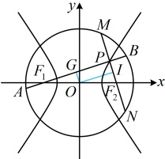

如图2，设$|AF_1|=n$，$|BF_1|=|AF_1|+2a=n+2a$，由双曲线定义，$\begin{cases}|AF_1|-|AF_2|=2a\\\ |BF_2|-|BF_1|=2a\end{cases}$，

所以$\begin{cases}|AF_2|=|AF_1|-2a=n-2a\\\ |BF_2|=|BF_1|+2a=n+4a\end{cases}$，故$|AB|=|BF_2|-|AF_2|=6a$，

因为$AF_1\perp AF_2$，所以在$\triangle ABF_1$中，$|AB|^2+|AF_1|^2=|BF_1|^2$，故$36a^2+n^2=(n+2a)^2$，化简得：$n=8a$，

所以$|AF_1|=8a$，$|AF_2|=6a$，由$|AF_1|^2+|AF_2|^2=|F_1F_2|^2$可得$64a^2+36a^2=4c^2$，化简得双曲线的离心率$e=\frac{c}{a}=5$。

答案：$\frac{\sqrt{10}}{2}$（或5）

【变式4】已知 $ F_{1} $， $ F_{2} $分别是双曲线 $ C:\frac{x^{2}}{a^{2}}-\frac{y^{2}}{b^{2}}=1(a>0,b>0) $的左、右焦点，点P在双曲线上， $ PF_{1}\perp PF_{2} $，圆 $ O:x^{2}+y^{2}=\frac{9}{4}(a^{2}+b^{2}) $，直线 $ PF_{1} $与圆O相交于A，B两点，直线 $ PF_{2} $与圆O相交于M，N两点。若四边形AMBN的面积为 $ 9b^{2} $，则C的离心率为（ ）

A.  $ \frac{5}{4} $ B.  $ \frac{8}{5} $ C.  $ \frac{\sqrt{5}}{2} $ D.  $ \frac{2\sqrt{10}}{5} $

解析：如图，因为  $ PF_1 \perp PF_2 $，所以  $ AB \perp MN $，故四边形 AMBN 的面积  $ S = \frac{1}{2}|AB| \cdot |MN| $ ①，

 $ |AB| $ 和  $ |MN| $ 都是直线被圆截得的弦长，考虑用公式  $ L = 2\sqrt{r^2 - d^2} $ 计算，下面先算圆心到直线的距离，

设  $ AB $， $ MN $ 的中点分别为  $ G $， $ I $，则  $ OG \perp AB $， $ OI \perp MN $，又  $ MN \perp AB $，所以  $ OG \parallel MN $， $ OI \parallel AB $，

结合  $ O $ 为  $ F_1F_2 $ 的中点可知  $ G $， $ I $ 分别为  $ PF_1 $ 和  $ PF_2 $ 的中点，

故  $ |OG| $ 和  $ |OH| $ 可分别与  $ \left|PF_{2}\right| $ 和  $ \left|PF_{1}\right| $ 建立联系，进而想到结合双曲线定义处理，

记 $ \left|PF_{1}\right|=m,\quad\left|PF_{2}\right|=n $ ，则 $ \left|OG\right|=\frac{n}{2},\quad\left|OH\right|=\frac{m}{2} $ ，因为 $ \frac{9}{4}(a^{2}+b^{2})=\frac{9c^{2}}{4} $ ，所以圆O的半径 $ r=\frac{3c}{2} $

从而  $ \left|AB\right|=2\sqrt{r^{2}-\left|OG\right|^{2}}=2\sqrt{\left(\frac{3c}{2}\right)^{2}-\left(\frac{n}{2}\right)^{2}}=\sqrt{9c^{2}-n^{2}} $ ， $ \left|MN\right|=2\sqrt{r^{2}-\left|OH\right|^{2}}=2\sqrt{\left(\frac{3c}{2}\right)^{2}-\left(\frac{m}{2}\right)^{2}}=\sqrt{9c^{2}-m^{2}} $

代入①得  $ S=\frac{1}{2}\sqrt{(9c^{2}-n^{2})(9c^{2}-m^{2})} $，由题意， $ S=9b^{2} $，所以  $ \frac{1}{2}\sqrt{(9c^{2}-n^{2})(9c^{2}-m^{2})}=9b^{2} $，

化简得： $ 81c^{4}-9c^{2}(m^{2}+n^{2})+m^{2}n^{2}=18b^{4} $ ②，求离心率需建立 a, b, c 的齐次方程，故考虑消去 m, n,

 $$ PF_{1}\perp PF_{2} $$ 

由双曲线定义， $ \left|m-n\right|=2a $ ③，

又  $ PF_{1} \perp PF_{2} $，所以  $ \left|PF_{1}\right|^{2} + \left|PF_{2}\right|^{2} = \left|F_{1}F_{2}\right|^{2} $，故  $ m^{2} + n^{2} = 4c^{2} $ ④，

 $$ m^{2}+n^{2}-2mn=4a^{2} $$ 

结合④可得  $ 4c - 2mn = 4a $ ，所以  $ mn = 2(c - a) = 2b $ ③，

将④⑤代入②可得  $ 81c^{4}-9c^{2}\cdot4c^{2}+4b^{4}=18^{2}b^{4} $，化简得：  $ 9c^{4}=64b^{4} $

所以  $ 3c^{2}=8b^{2}=8(c^{2}-a^{2}) $，从而  $ 8a^{2}=5c^{2} $，故离心率  $ e=\frac{c}{a}=\frac{2\sqrt{10}}{5} $.

答案：D