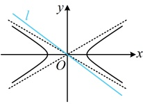
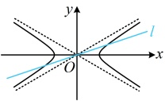

【例 11】已知双曲线  $ C: \frac{x^2}{a^2} - \frac{y^2}{b^2} = 1 (a > 0, b > 0) $，若直线  $ l: 3x + 4y = 0 $ 与 C 没有公共点，则 C 的离心率的范围为（ ）

A.  $ \left(1, \frac{5}{4}\right) $      B.  $ \left(0, \frac{5}{4}\right) $      C.  $ \left(1, \frac{5}{4}\right] $      D.  $ \left[\frac{5}{4}, +\infty\right) $

解析：所求为离心率的取值范围，考虑建立关于 $a$，$b$，$c$ 的齐次不等式，如何建立？观察发现直线 $l$ 过原点，研究过原点的直线与双曲线 $C$ 公共点的个数，可直接比较该直线和渐近线的斜率，由题意，双曲线的渐近线为 $y = \pm \frac{b}{a}x$，直线 $l$ 的方程可化为 $y = -\frac{3}{4}x$，其斜率为 $-\frac{3}{4}$，如图，要使 $l$ 与 $C$ 没有公共点，应有 $-\frac{3}{4} \leq -\frac{b}{a}$，所以 $\frac{b}{a} \leq \frac{3}{4}$，

故双曲线 $C$ 的离心率 $e = \frac{c}{a} = \sqrt{\frac{c^2}{a^2}} = \sqrt{\frac{a^2 + b^2}{a^2}} = \sqrt{1 + \left(\frac{b}{a}\right)^2} \leq \sqrt{1 + \left(\frac{3}{4}\right)^2} = \frac{5}{4}$，又 $e > 1$，所以 $1 < e \leq \frac{5}{4}$，故 $C$ 的离心率的取值范围是 $\left(1, \frac{5}{4}\right]$。

答案：C

【反思】①分析过原点的直线与双曲线的交点个数，常采用与渐近线比较斜率的方法处理。对于焦点在x轴上的双曲线，过原点的直线与其没有交点的充要条件是该直线的斜率不存在或斜率  $ k $ 满足  $ k \leq -\frac{b}{a} $ 或  $ k \geq \frac{b}{a} $；②求离心率的取值范围，需建立关于  $ a $,  $ b $,  $ c $ 的齐次不等式。本题的齐次不等式相对容易建立，我们来看一个变式。

【变式】已知双曲线  $ \frac{x^2}{a^2} - \frac{y^2}{b^2} = 1 $ ( $ a > 0, b > 0 $) 的左、右顶点分别为  $ A $,  $ B $，若该双曲线上存在点  $ P $，使得  $ PA $,  $ PB $ 的斜率之和为 1，则该双曲线离心率的范围为（ ）

A.  $ \left(\frac{\sqrt{3}}{2}, +\infty\right) $    B.  $ \left(1, \frac{\sqrt{3}}{2}\right) $    C.  $ \left(\frac{\sqrt{5}}{2}, +\infty\right) $    D.  $ \left(1, \frac{\sqrt{5}}{2}\right) $

解析：条件涉及 $PA$，$PB$ 的斜率之和，计算这两个斜率需要点 $P$ 的坐标，故先设坐标。

由题意，$A(-a,0)$，$B(a,0)$，设 $P(x_0,y_0)(x_0 \neq \pm a,y_0 \neq 0)$，则 $k_{PA} + k_{PB} = \frac{y_0}{x_0 + a} + \frac{y_0}{x_0 - a}$，

又由题意，$k_{PA} + k_{PB} = 1$，所以 $\frac{y_0}{x_0 + a} + \frac{y_0}{x_0 - a} = 1$，整理得：$2x_0y_0 = x_0^2 - a^2$ ①，

涉及  $ x_0 $， $ y_0 $ 两个变量，常规想法是用双曲线的方程消元，但  $ x_0 $ 和  $ y_0 $ 都有一次项，不方便消元，怎么办？注意到式①右侧是  $ x_0^2 - a^2 $，将  $ P $ 的坐标代入双曲线方程会产生这一结构，故考虑将其整体代换掉，再作观察，因为点  $ P $ 在双曲线上，所以  $ \frac{x_0^2}{a^2} - \frac{y_0^2}{b^2} = 1 $，从而  $ x_0^2 - a^2 = \frac{a^2}{b^2} y_0^2 $，代入①得  $ 2x_0 y_0 = \frac{a^2}{b^2} y_0^2 $，故  $ y_0 = \frac{2b^2 x_0}{a^2} $ ②，怎样看待式②？它和过原点的直线方程有点像，于是联想到过原点的直线与双曲线有交点，由②可知点  $ P $ 在直线  $ l: y = \frac{2b^2}{a^2} x $ 上，又因为点  $ P $ 在双曲线上，所以直线  $ l $ 与双曲线有交点，于是问题又回到了例 11 的模型，可通过比较直线  $ l $ 和渐近线的斜率来建立关于  $ a, b $， $ c $ 的不等式，注意到直线  $ l $ 过原点，所以要使其与双曲线有交点，如图，应有  $ \frac{2b^2}{a^2} < \frac{b}{a} $，从而  $ \frac{2b}{a} < 1 $，故  $ a > 2b $，所以  $ a^2 > 4b^2 = 4(c^2 - a^2) $，从而  $ 5a^2 > 4c^2 $，

