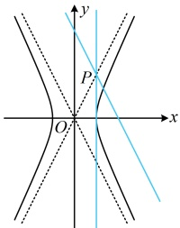
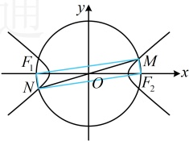

如图，点 P 恰好在渐近线上，过 P 与双曲线只有一个交点的直线有 2 条，其中一条为切线，另一条与渐近线 y = -2x 平行.

答案：A

【反思】研究直线与双曲线的交点个数，除了像例12那样联立直线和双曲线的方程来分析外，还可以通过画出图形，借助渐近线来看。

## 类型IV：双曲线的简单几何性质与平面几何综合题

【例 13】已知双曲线  $ C: \frac{x^2}{3} - y^2 = 1 $ 的左、右焦点分别为  $ F_1 $， $ F_2 $，以  $ F_1F_2 $ 为直径的圆与双曲线在第一、三象限的交点分别为  $ M $， $ N $，则  $ \triangle MF_1N $ 的周长为（ ）

A.  $ 8 + 2\sqrt{5} $          B. 8          C.  $ 4 + 2\sqrt{5} $          D.  $ 8 + 2\sqrt{3} $

解析：如图，$\triangle MF_1N$ 的周长中包含 $|MF_1|$ 和 $|NF_1|$，想到联系双曲线定义处理，但它们是双曲线上的两点到 $F_1$ 这一个焦点的距离，不能直接用定义，怎么办？注意到图形有对称性，故先分析几何特征，看能否把 $F_2$ 也用起来，如图，由对称性可知点 $M$，$N$ 关于原点对称，又 $F_1$，$F_2$ 也关于原点对称，所以四边形 $MF_1NF_2$ 是平行四边形，由题意，$M$，$N$ 在以 $F_1F_2$ 为直径的圆上，所以 $MF_1 \perp MF_2$，从而四边形 $MF_1NF_2$ 是矩形，故 $|MN| = |F_1F_2|$，$|NF_1| = |MF_2|$，所以 $\triangle MF_1N$ 的周长 $L = |MF_1| + |NF_1| + |MN| = |MF_1| + |MF_2| + |F_1F_2|$ ①，由双曲线方程可知，$a = \sqrt{3}$，半焦距 $c = \sqrt{3 + 1} = 2$，所以 $|EF_1| = 2c = 4$ ②，

由双曲线的定义， $ |MF_1| - |MF_2| = 2a = 2\sqrt{3} $ ③，还差的是  $ |MF_1| + |MF_2| $，怎么求？注意到有  $ MF_1 \perp Ml $

 $$ \triangle MF_{1}F_{2} $$ 

 $$ \left|M F\right| $$ 

 $$ \left|M F_{2}\right| $$ 

 $$ \triangle MF_{1}F_{2} $$ 

 $$ \left|M F_{1}\right|^{2}+\left|M F_{2}\right|^{2}=\left|F_{1}F_{2}\right|^{2}=16 $$ 

由③可得 $ \left|MF_{1}\right|^{2}+\left|MF_{2}\right|^{2}-2\left|MF_{1}\right|\cdot\left|MF_{2}\right|=12 $，结合④得 $ \left|MF_{1}\right|\cdot\left|MF_{2}\right|=2 $，所以 $ \left(\left|MF_{1}\right|+\left|MF_{2}\right|\right)^{2}=\left|MF_{1}\right|^{2}+\left|MF_{2}\right|^{2}+2\left|MF_{1}\right|\cdot\left|MF_{2}\right|=16+2\times2=20 $，故 $ \left|MF_{1}\right|+\left|MF_{2}\right|=2\sqrt{5} $ ⑤，将②⑤代入①得 $ \triangle MF_{1}N $的周长 $ L=2\sqrt{5}+4 $。

答案：C

【反思】看到双曲线上关于原点对称的两点，要想到以这两点和两个焦点为顶点的四边形是平行四边形，如果还有邻边垂直，则为矩形，此时常用勾股定理翻译垂直关系，并联系双曲线定义解决问题。

【变式】已知双曲线 $ \frac{x^2}{a^2} - \frac{y^2}{b^2} = 1 (a > 0, b > 0) $的左焦点为 $ F $，过 $ F $且斜率为 $ \frac{b}{4a} $的直线交双曲线于点 $ A(x_1, y_1) $，交双曲线的渐近线于点 $ B(x_2, y_2) $，且 $ x_1 < 0 < x_2 $，若 $ |FB| = 3|FA| $，则双曲线的渐近线方程是___。

解析：如图，点 B 的坐标可通过联立直线 AB 和渐近线的方程来求，先求该坐标，

由题意， $ F(-c,0) $，直线 $ AB $的方程为 $ y=\frac{b}{4a}(x+c) $，联立 $ \begin{cases} y=\dfrac{b}{4a}(x+c) \\ y=\dfrac{b}{a}x \end{cases} $解得： $ \begin{cases} x=\dfrac{c}{3} \\ y=\dfrac{bc}{3a} \end{cases} $，所以 $ B\left(\dfrac{c}{3},\dfrac{bc}{3a}\right) $，可以想象，点 $ A $的坐标不好求，不方便计算 $ |FA| $，如何翻译 $ |FB|=3|FA| $？已知 $ |FA| $与 $ |FB| $的比值，可联想到类似比，结合图形我们发现通过构造相似三角形能求出点 $ A $的坐标，代入双曲线即可求得渐近线斜率，